[View this document as a gitbook]([https://astrobotany.gitbook.io/copy-of-osdr-repo-training/](https://astrobotany.gitbook.io/osdr-repo-training/))


# OSDR Repo Training

### Introduction to NASA Open Science Data Repository (OSDR) <a href="#brcyrnoxf6tk" id="brcyrnoxf6tk"></a>

The NASA Open Science Data Repository (OSDR) is an open-access data collection from spaceflight-related missions and other related research activities. The purpose of the OSDR is to provide a centralized location for researchers to access and share data, promote collaboration and discovery, and accelerate scientific research. The OSDR contains various data types, including genomic, transcriptomic, proteomic, metabolic and imaging data. The data is available for download in multiple formats, including CSV, JSON, and XML. The OSDR is a valuable resource for researchers studying topics related to space biology including both human health and environmental science. This training provides an overview of the OSDR and how to access and use the data. The data repository is organized by experiment. Each experiment has a distinct page with a description of the experiment, the data files, and the associated publications.


<figure><figcaption><p>Transparent images of organisms and physical processes in microgravity alongside the DNA double helix and a bubble full of micro-bubbles overlayed on an image of an astronaut picking up lunar regolith with a space vehicle in the background. The Artemis logo is overlayed in the bottom right-hand corner. </p></figcaption></figure>

In addition to providing access to data, the OSDR also offers a variety of tools and resources to help researchers use the data. These tools include a data search engine, a data visualization tool, and a data analysis tool. The OSDR also hosts a community forum where researchers can discuss the data and collaborate on projects. The NASA Open Science Data Repository is a powerful and continually evolving ecosystem of open science tools that is helping to advance scientific research and increase the accessibility of Space Biology data. Many users create new code to analyze data from the OSDR and share it with the global community through Git Hub and complete published data products through Zenodo. By providing access to a wealth of open-access data, the OSDR is accelerating the pace of discovery and helping to make the world a better place.

### &#x20;<a href="#m8gv8gjhhcjx" id="m8gv8gjhhcjx"></a>

<figure><figcaption><p>The diagram shows three main columns: Increased NASA data connectivity, Data Processing Systems, and Presentation &#x26; Researcher Connectivity. The Data Processing, Analytics, and Management column shows how raw and processed NASA data is stored in a secure AWS bucket. It also shows how data is ingested, processed, and analyzed using analysis workflows. The Presentation &#x26; Researcher Connectivity column shows how researchers can access NASA data. The diagram also shows how new code generated by analysis of OSDR data can be shared through GitHub and published data products can be shared through Zenodo.</p></figcaption></figure>


#### OSDR Home page <a href="#m5rqt1baj5ra" id="m5rqt1baj5ra"></a>

<figure><figcaption><p>GeneLab logo</p></figcaption></figure>

[Learn more GeneLab](https://genelab.nasa.gov/about): GeneLab, an open science multi-omics repository, covering transcriptomics, metagenomics, epigenomics, proteomics, and metabolomics. Studies comprise of data from model organisms including microbes, plants, fruit flies, rodents and humans.

<figure><figcaption><p>Biospecimen Sharing Program  Logo</p></figcaption></figure>

[Learn more about BSP](https://science.nasa.gov/biological-physical/space-biology-biospecimen-sharing-program): The NASA Space Biology Biospecimen Sharing Program (BSP) collects biospecimens to maximize the scientific return from biological spaceflight and associated ground investigations and to encourage and broaden participation from the scientific community in space biology-related research.

<figure><figcaption><p>Ames Life Sciences Data Archive Logo</p></figcaption></figure>

[Learn more about ALSDA](https://osdr.nasa.gov/bio/about/alsda.html): Ames Life Sciences Data Archive (ALSDA) collects, curates, and makes available space-relevant higher-order phenotypic datasets. Datasets that enable scientists to perform retrospective analysis across missions, experiments, life science disciplines, research subjects, and species.

<figure><figcaption><p> Biological Institutional Scientific Collection Logo</p></figcaption></figure>

[Learn more about NBISC](https://osdr.nasa.gov/bio/about/nbisc.html): NASA Biological Institutional Scientific Collection (NBISC) is a biorepository of non-human samples collected from NASA-funded spaceflight investigations and correlative ground studies. The purpose of NBISC is to receive, store, document, preserve, and make the collection available to the scientific community.

### &#x20;<a href="#nlmcjqbf9moz" id="nlmcjqbf9moz"></a>

### **Open Science Data Repository** [**(OSDR) Home Page**](osdr-repo-training.md#y1ghpc1dn4ak)**:**  <a href="#ynesm822t5ts" id="ynesm822t5ts"></a>

**Home:** The Open Science Data Repository (OSDR) home page includes the navigation menu, Latest data releases, Latest news, Spotlight features, Research opportunities and recent open access publications.

(A) Navigation menu – click on any of the options to navigate through the different pages.

(B) Open Science Data Repository (OSDR) data exploration environment.

(C) Open Science Data Repository (OSDR) data submission portal.

<figure><figcaption><p><em>Open Science Data archive allows you to save, share and access FAIR space biology data.</em></p></figcaption></figure>

#### Explore the [OSDR](https://osdr.nasa.gov/bio/index.html) home pages by scrolling down reveals information about the latest data releases, news, and events. <a href="#shydp3pnfubk" id="shydp3pnfubk"></a>

<figure>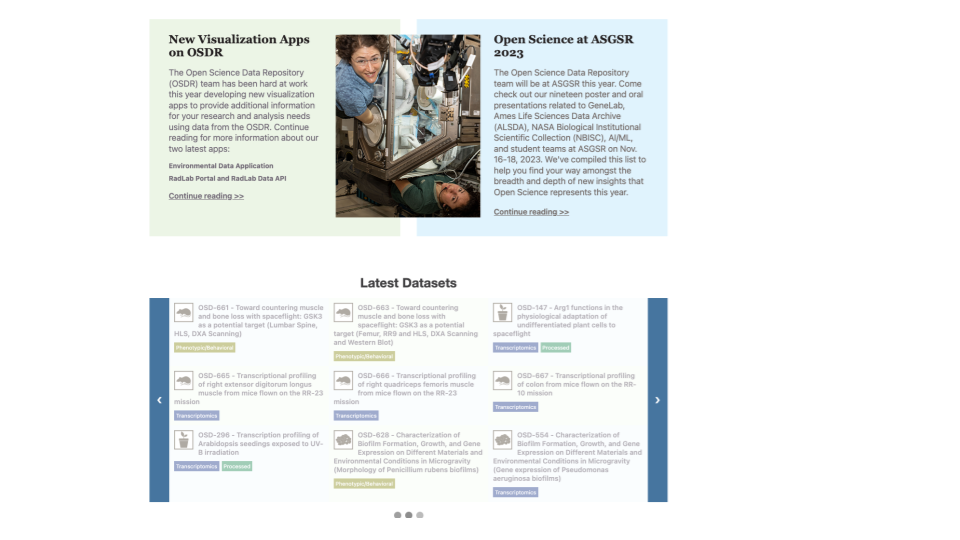<figcaption><p><em>The latest OSDR news and also promotes the latest datasets that have been.</em> </p></figcaption></figure>

### [About](https://genelab.nasa.gov/about)

**About:** The "About" drop-down menu from the OSDR home page provides a wealth of information about OSDR groups and resources. Here's a detailed overview of what you can explore:

#### NASA Open Science: Learn about NASA's commitment to open science and its efforts to make scientific data, publications, and software accessible to the public. Discover how NASA's open science policy promotes transparency, collaboration, and the advancement of scientific knowledge. <a href="#divah0gosyi5" id="divah0gosyi5"></a>

#### [Ames Life Science Data Archive (ALSDA)](https://osdr.nasa.gov/bio/about/alsda.html): Explore the ALSDA, a comprehensive repository of life science data generated from NASA spaceflight experiments. Gain insights into the diverse range of biological studies conducted in space, including investigations into human physiology, microbiology, and plant biology.

#### [GeneLab Infrastructure](https://genelab.nasa.gov/about): Discover the GeneLab, a state-of-the-art genomics and bioinformatics facility at NASA Ames Research Center. Learn about the advanced technologies and services offered by the GeneLab, such as DNA sequencing, gene expression analysis, and bioinformatics support.

#### [Space Biology Biospecimen Sharing Program (BPS)](https://nlsp.nasa.gov/explore/lsdahome/datarequest): Explore the BPS, a program that facilitates the sharing of biological samples collected during spaceflight experiments. Gain insights into the importance of biospecimen sharing for advancing space biology research and understanding the effects of space travel on living organisms.

#### [Latest News:](https://genelab.nasa.gov/newsarchive) Stay up-to-date with the latest news and developments in NASA's space biology research. Read about recent scientific discoveries, upcoming missions, and other exciting initiatives in the field of space biology.

<figure><figcaption><p><em>"Open Science for Life in Space". To the right of the text is the website's navigation menu the "About," option has been selected revealing subpages “Open Science”, “ALSDA”, “GeneLab”, “BPS”, and “Latest News”</em></p></figcaption></figure>

### Data & Tools <a href="#c1rmyihewqk5" id="c1rmyihewqk5"></a>

**Data & Tools:** The "data & tools" drop-down menu provides a wealth of information about OSDR data and tools. Here's a detailed overview of what you can explore:

#### [Data Repository:](https://osdr.nasa.gov/bio/repo/search?q=\&data\_source=cgene,alsda\&data\_type=study) Links to the data repository, where users can access space biology-centric data. Contains datasets from various space biology studies including data on gene expression, proteomics, and physiological adaptation to spaceflight. Users can search and download datasets of interest.

#### [Submission Portal:](https://osdr.nasa.gov/bio/submission-sso-login.html) Link to the submission portal, where users can upload their space biology data. Allows researchers to contribute their data to the OSDR, making it accessible to the broader scientific community. Users can also submit metadata, including information about experimental protocols and sample characteristics.

#### [Workspace:](https://osdr.nasa.gov/bio/workspace-sso-login.html) Requires the creation of an OSDR guest account. Provides a personalized interface for managing data, creating analyses, and collaborating with other researchers. Includes tools for data visualization, statistical analysis, and data sharing.

#### [Data Visualization:](https://visualization.genelab.nasa.gov/data/) Opens the application that manages multiple research studies. Allows users to visualize and compare data from different studies. Includes a variety of interactive plots and charts, as well as tools for data filtering and sorting.

#### [RadLab:](https://visualization.osdr.nasa.gov/radlab/gui/data-overview/) Is a tool for interrogating radiation data collected during spaceflight missions. Provides a comprehensive view of radiation exposure, including dose, LET, and particle type. Allows users to analyze radiation data in the context of biological effects.

#### [Environmental Data App:](https://visualization.osdr.nasa.gov/eda/) Facilitates visualization of environmental data collated from numerous rodent research studies. Includes data on temperature, humidity, and light levels. Allows users to identify potential environmental factors that may affect research outcomes.

#### [OSDR API:](https://genelab.nasa.gov/genelabAPIs) A webpage presenting the automated programming interface for OSDR. Provides documentation and examples for programmatic access to the OSDR data and tools. This page enables researchers to integrate OSDR data and tools into their applications and workflows.

<figure><figcaption></figcaption></figure>

### Research & Resources <a href="#th7npdw6jr01" id="th7npdw6jr01"></a>

The "Research & Resources" section provides access to information on open science, artificial intelligence, and life in space. Here's an expanded elaboration of each subsection:

[**Publications:**](https://osdr.nasa.gov/bio/data/publications.html)[ ](https://osdr.nasa.gov/bio/data/publications.html)This page contains links to literature related to the Open Science Repository, a central hub for NASA's open science publications. It includes journal articles, reports, and other scientific documents that have been made publicly available.

**AI/ML:** The "AI/ML" drop-down menu offers a link to the "AI4LS" (Artificial Intelligence for Life in Space Working Group) page. This working group brings together experts from NASA, academia, and industry to explore the potential of AI and machine learning for advancing life in space.

[**AI4LS:**](https://osdr.nasa.gov/bio/data/ai4ls.html) The AI4LS working group focuses on utilizing artificial intelligence (AI) and machine learning (ML) methods to analyze complex, heterogeneous, multi-modal biological datasets. ML approaches have shown promise for deriving meaningful patterns from these datasets and creating mathematical models to fit patterns and minimize errors. The group aims to build ML models to predict the physiological effects of spaceflight hazards using multi-modal biological and environmental data. Focus areas include causal inference, foundation models, and "self-driving" labs. Causal inference aims to elucidate causal relationships in complex biological data by combining invariance theory and ML methodology. Foundation models are trained on large, broad datasets and then refined on smaller datasets, which is relevant to space biology research due to limited sample size and restricted problem space. Self-driving labs are cutting-edge technology designed for space exploration. They employ automation and cloud-based systems to collect data points in a consistent and reproducible manner, leading to enhanced data acquisition and analysis.

#### **Seminars:** The analysis working groups regularly host spacebiology discussions and seminars. <a href="#gibzvugs02ne" id="gibzvugs02ne"></a>

[**HBISS Seminar Series:**](https://osdr.nasa.gov/bio/data/hbiss.html)

The "HBISS Seminar Series" link leads to the Horizons in Biosciences & Informatics Seminar Series website. This internal NASA seminar series showcases cutting-edge research in the fields of biosciences and informatics, with presentations from leading scientists from around the world.


**Open Science:** The "Open Science" drop-down menu contains a link to the "Data Management Policies for BPS" page

This page summarizes the data management policies for the Biological and Physical Sciences (BPS) division of NASA's Science Mission Directorate (SMD). It outlines the requirements for data management and sharing for BPS-funded research projects.

[**TOPS**](https://osdr.nasa.gov/bio/data/tops.html)**:** The "TOPS" (Transform to Open Science) page provides an overview of the US White House's Transform to Open Science initiative. This initiative aims to make publicly funded research more accessible and reproducible by requiring federal agencies to develop plans for transitioning to open science practices. The page also includes a link to enrol in the OS101 curriculum, which provides training on open science principles and best practices.



[**Data**](https://osdr.nasa.gov/bio/data/data-management-bps.html)[ **management policies:**](https://osdr.nasa.gov/bio/data/data-management-bps.html) NASA seeks to transform science data management to increase research throughput and transparency. The Science Mission Directorate (SMD) has issued new policies, including the Scientific Information Policy for the Science Mission Directorate (SMD Policy Document SPD-41a). The Biological and Physical Sciences (BPS) division of SMD has further specified these policies in the BPS Scientific Data Management Policy (BPS-021). Guidance and aids on implementing these data management policies are available at various locations, including the Space Biology Open Science-Data Management Plan (OS-DMP) Template and Guidance, the ROSES Open Science and Data Management Plan, and the NASA Science Mission Directorate: Open-Source Science Guidance.

[ROSES Open Science and Data Management Plan](https://science.nasa.gov/researchers/sara/faqs/osdmp)

[NASA Science Mission Directorate: Open-Source Science Guidance](https://github.com/nasa/smd-open-science-guidelines#nasa-science-mission-directorate-open-source-science-guidance)

<figure>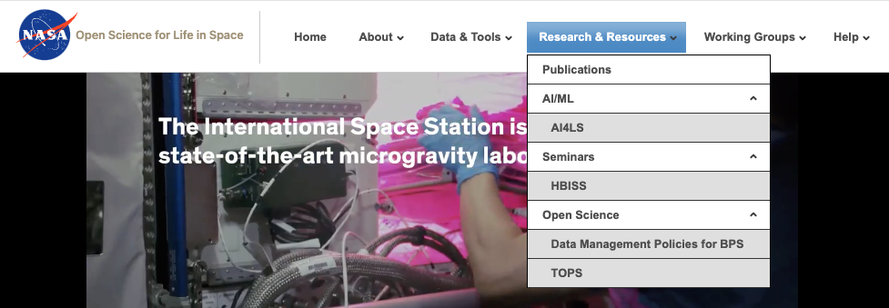<figcaption></figcaption></figure>

#### [Analysis Working Groups (AWG)](https://osdr.nasa.gov/bio/awg/about.html)

The AWG dropdown menu in GeneLab serves as a comprehensive resource for users to explore and engage with the organization's Applied Working Groups (AWGs). Through this menu, users can access various pages that provide information related to the AWGs.

[**About AWG(s)**](https://osdr.nasa.gov/bio/awg/about.html)**:** This page offers an overview of GeneLab's AWGs, explaining their purpose, goals, and activities. It highlights how AWGs bring together experts, researchers, and community members to collaborate on specific scientific projects and initiatives.

[**Charter:**](https://osdr.nasa.gov/bio/awg/charter.html) Here, users can access the formal charter documents for each AWG. The charters outline the AWG's mission, objectives, scope of work, and governance structure. They provide a framework for the AWG's activities and ensure alignment with GeneLab's overall strategic goals.

[**How to Join:**](https://osdr.nasa.gov/bio/awg/join.html) This section guides how individuals can become members of an AWG. It outlines the eligibility criteria, application process, and selection procedures. Interested individuals can learn about the requirements and steps involved in joining an AWG.

[**Current AWG Members:**](https://osdr.nasa.gov/bio/awg/awg-members.html) This page lists the current members of each AWG. It includes the names, affiliations, and brief bios of the individuals involved. Users can explore the expertise and backgrounds of the AWG members, providing insights into the diversity and strength of GeneLab's collaborative network.

[**SOLSTICE Project Goals:**](https://osdr.nasa.gov/bio/awg/solstice.html) Under the citizen science dropdown menu, users can find a description of the SOLSTICE project goals. SOLSTICE (Space Open Life Science Team for International Collaborative Exploration) is a citizen science project that engages the public in scientific research. This page outlines the project's objectives, research questions, and anticipated outcomes.

[**SOLSTICE Members and Affiliations:**](https://osdr.nasa.gov/bio/awg/solstice-members.html) This page lists the SOLSTICE members and their affiliations. Similar to the AWG members page, it provides information on the individuals involved in the SOLSTICE project, showcasing the diverse backgrounds and expertise of the participants.

<figure>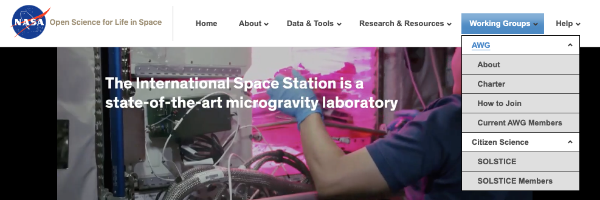<figcaption><p>Come join one of our analysis working groups.</p></figcaption></figure>

#### &#x20;<a href="#id-564cno4mscup" id="id-564cno4mscup"></a>

#### Help <a href="#lp2etw388rfz" id="lp2etw388rfz"></a>

**Open Science Data Repository (OSDR) offers a comprehensive collection of resources to assist users with various inquiries, policies, learning materials, and communication channels.** Here's an expanded elaboration of the services provided:

[**Frequently Asked Questions (FAQs)**](https://osdr.nasa.gov/bio/help/faq.html)[**:**](https://osdr.nasa.gov/bio/help/faq.html) A dedicated FAQ section addresses common queries related to OSDR's services, data submission process, accessibility, and account management. The FAQs are organized into categories for easy navigation and quick reference. Regular updates ensure that the information provided stays current and relevant.

[**Terms & Conditions**](https://osdr.nasa.gov/bio/help/terms.html)[**:**](https://osdr.nasa.gov/bio/help/terms.html) OSDR's Terms & Conditions outline the legal agreement between the platform and its users. Clear explanations of rights, responsibilities, and expectations for both parties are provided. Adherence to these terms is crucial for maintaining a respectful and ethical environment within the archive.

[**Tutorials**](https://genelab.nasa.gov/help/tutorials)[**:**](https://genelab.nasa.gov/help/tutorials) Step-by-step tutorials guide users through essential tasks such as data submission, metadata creation, and search functions. Visual aids, screenshots, and detailed instructions make the learning process intuitive and accessible. Tutorials are regularly updated to reflect any changes or improvements in OSDR platform.

[**Contact Information**](https://genelab.nasa.gov/help/contact)[**:**](https://genelab.nasa.gov/help/contact) Multiple communication channels are available for users to reach OSDR staff including (GeneLab Slack and Discorse.OSDR.space are used by AWG's for communication). Email, phone numbers, and social media platforms provide convenient options for inquiries, feedback, and technical support. Prompt response times ensure that users receive the assistance they need promptly.

<figure>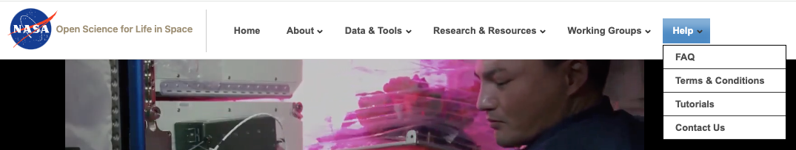<figcaption><p><em>Feel free to contact us.</em></p></figcaption></figure>

#### How to use the [OSDR data repository](https://osdr.nasa.gov/bio/repo/) <a href="#tk00089ds1w" id="tk00089ds1w"></a>

**The OSDR data repository contains lots of information and data from the Space Biology research community.**

1. Go to the **NASA OSDR** [home page](https://osdr.nasa.gov/bio/index.html).
2. Click on the **"Data & Tools"** tab at the top of the page

_or click on the Data Repository Explore Image (right)_

<figure><figcaption><p><em>or click on the Data Repository Explore Image</em> </p></figcaption></figure>

1. Select **“Data Repository”** to navigate to the list of studies ([Or use this link](https://osdr.nasa.gov/bio/repo/search?q=\&data\_source=cgene,alsda\&data\_type=study)).
2. Search for studies by entering text into the **“Search Datasets”** box.
3. On the right you’ll see the number of items per page, the default is 25, but this number can be increased to 50 or 100.
4. These lists are sorted based on **“Release Date”** as default, but can be adjusted to reflect **“Relevance”,** **“study accession ID”** # or the **“Study title”**.
5. On the left of the webpage, you will see some filters to help you identify related studies, select any combination of study features by ‘checking the boxes’ and this will change the number of studies being shown on the screen.
6. Each study is summarized by an image representing the model organism being investigated, the study title, organism, factors being investigated, assay types, release date, a description and a “Highlights”/ summary.
7. Clicking on either the image of the model organism or the title will open that study database and present the related metadata, primary data and if available processed data.

<figure><figcaption><p><em>The Open Science Data Repository search interface allows users to search, filter, and view search results, including titles, organisms, factors, descriptions, and experiment details. Below the search results, users can find additional filters for refining the search by organisms, factors, assay types, and project type. Search datasets are highlighted red (4), the number of items per page is highlighted (5), the Sort by options are set to release date and are highlighted red (5) and the General search Filter table is highlighted red (6).</em> </p></figcaption></figure>

<figure><figcaption><p><em>Section A, titled "General Search Filters," provides options for filtering data sources (GeneLab, ALSDA, NIH GEO, EBI PRIDE, and ANL MG-RAST) and data types (Study, Experiment, Subject, Biospecimen, and Payload). It also includes a "Show more" button. Section B, titled "Study Search Filters," offers project-type options for filtering studies, including Ground, Spaceflight, and High Altitude. The GeneLab, ASLSDA and Study data options have been selected and the boxes next to them are orange.</em></p></figcaption></figure>

1. **“General Search Filters”**
   1. Data Source
   2. Data Type
2. **“Study Search Filters”**
   1. Project Type
   2. Assay type
   3. Organism
   4. Tissue
   5. Factor

#### Metadata User Interface <a href="#i4jh5wczhr02" id="i4jh5wczhr02"></a>

**There is a lot of information available through the OSDR so it is important to read the description of each experiment carefully.**

Study metadata are viewable through a tabbed user interface for each study (see below). Click on each tab to navigate through the different sections: Description, Protocols, Sample and Assay Tables, Publications, Study Files and for some processed studies transcriptional visualization.

* The “Description” tab provides an overview of the study including a text description, contact information, experimental factors, organism(s), type of assay(s), project or mission details, funding information and citation information.
  * **Description example:** The red box highlights the “Description tab” view that has selected an example dataset, GLDS-37. Below is a series of buttons that allow the user to navigate through the data to find details of interest.

<figure><figcaption><p><em>The left-hand side of the webpage contains shortcut buttons that take you to additional information, such as a brief description of the experiment, the submission date of the experiment, the size of the data, the GeneLab ID associated with the data, the Digital Object Identifier (DOI), information about the source of the samples, and the assays, publications, files, and version history. The description box has been highlighted with a red dashed line. All the options on the menu on the left have been highlighted with red letters (A-K).</em></p></figcaption></figure>

#### Single study data visualization <a href="#id-882uty7gnw36" id="id-882uty7gnw36"></a>

1. Go to a study you are interested in within the OSDR or use [this link](https://osdr.nasa.gov/bio/repo/data/studies/OSD-37) to observe OSD-37.

**Note:** When examining the Uniform Resource Locator (URL) in your web browser, one can swiftly navigate between various studies by simply modifying the numeric value after the web link. This capability enables the user to swiftly transition between distinct studies.

[https://osdr.nasa.gov/bio/repo/data/studies/OSD-37](https://osdr.nasa.gov/bio/repo/data/studies/OSD-37)

[https://osdr.nasa.gov/bio/repo/data/studies/OSD-###](https://osdr.nasa.gov/bio/repo/data/studies/OSD-37)

1. At the top of the page, you should be able to see an icon picture summarizing the model organism next to the study ID number and data release version #.
2. On the left of the screen, you’ll see a series of buttons that can quickly navigate you down to different sections.
   1. Description - An abstract summary of the experiment
   2. Experiment(s) - “No associated Experiments” is not uncommon
   3. Payload(s) - “No associated Payloads” is not uncommon
   4. Mission(s) - “No associated Mission” is not uncommon
   5. Protocol(s) - provides the names and detailed descriptions of the sample collection, library construction, assay, treatment and any other protocol(s).
   6. Samples - Table of metadata describing the sample's names including quantitive and qualitative metadata values describing how they were treated. Users can select which fields they wish to export and export them as .csv files for use as factors in new subsequent models.
   7. Assay(s) - Table of metadata linking the samples to quantitive and qualitative metadata about how they were processed. Users can select which fields they wish to export as .csv files that can be used as factors in downstream statistical models.
   8. Publication(s) - Title, Authors, PubMedID, DOI## and web link to papers associated with this study. These provide a first-hand account of the study from the researchers who conducted the primary study.
   9. File(s) - A directory showing the OSD archive data folders that contain the study metadata, the raw or processed data provided by the research team and any extra processed data created by the GeneLab team.
   10. Version History - Date of the release of the current version and any associated files that were updated.
   11. Visualization - Launches into a new tab in the browser and provides insights into the GeneLab studies with processed data. “No processed data” is not uncommon.
3. Scrolling down will allow you to a description of the study, the factor(s), organism(s), assay(s), and descriptions of the related project metadata.
4. There are a lot of different types of data that can be downloaded and used for further analysis and publication.

#### Selecting sample(s) data for export <a href="#fjmk1199na87" id="fjmk1199na87"></a>

**The samples tab contains data that can be downloaded for new statistical analysis.**

*   The “Samples” and “Assays” tabs provide sample and assay level details formatted in a navigatable table. These tabs include specific organism characteristics, study factors and treatments, sample and sample processing metadata, assay execution parameters, and data processing metadata. Use the bottom navigation bar to scroll through all the columns, and the right margin scroll bar to navigate the rows.

    * **Sample example:** A GeneLab dataset, GLDS-37, sample name tab and sort/filter functions. The select export column button in the top left corner allows the selection and download of the most important sample factors. Entries in the table with Blue text provide links to ontology databases to help define their meaning. In the bottom right corner the number of entries on the page is set to 25 as default, many studies have more samples, so you can either navigate through the samples with the arrow button(s) or increase the number of entries per page to 50 or >\~100.

    <figure><figcaption><p><em>The image shows the “Samples” tab selection which includes the name of the samples. The table contains data describing the characteristics of the samples and providing links to some ontology terms that can be used to define experimental factors. The Select Export Columns button has been highlighted with a red box and a red dotted arrow.</em></p></figcaption></figure>

#### Selecting assay data for export <a href="#glrbshh7awz9" id="glrbshh7awz9"></a>

**The Assay(s) tab contains data that can be saved or used to develop new statistical tests.**

* There are many fields of data, users can scroll left and right using the slider bar at the bottom of the table or by “holding shift” while scrolling with a “mouse wheel”.
  * **Assays example:** A GeneLab dataset, GLDS-37, assay name tab and sort/filter functions. Some studies have more than one assay type which can be accessed using the drop-down menu in the top right-hand corner. These columns can be selected for download using the export column button. Some fields are links to data files that can be downed directly from the webpage, “right-click” on the entries with blue text and select “download” from the options.

<figure><figcaption><p>Please remember that you change between different types of assay and can scroll lef and right to observe more metadata information. </p></figcaption></figure>

#### Exporting tables to csv, txt, or .xls <a href="#f2351776owgq" id="f2351776owgq"></a>

**Assay data tables can be exported from OSDR and saved or used on local or cloud-based computers.**

* Users can download selected columns from the Samples and/or Assays table. Click on the Select Export Columns button. Select the desired columns and click Export CSV or desired format.
  * **Assay example:** The OSDR dataset, OSD-37, the “select export columns” has been selected. The Export CSV can be seen at the center top of the table. The user can select which columns or “Fields” they’d like to download by selecting boxes next to the options. The button left corner has “select all”, “unselect all” and close buttons.

#### The File(s) tab provides raw and processed data <a href="#m4rj3iwtu9j" id="m4rj3iwtu9j"></a>

**This resource allows you to access and download the raw and processed data.**

* The Study Files tab provides metadata and raw or processed study data files. Each row includes information about the size, type, and description. Click on the file name to download. You can download multiple files by clicking the checkbox at the left of the file name to select and then clicking the “Download Selected Files” button. To select all files in a resource category, navigate to the desired folder by selecting the folder name and then click on the checkbox at the top of the table, next to the Files column name.
  * **File example:** Study files view and sort/filter functions for GeneLab dataset, GLDS-37.

<figure>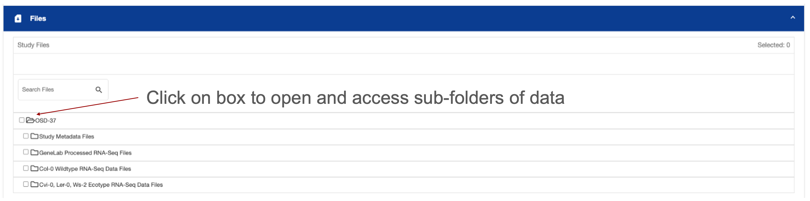<figcaption></figcaption></figure>

### Search Bar <a href="#iu61uhqypy1m" id="iu61uhqypy1m"></a>

**The search bar is a quick and easy way to filter through the data and can be used to create precise database queries.**

#### Search database <a href="#qdxg8g4b8f9y" id="qdxg8g4b8f9y"></a>

**OSDR provides users with a full-text search capability of the metadata for all datasets.**

Full-text search terms can be a single word or multiple words with either Boolean, wildcards (asterisks \*), or string (text).

* Searches are case-insensitive concerning search term(s). To perform a search, enter a keyword or set of keywords, in the search box and either press ‘Enter’ or use your mouse to select the magnifying glass icon.
  * **Search bar example:** Search results can be sorted by relevance, release date, source, and title in ascending or descending orders. In addition, to see an overview of the study metadata, click on the image of a magnifying glass, (highlighted with a red dashed square) to show highlighted keyword search relevance.
  * Clicking on a study title will show all the detailed metadata for that study and provide further data and links or use the page navigator arrow(s) on the top right corner to go to the next page of search results.

<figure>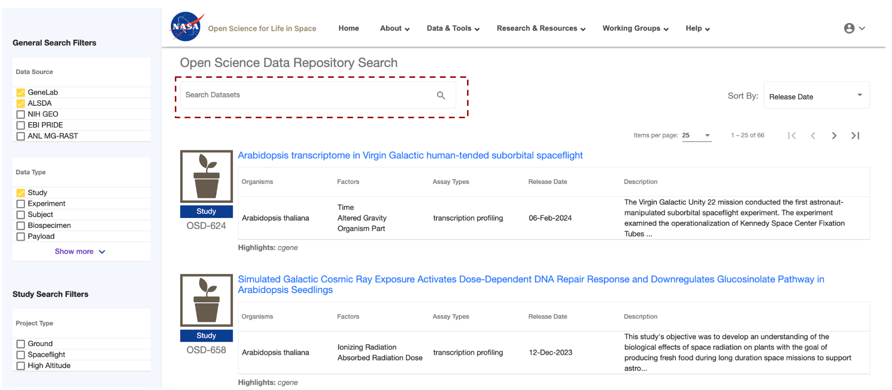<figcaption><p><em>The NASA logo, website navigation menu, and page title are displayed in the header section. The left-hand side of the webpage contains the filters mentioned previously. In the center of the page, the “Search Datasets” box has been highlighted.</em></p></figcaption></figure>

#### Single-word search <a href="#f4y457hcuqrc" id="f4y457hcuqrc"></a>

**Below are some examples of searches.**

* **Single-term search:** These are quick and easy and usually create long lists of loosely connected studies.
  * **Single-term example:** Search results from searching the single term ‘genome’

#### Multi-word search <a href="#u3geep5fcd5d" id="u3geep5fcd5d"></a>

**Choosing two or more keywords can quickly identify studies related to your area of interest.**

* Search results will contain all the search terms and in this example, filter down to 14 OSDR accessions.
  * **Duel-word example:** Search results from searching on multiple terms ‘genome ecotype’

<figure><figcaption><p>The NASA logo, website navigation menu, and page title are displayed in the header section. The left-hand side of the webpage contains the filters mentioned previously. In the center of the page the “Search Datasets” box has been highlighted, and the term “genome ecotype” has been entered. This search identifies 14 studies that use these terms in their metadata.</p></figcaption></figure>

#### Multiple-field searches <a href="#yo5jgk217hqz" id="yo5jgk217hqz"></a>

**How to create efficient searches by searching multiple fields.**

**Multiple-term search:** Search in multiple files such as general search filters, study search filters and keywords or phrases can be used to create concise lists of related studies.

* **Multiple-term search example:** Search results from multiple-term search combined with an additional selection of “Spaceflight” specific “Project type” are shown below.


<figure>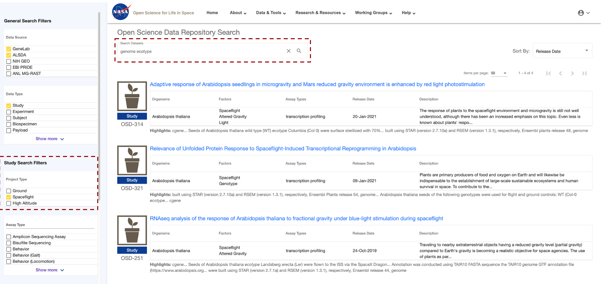<figcaption><p><em>The left-hand side of the webpage contains the filters mentioned previously. In the center of the page the “Search Datasets” box has been highlighted, and the term “genome ecotype” has been entered. In addition, the “Space flight” has been selected as a factor and is highlighted with a red box. This search identifies 4 studies that use these terms in their metadata but only the first 3 are shown.</em></p></figcaption></figure>


#### Boolean Operator Options <a href="#l33m3u35t1a7" id="l33m3u35t1a7"></a>

**How to make your search more insightful or precise using defined boolean operators.**

Please note that you may not use both the Boolean operators and double quotations together.

The resulting set is the same as searching for the terms ‘genome’ and ‘ecotype without the operator.

<table data-header-hidden><thead><tr><th width="190"></th><th></th></tr></thead><tbody><tr><td>Operator</td><td></td></tr><tr><td>AND</td><td>ALL search terms must be present (default Boolean search)</td></tr><tr><td>OR</td><td>ANY of your search terms can be present</td></tr><tr><td>NOT</td><td>Exclude words from your search</td></tr></tbody></table>

**Double Quotation marks define search phrases as essential for a precise match requirement.**

* If multiple words are in double quotations, then those words must match exactly in the order given, as shown below:
  * **Quotation example:** Search results from searching the exact term “genome ecotype” by using quotation marks. In this example, no search results were due to a combination of keywords and Boolean operators that failed to match any sample in the database.&#x20;

<figure><figcaption><p><em>The left-hand side of the webpage contains the "genotype ecotype" search results. In the center of the page the “Search Datasets” box has been highlighted, and the term “genome ecotype” has been entered, this time in quotation marks. This search resulted in no matches being found.</em> </p></figcaption></figure>

#### Boolean NOT operator. <a href="#w4aeta4y960m" id="w4aeta4y960m"></a>

**Refining search techniques to identify related studies.**

* Exclude studies containing the term(s) from your search using the minus prefix (-). This is the same as using the NOT operator which is the same as using the NOT operator.
  * **Not operator example:** Below is a search using the ‘NOT’ operator. genome ecotype –genotype.

<figure><figcaption><p><em>The left-hand side of the webpage contains the "genoe ecotype - genotypes" search results. In the center of the page the “Search Datasets” box has been highlighted, and the terms “genome ecotype - genotypes” are highlighted to show how Not operators can be used to adjust the search results.</em></p></figcaption></figure>

#### Boolean AND operator. <a href="#c7u6se40fjeh" id="c7u6se40fjeh"></a>

**How to use AND operators to make your search more precise.**

* Require term(s) in your search using the plus prefix (+). This is the same as using the AND operator.
  * **An operator example:** genome sequencing +WS ecotype

<figure><figcaption><p><em>The left-hand side of the webpage contains the filters mentioned previously. In the center of the page the “Search Datasets” box has been highlighted, and the terms “genome ecotype + WS ecotype” are highlighted to show how AND operators can be used to adjust the search results.</em></p></figcaption></figure>

#### Boolean \* wild card operator. <a href="#v28y5ignyqya" id="v28y5ignyqya"></a>

**How to use a \* wild card to find closely related studies.**

* Search on unspecified portions of the search terms using an asterisk (\*)
  * **A \*wild card Boolean operator example:** genome ecotype \* Gravity. In this example, we identified 2 studies with samples that received variable quantities of gravity as a study factor.


<figure><figcaption><p><em>The left-hand side of the webpage contains filters with a Booealn wild card operator being used to define the gravity level. In the center of the page the “Search Datasets” box has been highlighted, and the terms “genome ecotype + * Gravity” is highlighted to show how unspecified “wild card” operators can be used to adjust the search result.</em></p></figcaption></figure>

### &#x20;<a href="#alw6ircy431n" id="alw6ircy431n"></a>

### Federating data sources <a href="#id-86tmuz33uzle" id="id-86tmuz33uzle"></a>

**How to add an external database to your search.**

OSDA has integrated, commonly termed a data federation, with multiple heterogeneous external databases. Users can search across multiple databases in addition to OSDA. The links in the federated search results are to the authoritative external databases.

OSDA is currently federated with:

* [The National Institutes of Health (NIH) Gene Expression Omnibus (GEO)](https://www.ncbi.nlm.nih.gov/geo/)
* [The European Bioinformatics Institute (EBI) Proteomics Identification (PRIDE)](https://www.ebi.ac.uk/pride/archive/)
* [The Argonne National Laboratory (ANL) Metagenomics Rapid Annotations using Subsystems Technology (MG-RAST)](http://metagenomics.anl.gov/)

The OSDA repository does not contain copies of the data sets found in the external databases, GeneLab maintains metadata records (e.g., information about the data) of the external data sets in federated databases. These records are automatically updated to keep the GeneLab database search content up to date with the external databases.

To search in one or all of these databases, enter text search term(s) and select the desired databases as shown below. Federated search results are then shown. You may change the database selection(s) at any time and the search results will be updated accordingly.

* In addition to searching the GeneLab Data Repository, federated data repositories can be included in the search.
  * **Example:** Below are examples of federated data repositories that can be searched.

<figure>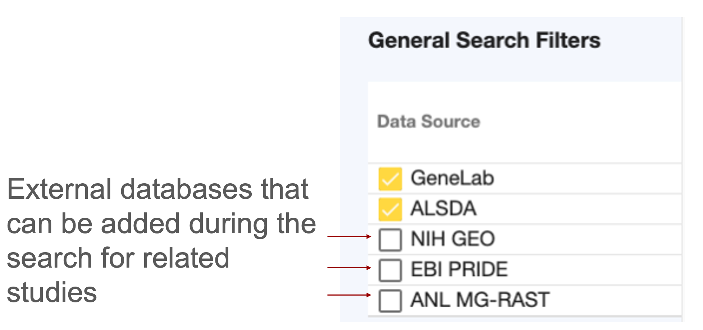<figcaption><p><em>The user can select specific databases to be included in the general search filters. If the user does not have a specific database in mind GeneLab and ALSDA are automatically selected, these options can be left on or turned off or they can also add NIH GEO, EBI PRIDE and AML MG-RAST to search.</em></p></figcaption></figure>

### Study Search Filters <a href="#id-5dnlxovdz6up" id="id-5dnlxovdz6up"></a>

**The filter box on the left can filter through the OSDR to find studies related to your expertise or interests.**

In addition, OSDR offers filters that facilitate the search process for related studies within the GeneLab repository. These filters encompass Project Type, Factors, Organisms, and Assay Types. The menu associated with each category contains pre-populated terms derived from datasets included in the OSDR repository. It is noteworthy that the use of these filters is possible without the inclusion of any additional search terms.&#x20;

* After filter selection, the filter is immediately applied, potentially altering the number of search results displayed. Filter values are shown as text above the results as they are added. Multiple options from the same filter allow users to select more closely related studies.
* For instance, to filter your search, choose 'Spaceflight' from the 'Factors' menu, followed by 'RNA sequencing (RNA-seq)' and 'Seedlings' from the 'Tissue' menu. OSDR will search for studies that have either of these terms as factors.
* Users can change the filter terms they have selected by selecting the filter again from the drop-down menu or by clicking the "Clear" button. It is important to note that the "Clear" button only eliminates the filter conditions and does not erase any text search terms entered before the filters. In addition to keyword searches in the OSDA, users can also search using key factors from the metadata of the studies.
  * **Example:** Below is an example set of filters that can be used to identify studies with similar experimental designs.

<figure>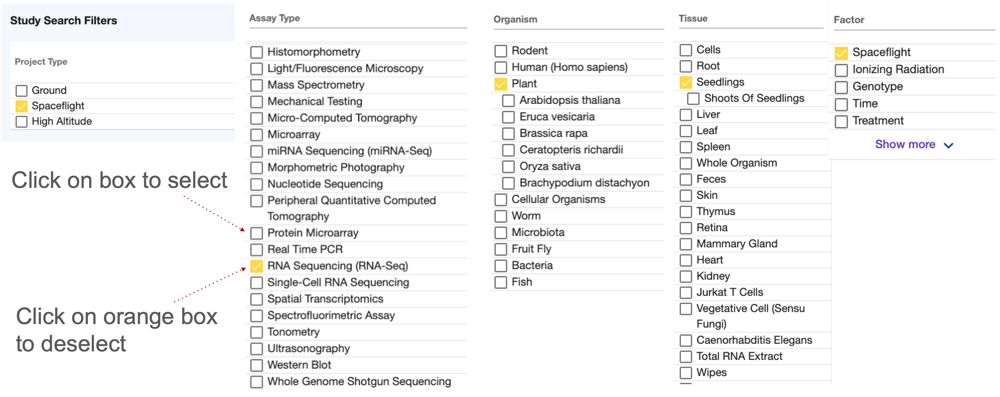<figcaption><p><em>The Image shows a series of Filters grouped by Assay type, Organism, Tissue and Factor. Spaceflight, RNAseq, Plant and Seedling were selected.</em></p></figcaption></figure>

### Single Study Data Visualization <a href="#n2cdxvmjoiy1" id="n2cdxvmjoiy1"></a>

#### Launching the single-study data visualization <a href="#jirp1jnmqw4k" id="jirp1jnmqw4k"></a>

Alternatively, if you’ve identified a study of interest in the OSDA and it has processed data available then you can view it with the OSDR single study data Visualization either by launching it from the OSDR accession’s ”Visualization” button or by replacing the \* wildcards in this website URL ([https://visualization.genelab.nasa.gov/data/OSD-\*\*\*](https://visualization.genelab.nasa.gov/data/OSD-\*\*\*)) with the accession number of interest.

*   After assessing the title, study descriptions and any related research paper you can use the data visualization application to learn more about some of the quantitative patterns within the data.

    * **Single study** [**example OSD-37:**](https://visualization.genelab.nasa.gov/data/OSD-37) If you’ve already navigated to a study of interest by searching through the study metadata you can launch the visualization menu using the visualization tab on the left menu.&#x20;


<figure>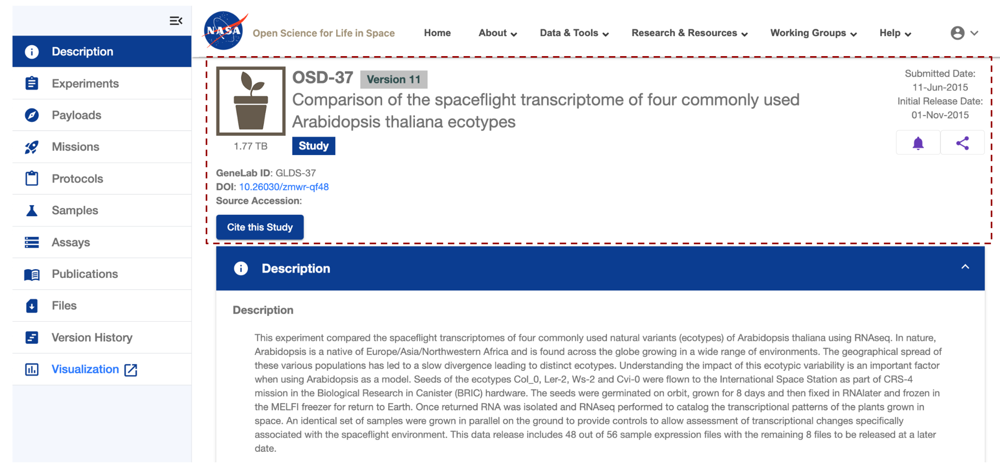<figcaption><p><em>Example showing the OSD page for accession # 37. The page presents a description of the experiment and related metadata.</em> <a href="https://osdr.nasa.gov/bio/repo/data/studies/OSD-37">https://osdr.nasa.gov/bio/repo/data/studies/OSD-37</a>.</p></figcaption></figure>

### Single Study Visualization Navigation bar <a href="#bltxtycjg7o9" id="bltxtycjg7o9"></a>

**The OSDR Visualization Navigation bar can allow you to navigate to a graph of interest.**

* After launching the OSDR visualization application on the lefthand side of the screen you’ll see a navigation window that will allow you to select to go to the "Home," "PCA," "Volcano,", “Pair plots”, “Heat maps”, “DGE”, “GSEA”, and Group Selection.
  * [**Single study navigation example**](https://visualization.genelab.nasa.gov/data/OSD-37)**:** In this example, we see Group 1 of Col-0\&FLT ( FLT is the flight group) and Group 2 is Col-0\&GC (GC is the ground control group). [https://visualization.genelab.nasa.gov/data/OSD-37](https://visualization.genelab.nasa.gov/data/OSD-37)
  * Clicking on these visualisation names allows the user to jump straight to the visualization of most interest.

<figure><figcaption><p><em>The OSDR Visualization interface includes the text "GeneLab Visualization" and "OSD-37," and a “Study details” search bar. Below is a horizontal navigation menu with various options like "Home," "PCA," "Volcano,", “Pair plots”, “Heat maps”, “DGE”, “GSEA”, and “Group Selection”. In this example, it shows that Group 1 of Col-0&#x26;FLT (which is the flight group) and Group 2 is Col-0&#x26;GC (which is the ground control group). There is a “Modify groups” button in the bottom left corner that can be used to change the groups of samples used to generate the data in the plots</em></p></figcaption></figure>

#### Select Group(s) <a href="#hmtojdhstykw" id="hmtojdhstykw"></a>

**Select Groups can be compared statically using the GeneLab data visualisation application.**

* Space Flight (FLT) vs Ground control (GC) is a linear model often used to understand and identify genes, proteins and other omics data types that change in response to spaceflight (or related stimuli)
  * **Single study grouping example:** Select the sample group 1 and group 2 for differential comparison. You can deselect these groups by clicking on the blue check box or select them by clicking on the empty boxes. In this example, the user can compare the ecotype and treatment groups.

<figure>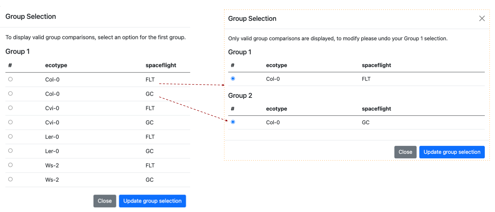<figcaption><p><em>The images show the Group Selection screen. The screen is divided into two sections, each labelled with a group name and containing descriptions of the selected factors. In this example, it shows the "Ecotypes” and "treatments". A red dashed line highlights that when 2 groups are assigned a pop-up window shows the groups that are being compared.</em></p></figcaption></figure>

#### Principal component analysis <a href="#we9brgzii034" id="we9brgzii034"></a>

**Principal component analysis (PCA) shows clusters of samples based on their similarity.**

* **PCA:** Click on samples to the right to select the desired samples to be viewed on the PCA plot. Icons on the upper right region of the plot allow for downloading, navigating and saving the plot. You can choose either 2D or 3D plots. If you click on the 3D graph and hold the left mouse button you can rotate the graph in 3D to optimise the angle and potentially highlight specific clustering patterns.
  * **Single study PCA example:** 3D plot has been selected and PC1, PC2, and PC3 are presented on the graph. Drop-down options allow users to replace these PC’s by selecting an alternative from the menu.
  * We can also see next to the “Color by factor” label that the current “all” is selected and the yellow arrow shows how the names of the factors have been combined in the figure legend.
  * It can be important to explore the PC's that separate the data based on different factors as the main factor such as spaceflight might not always be captured by the first or second PC's values. Sometimes results presented as a series of 2D PCA plots can be clearer than a 3D plot present 3 PC values.&#x20;

<figure>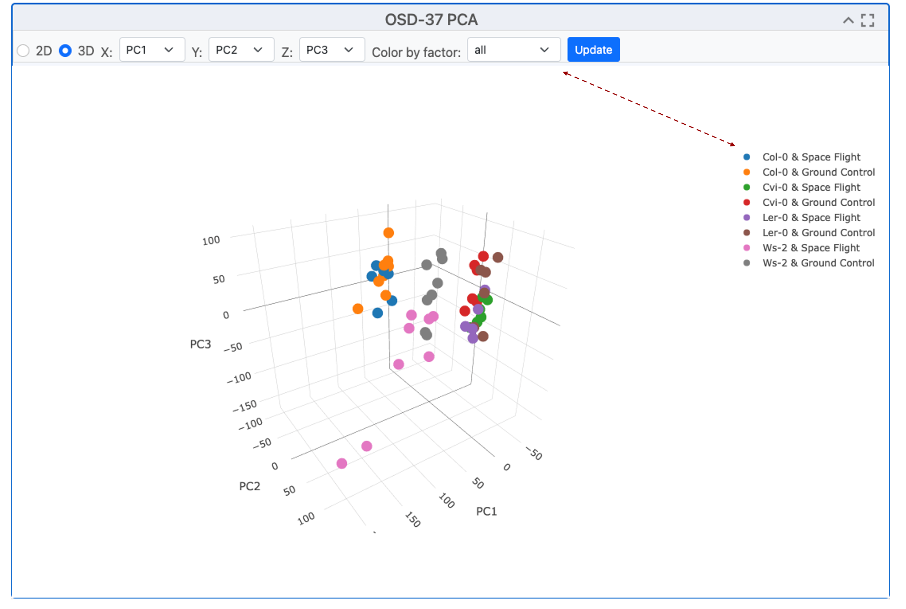<figcaption><p><em>The scatter plot exemplifies the clustering of samples via Principal Component Analysis (PCA), a method that transforms correlated variables into uncorrelated ones called principal components. The plot presents the projection of samples onto the first two or 3 principal components, showcasing the majority of the variance in the original data. The clustering suggests the presence of distinct groups, indicating different characteristics captured by the principal components.</em></p></figcaption></figure>

#### Replicate variability pair plots <a href="#eewgwyi97mqc" id="eewgwyi97mqc"></a>

**The “Pair plots” can be used to compare 2 samples from group 1 or group 2 respectively.**

* Drop-down menus allow the researcher to select different replicates and view the comparative gene expression dispersion plots. This is useful for finding outlining samples or loci and the difference between each sample can be refined by adjusting the color threshold (default 20). In the top right-hand corner, there is a menu of graph-specific options, including snapshot, zoom, lasso, and full screen. The “update” button is highlighted in blue and needs to be pressed if you change any of the factors.
  * **Pair plot replicate comparison example:** We can see the % difference threshold is set to 20, we can also see the names of the samples being paired against one another and they are replicated of the same treatment.

<figure><figcaption><p><em>Pair plots comparing 2 samples from Atha_Col-0_s1-pool_FLT_Rep4_R1-FL-B4 on the X axis and with Atha_Col-0_s1-pool_FLT_Rep4_R1-FL-B4 on the Y-axis. Loci are represented by red and blue dots. In the top right-hand corner, there is a menu of options, including snapshot, zoom, lasso, full screen, and the “update” button is highlighted in blue.</em></p></figcaption></figure>

#### Volcano Plots <a href="#id-3cb9r7if7di1" id="id-3cb9r7if7di1"></a>

**Volcano plots are show statistical significance vs magnitude of change.**

* To present the Volcano plot, the p-value is converted using a -log10 transformation to enhance the visibility of significant loci. Additionally, the Fold Change (FC) is transformed using a Log2 transformation to balance the representation of upregulated and downregulated genes. This facilitates the identification of genes with significant statistical differences and substantial expression changes. Users can select parameters, samples for comparison, and the maximum adjusted p-value using the drop-down menu. The Log2 FC threshold can be adjusted using the menu bar at the top. The image can be exported or explored using the zoom or lasso tool to investigate specific clusters or outliers.
  * **Volcano plot example:** This graph generated by OSD-37 shows the adjusted P-value on the y-axis after it has experienced a -log10 transformation compared to the Log10 fold change (FC). In this example, _SCPL50_ appears to have a dramatic suppression during flight.

<figure><figcaption><p><em>Image showing a volcano plot, with red dots representing genes with a significant increase in expression in orbit and blue dots representing genes that expression that was potentially suppressed by spaceflight-related factors. Drop-down menu allows for the selection of parameters, samples for comparison and maximum adjusted p-value. Some tabs also enable the transformation of the Y axis, the threshold of the adjusted P-value and the threshold of the Log2 FC can be adjusted using the menu bar at the top.</em></p></figcaption></figure>

#### Table of resulting gene expression data <a href="#t7933tpb5wrd" id="t7933tpb5wrd"></a>

**A summary table of data compiling gene RefSeq IDs, Symbols, Log2Fc, P values, and Adjusted-P-values is often the most concise way to view data.**

* In the top right-hand corner, boxes allow the user to filter the table based on the maximum P-VAL (P-value), maximum ADJP (adjusted P-value), LOG2FC (Log2 transformed fold change) or to just search for gene REFSEQ ID or gene Symbol (Name). In the top left of the table, the buttons allow the user to copy, export to CVS, Excel, PDF or even directly Print.
  * **Summary of results example:** This table shows the top 10 most significantly differentially expressed loci from OSD-37. The maxim adjusted p-value is set to 0.05, in the bottom left it shows 2445 entries selected by this threshold, in the bottom right it shows that there are 245 pages of data (as the screen had been adjusted to show 10 loci per page). These can be downloaded for further analysis.

<figure><figcaption><p><em>A screenshot from OSDR data visualization titled "OSD-37 DGE" showing a list of Gene REFSEQ IDs and Gene Symbols, along with their LOG2FC, PVAL and ADJP values. In the top right corner, there are boxes where users can enter values for P-VAL (P-value), maximum ADJP (adjusted P-value), LOG2FC (Log2 transformed fold change) or just search for particular gene REFSEQ ID or gene Symbol (Name).</em> <em>In the top left, there are a series of buttons to help export to CVS, Excel, PDF or Print. In the bottom left corner, it shows the number of entries on the page the total number selected by the filtering options and the total number of entries. In the bottom right corner, some buttons allow the user to navigate through the results on the screen.</em></p></figcaption></figure>

#### Gene Set Enrichment Analysis (GSEA) <a href="#l6v0c891a6ps" id="l6v0c891a6ps"></a>

**GSEA is a tool that enables statistical comparisons of genetic and molecular databases.**

[“Geneset Enrichment Analysis](https://www.gsea-msigdb.org/gsea/index.jsp) (GSEA) - For a detailed explanation of GSEA statistics (ES, NES, FDR, P-value) see the [\*GSEA Statistics](https://www.gsea-msigdb.org/gsea/doc/GSEAUserGuideTEXT.htm#\_Enrichment\_Score\_\(ES\)) website. GSEA is performed using GSEApy 0.10.3, for more information about the parameters used and how to run GSEApy GSEA function: [GSEA](https://gseapy.readthedocs.io/en/latest/run.html) or [GSEApy documentation](https://gseapy.readthedocs.io/en/latest/introduction.html). All gmt files were downloaded from Enrichr: [Enrichr libraries](https://maayanlab.cloud/Enrichr/#libraries). The number of “genesets” and maximum false discovery rate (FDR) are set to their default values 6 and 0.25 respectively. The Permutations, type, min size and max size are all left as default.

* The are many plot types that be used to view these results including, Enrichment Score Plot, NES Plot, Dot Plot, Ridge Ploy and Network Plot.
  * **Example GSEA:** Before starting the analysis select the plot type you wish to use. This example uses a NES Plot (bar plot) but there are often logical reasons to present different types of data in different types of plot(s) to help disguise between results.

<figure>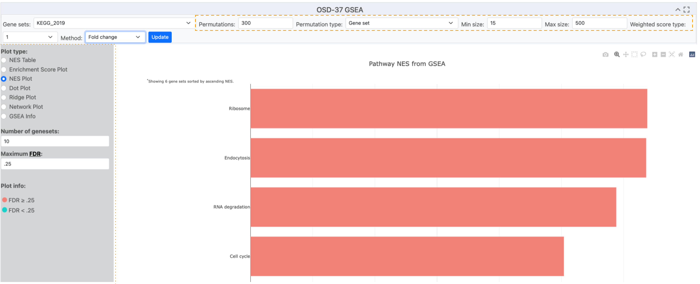<figcaption><p><em>Image displaying a table of graphing options. The selection of options has created a red NES plot showing 4 terms (Ribosome, Endocytosis, RNA degradation and cell cycle) identified by GSEA analysis of the KEGG_2019 database. The permutation and gene list min and maximum parameters are highlighted with an orange dashed box. The plot-type menu has been highlighted with an orange dotted box.</em></p></figcaption></figure>

#### Ontology databases and statistical methods used for analysis. <a href="#o9we3slvz8rf" id="o9we3slvz8rf"></a>

**Selecting different databases for statistical analysis can identify different responses and provide alternative perspectives and insights from the results.**

* Numerous ontology databases and statistical methodologies are available for application to the processed DESeq2 results.
  * **Ontology database example description:** A menu of pop-up menu databases can be opened and one selected based on your model organism and question of choice. 5 different statical methods can be used by GSEA, signal to noise, T test, Fold change, Difference of class and Log2 Fold change.

<figure>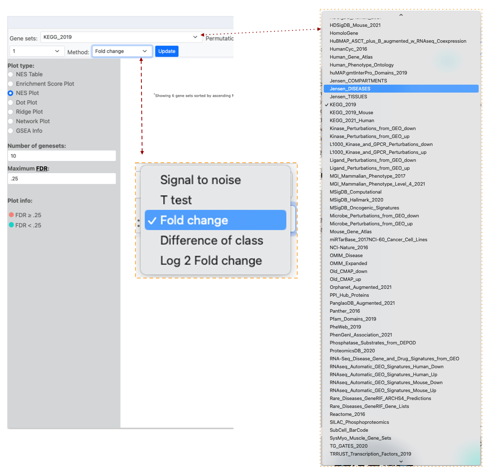<figcaption><p><em>Image of half of the OSDR visualization page, the “Gene Set” menu has KEGG_2019 selected and a red dotted line links the list of accessible databases that can be selected from the connected drop-down menu that is highlighted by a yellow dotted line. The image also shows a red dashed line listing the different analysis “Methods” that can be used and the “Fold change” option is highlighted in blue to show it is selected.</em></p></figcaption></figure>

#### Dot plots <a href="#bj3385d7e61m" id="bj3385d7e61m"></a>

**Dot plots can present 3 types of data on the same graph.**

The OSDR facilitates the visualization of the normalized enrichment score, false discovery rate, and Gene ratio values of all differentially expressed pathways on a single graph for user evaluation.

* **Phenotype Permutation vs. Gene Set Permutation:** Choosing the appropriate permutation method can influence your results. Phenotype permutation is generally preferred as it maintains the biological context of your experiment.
  * **Example dot plot:** demonstrating the analysis of the OSD-37 KEGG\_2019 pathway employing the Fold change method and “Phenotype” permutation type. The Minimum and maximum size parameters were retained at their default values of 15 and 500 loci, respectively, as per standard practice. The quantities of “geneset”s” and the maximum false discovery rate (FDR) are set to their default values of 6 and 0.25, respectively.

<figure><figcaption><p><em>A screenshot of  a Dotplot graph titled "OSD-37 GSEA." The x-axis label is "Normalized /enrichment Score" and the y-axis shows the name of the enriched KEGG pathway. The graph used two colors, red and blue to emphasize the variation in the FDR values for this data series. Data points size displays the Gene ratio value which is connected by lines to the pathway name on the Y-axis. Red dotted lines highlight where the Dot ploy options can be found and the “Phenotype” permutation has been selected.</em></p></figcaption></figure>


Ridge plots

**A ridge plot combines a density plot and a histogram to show how data, like Fold Change (FC), is distributed.**

The OSDR facilitates the visualization of the false discovery rate (FDR), and Foldchange values of all differentially expressed pathways on a single graph for user evaluation. This visualization aids in determining whether genes are predominantly upregulated, downregulated, or exhibit minimal change. The smooth, ridge-like form reveals trends, and the plot is compatible with log-transformed data, a common feature in fold-change analysis. Overlaying plots for various groups allows researchers to compare fold-change distributions.

* Ridge plots are effective tools for present GSEA analysis.
  * **Example Ridge plot:** This example ridge-plot was made with a “Fold Change” of loci from the KEGG\_2019 GSEA analysis data from OSD-37. The Minimum size and maximum size values were left to the default 15 and 500 loci as standard. The number of ““geneset”s” and maximum false discovery rate (FDR) are set to their default values 6 and 0.25 respectively.

<figure>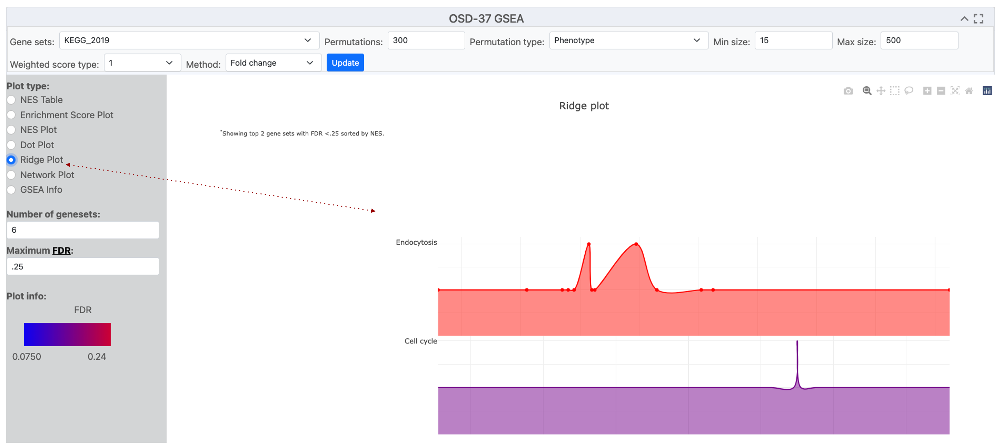<figcaption><p><em>A screenshot of an Open Science Data Repository (OSDR) ridge plot page displays a ridge plot entitled "OSD-37 GSEA”. The Y-axis label shows the names of the terms detected by enrichment analysis of the selected gene sets eg Endocytosis and Cell cycle. The x-axis label is "Gene Fold Change”. Red dotted line highlights where the “Ridge Plot" option was engaged.</em></p></figcaption></figure>

#### Network Plot <a href="#v5vfnpxc0gtj" id="v5vfnpxc0gtj"></a>

**A network plot uses dots that represent nodes of data points that describe the response detected in the analysis.**

* Network plots are effective tools for showing the variation in the number of genes involved in a detected response.
  * **Example network diagram:** it can be observed that the Ribosome possesses a greater number of loci that were implicated in that response ontology group. Even though "RNA degradation" and "Cell cycle" demonstrate a lesser quantity of associated genes, it is evident that they possess heightened significance due to their diminished adjusted P-value, as delineated by the gradient ranging from blue to red.

<figure>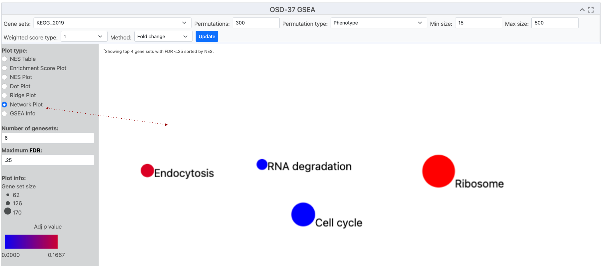<figcaption><p><em>A screenshot of an Open Science Data Repository (OSDR) network plot page with the title OSD-37 GSEA. In the center a plot shows 4 circles, representing enriched terms from the KEGG_2019 database. The size of the dots indicates the number of genes detected in that GO group and the red-to-blue color gradient shows the significance of their enrichment. A red dotted line highlights where the network plot was selected</em></p></figcaption></figure>

#### Network Plot used in conjunction with pathway illustration

**A network plot uses dots that represent nodes of data points that describe the response detected in the analysis.**

* Network plots can be merged with pathway diagrams to help illustrate connections between enriched terms and concepts like cellular function. Figures can then be shared with other OSDR AWG collaborators on platforms like GitHub as staging for eventual publication in Zenodo and peer-reviewed journals.

<figure>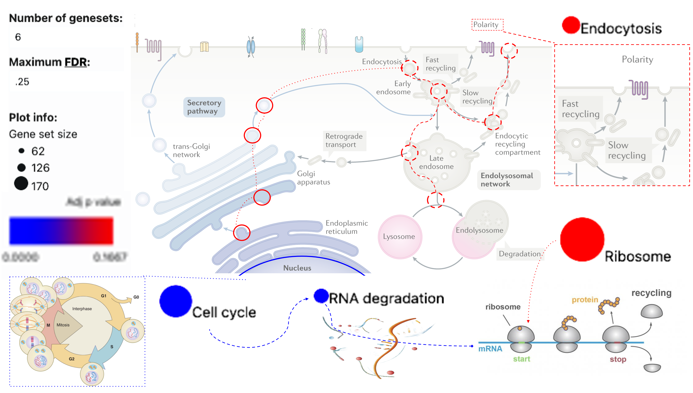<figcaption><p><em>The previous network dots and plot information have been incorporated into the endocytosis diagram to illustrate how these KEGG pathway terms related to cellular biology. The use of pop-out boxes and dotted or dashed lines is used to show connections based on knowledge from the literature.</em></p></figcaption></figure>

#### NES plots <a href="#j5wz6ra5953b" id="j5wz6ra5953b"></a>

**NES (Normalized Enrichment Score) plot offers a visual representation of the normalized enrichment score for gene sets identified by the user based on their parameters.**

* NES plots are an effect tool for viewing pathways that are identified by GSEA.
  * **Example NES plot:** The data from OSD-37 provides the normalized enrichment score adjacent to terms that possess enrichment in the selected database. KEGG\_2019 was used as the “geneset” for enrichment analysis. However, in this instance, we show it is possible to change the database being analyzed to observed. There are many GO terms identified during the analysis when the GO\_cellular\_Componet\_AutoRIF gene set database was queried.

<figure><figcaption><p><em>This image shows a NES plot and the options used to generate it. Situated at the top of the webpage is a search bar that facilitates the exploration of specific terms within the datasets and other “geneset" for analysis. Immediately beneath the search mechanism is a tabular structure providing alternative plot types and graph parameters. The bar plot structure summarizes distinct gene groups that are known to function in a similar location based on the GO-Cellular_Component_AutoRIF enrichment analysis. The Red dotted lines highlight the “number of “geneset”s” and the method values have been adjusted from their default values.</em></p></figcaption></figure>


Enhancing NES plots

**Adjusting the parameters to influence the quantity and sequence of pathways detected.**

* NES plots have a numerical constant that can be adjusted to modify the appearance pathways that are identified by GSEA
  * **Numerical method example:** In this OSD-37 example we’ve changed the “Method” value to 0 (classic), which changes the normalized enrichment score and graph layout.

<figure>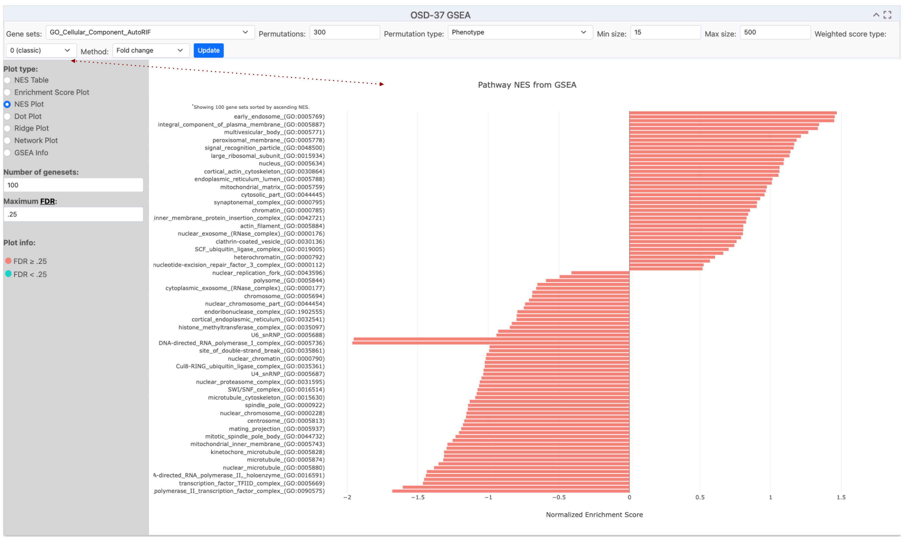<figcaption><p><em>This image shows a NES plot and the options used to generate it. The bar plot structure summarizes distinct gene groups that are known to function in a similar location based on the GO-Cellular_Component_AutoRF enrichment analysis. The red dotted line highlights that the “Method” is currently set to 0 (classic mode) but was set to 1 in the previous figure.</em></p></figcaption></figure>

**Refining NES plots using the Method Value**

**Adjusting the “geneset” is highly recommended in the Method tab and can change the number and order of pathways identified.**

* When utilizing a normalized enrichment score plot (NES plot) to depict pathway enrichment via the fold change method, the graphical representation not only illustrates pathways with statistical significance but incorporates pathways that lack such significance.
  * **Number of “genesets” example:** In this example, the “Method” value is set to 1, and we’ve changed the “geneset” to Cellular\_Component\_AutoRIF\_Predicted\_zscore. Notice that the number of “genesets” is now set to 15 and that the color coding shows that only 4 of these are significant based on the current threshold of a maximum False Discovery Rate of 0.25.

<figure><figcaption><p><em>This image displays a screenshot of the OSDR Visualization software, which includes an NES plot graph and the parameters used to create it. The NES bar plot structure summarizes distinct gene groups known to function in a similar cellular location based on GO-Cellular_Component_AutoRIF_zscore enrichment analysis. The method is currently set to 0 1, and the number of “geneset”s included was set to 15, with coloring determined by a 0.25 False Discovery Rate (FDR) cutoff threshold. Red arrows highlight the Gene sets and number of “geneset”s selected for this enrichment analysis.</em></p></figcaption></figure>

Fine-tuning permutations

**Adjusting the permutation value can be used to improve the GSEA statistical model.**

GSEA calculates enrichment scores by comparing the data to a random null distribution. This null distribution is generated by permuting the phenotype labels of your samples numerous times. A higher number of permutations leads to a more precise estimation of the p-value associated with your enrichment score.

* You can choose the number of permutations to run, with a higher number leading to potentially more accurate p-values.
  * **Example Finetuning Permutations:** Altering the default premonition from 300 to 500 in the example description resulted in a significant change in the FDR of the "cytoskeleton" Gene Ontology term.

<figure>0.25 to the Blue FDR<0.25 group. Red arrows highlight the Permutations value has been increased and that moving the mouse over a bar creates a popup that provides its name and value."><figcaption><p><em>This image displays NES plot graph and the parameters used to create it. The NES bar plot structure summarizes distinct gene groups known to function in a similar cellular location based on GO-Cellular_Component_AutoRIF_zscore enrichment analysis. The method is currently set to 1, and the number of “genesets” included was set to 15, with coloring determined by a 0.25 False Discovery Rate (FDR) cutoff threshold. The permutations number has been increased to 500 and the cytoskeleton GO term has increased its NES score and changed from the Red FDR>0.25 to the Blue FDR&#x3C;0.25 group. Red arrows highlight the permutation value has been increased and that moving the mouse over a bar creates a popup that provides its name and value.</em></p></figcaption></figure>

### &#x20;<a href="#xez5bpa6ns59" id="xez5bpa6ns59"></a>

### **OSDR Data Visualization Portal** <a href="#l1guj254u48q" id="l1guj254u48q"></a>

[Link to Data Visualization Portal](https://visualization.genelab.nasa.gov/data/)



[Link to detailed Multi-study visualization tutorial](https://genelab.nasa.gov/sites/default/files/2024-03/Data%20Visualization%20Portal%20JT\_AU.pdf)

{% embed url="https://genelab.nasa.gov/sites/default/files/2024-03/Data%20Visualization%20Portal%20JT_AU.pdf" %}

Open Science Data Repository (OSDR) “Data Visualization” portal that allows users to interact with the data from space-related studies within GeneLab's processed database. The portal encompasses various visualization types, including Gene Expression query tables, Dendrograms, Heatmaps, Ideogram, Gene Set Enrichment Analysis (GSEA) and interactive plots including PCA plots, Pair plots, and Volcano plots. Each tool offers the flexibility to adjust parameters and explore specific aspects of the data.

* The OSDR has many data visualization tools suitable for multiple applications and stakeholders. On the OSDR home page ([https://osdr.nasa.gov/bio/](https://osdr.nasa.gov/bio/)) the “Data Visualization” tab provides a list of OSDR datasets studies that contain visualizations.
  * **Data & Tools: Use the dropdown menu to access the** “[Data Visualization](https://visualization.genelab.nasa.gov/data/)” Hyperlink that will open the OSDR multi-study data visualization application ([https://visualization.genelab.nasa.gov/data/](https://visualization.genelab.nasa.gov/data/)).

<figure><figcaption><p><em>The image displays the NASA logo, which is a red, white, and blue meatball design. Below the logo is the text "Open Science for Life in Space". To the right of the text is the website's navigation menu the "Data Visualization” is highlighted with blue text, surrounded by a red box and has an red arrow pointing at it.</em></p></figcaption></figure>

### **Metadata Dashboard** <a href="#id-18i9g98tw37j" id="id-18i9g98tw37j"></a>

[Link to Metadata Dashboard](https://visualization.genelab.nasa.gov/data/)



**The metadata dashboard is designed to help users narrow search results for experimental data. It provides various tools for filtering and displaying results.**

*   The main tools for filtering the study table's results are the Pie charts and the filters on the left side of the dashboard. Each section of the Pie chart acts as a separate section of filters, and when a filter from the Pie chart is selected the results containing that factor will automatically populate in the studies table below. A user can make one selection on each Pi chart to narrow the results in the studies table. On the left side of the dashboard are a series of filtering options that can be used to identify similar studies. At the bottom of the page is a table summarizing the main metadata that describes how these studies were conducted.

    * At the bottom left of the table, there is a blue “Visualize Study” button that will launch any combination of studies that can be selected into a new tab in your browser for further analysis


<figure><figcaption><p><em>Image showing the OSDR data visualisation home page. 4 pie chart are divided into multiple colored sections. The text in the center above the pie chart says 438 studies are currently selected. The pie charts summarize the OSDR metadata values for Factors, Assay technology type, Organism and tissue. Below the pie charts is a time providing more details and the capacity to select individual or multiple studies for further analysis. To the left of the screen is a series of filter options that allow the users drill down into the datasets and find related studies.</em></p></figcaption></figure>

#### Selecting “processed studies” to find higher-order data. <a href="#uk50q5k2hiyu" id="uk50q5k2hiyu"></a>

* Users can select factors as filters on the Pie charts or the left side of the dashboard, both sections will be updated to show the selected filters and the studies table will be updated to show the relevant studies.
  * At the top of the filter panel on the left of the screen, you can see the “Show only studies with processed data tab”, selecting this option and then pressing the “Apply” filter button that excludes studies without processed data.

<figure>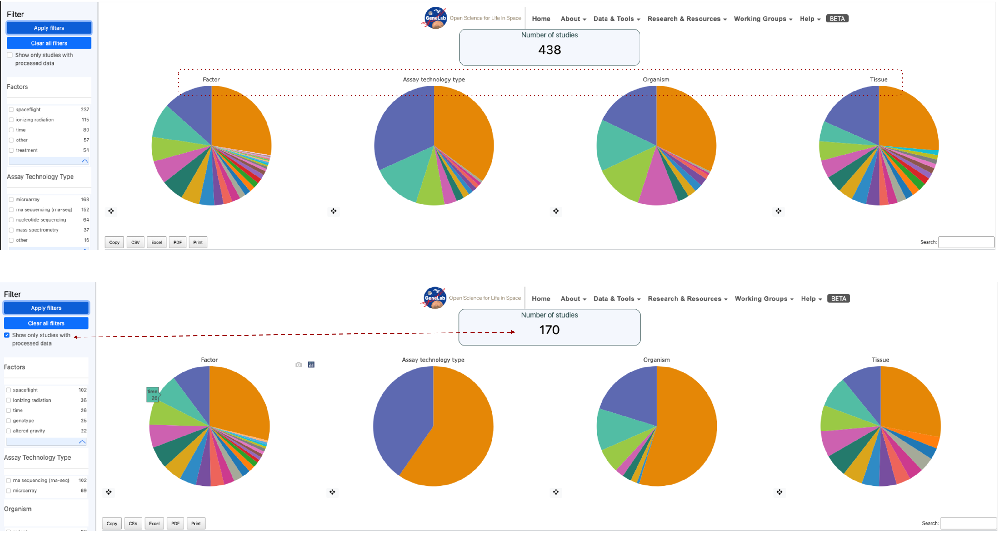<figcaption><p><em>Image showing 2 screenshots of the metadata pie charts. The top row shows 438 studies and a red dotted box highlights the Factors, Assay technology types, Organism and Tissue titles on the pie charts to highlight they can be used as filters. The second row of pie charts is annotated with a red dashed arrow connecting the “Show only studies with processed data” option has been engaged and as a result the number of studies currently being selected has been reduced to 170.</em></p></figcaption></figure>

#### Bar charts of factors <a href="#e5g8py1a7trn" id="e5g8py1a7trn"></a>

**The bar graph displays the results per factor.** When a factor is selected, it is broken down into types. After selecting a filter, the user can click "apply" to activate the filter and update the results on the graph. A red "X" appears next to the crosshair of the Pi chart to clear filters.

* Each pie chart comes with a crosshair tool located at the bottom left. Selecting the crosshair displays a bar graph showing the factors listed in the pie chart.
  * **Example factors bar plot:** In this example, the tissue factor has been viewed as a bar plot, and then the “Root” is selected, this then opens a new table that includes the 2 tissue ontology terms that contributed to the original “Root” ontology term. In this example “Root” is made up of both “plant root” and “root”

<figure>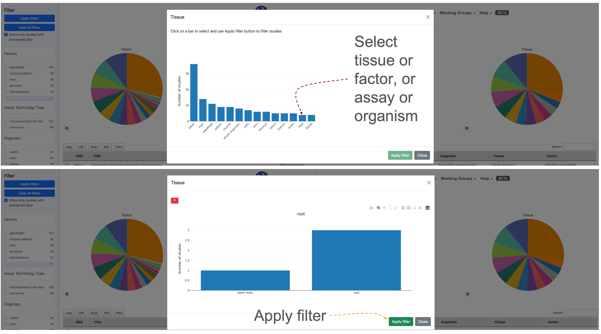<figcaption><p><em>2 screenshots showing the “Tissue” metadata presented as bar charts. The red dashed line shows all the "tissue" options and highlights that in this example the “root” term is selected. In the bottom screenshot shows the 2 sub-terms that are combined in the “Root” term and an orange arrow pointing at the “Apply filter” button.</em></p></figcaption></figure>

#### Selecting a study or group of studies for visualization <a href="#baeehoyiz78k" id="baeehoyiz78k"></a>

**Once a user has selected a study or multiple studies they can press the "Visualize Study" button to be directed to the data visualization tools.**

* You may also select multiple studies to visualize simultaneously in which case a user will be directed to a Multi-Study preview page before being directed to the data visualization tools.
  * **Filtered down to one study example:** A series of filters applied narrowed the selection to 1 study that fulfils all the user's parameters. The red dashed lines highlight the box that allows the user to select a study, the screen image also shows how a selected study appears when it is highlighted and also identifies where the blue “Visualize Study” button can be found.

<figure><figcaption><p><em>Image showing Four pie charts illustrate the metadata results determined by applying a series of filters to identify studies with similar organisms and tissues. Red arrows indicate where users can select studies of interest and highlight how the blue visualization study button can be utilized to activate the data visualization graphical user interface.</em></p></figcaption></figure>

#### Studies Metadata Menu as a Table <a href="#s7aljci4w0hb" id="s7aljci4w0hb"></a>

**At the bottom of the page below the pie charts is a table that lists the studies resulting from the selected filters from above.**

*   The table includes the following information for each study: OSD, Title, Assay, Organism, Tissue, and Factor. By default, the studies will be listed in order of OSD-# from smallest to largest, but the order can be reversed based on each information category by double-clicking on the title of the category.

    * **First 10 in chronological order:** If no list is applied then the table default is to show these in numerical order based on the OSD accession number.


<figure><figcaption><p><em>Table showing the frist 8 OSD accessions providing their title, assay, organism, tissue, and factors being studied.</em></p></figcaption></figure>

#### Multi-study Sidebar Functions <a href="#oek6t1v60xxg" id="oek6t1v60xxg"></a>

**When a user has selected the study/studies to visualize, they will be directed to the data visualization tools, where a sidebar of helpful tools is provided on the left side of the screen.**

The "Study Details" button is located at the top of the sidebar. This button pulls up a display with the study information including a small description. The display also includes a tab labelled “samples” that a user can press to see the individual samples and additional information for the study.

Below the study details button is a label for each plot provided for a user within the data visualization tool. Clicking these labels will automatically direct the user to the plot associated with the label.

At the bottom of the sidebar is the default Group selection is utilized for each plot. A user can modify the groups are selected by pressing the "Modify Groups" button. This button will prompt the user to select the individual groups that a user would like to see displayed on each plot.

A feature exclusive to multi-study visualization is the option to download the combined Differential Gene Expression (DGE) table.

Users can then select a threshold based on quantitative factors of gene expression such as fold change, P-value and Adjusted P-value.

When a user accesses the multi-study visualization the DGE table will have several options to export the information at the top of the table.

<figure><figcaption><p>The sidebar allows users to go straight to specific types of data visualisation including PCA, Volcano, Scatter pairs, heatmaps, GSEA and tables of DESeq2 results. </p></figcaption></figure>

#### Plotly <a href="#id-6klo26n9so4x" id="id-6klo26n9so4x"></a>

**Plotly is a third-party software that uses data provided by OSDR to create the interactive visualizations displayed.**

* At the top-right corner of each plot will be options to help a user better visualize the data. The house logo within the options will reset the axes of the plots back to default.
  * Users also have the option to zoom in/out on each plot as well as auto-scale the graphic. There are two tools provided for data point selection, the lasso tool and the box select tool. Each of these tools provides a shape that will select any data points that fall within them. Lastly, there is a download button in the shape of a camera will let you download the plot as a PNG file.

<figure><figcaption></figcaption></figure>

<figure><figcaption><p><em>Screenshot showing an example scatter plot made of red and blue dots. The % difference threshold is used to determine the relative proportions of red and bue. Above it is an enlarged version of the plotly panel of graph optimization options with the "Pan" button selected. The panel also has a button for copying a screenshot, minimising the screen, and maximising the screen, along with the lasso and square box selection tools.</em></p></figcaption></figure>

#### &#x20;<a href="#pf6ggq2bhe0b" id="pf6ggq2bhe0b"></a>

#### PCA Plots <a href="#zgf6azkbfb8w" id="zgf6azkbfb8w"></a>

**PCA stands for Principal Component Analysis, and this type of plot is used to reduce the dimensionality of large sets of data to simplify the process of analyzing the data points.**

[Link to read about PCA plots](https://builtin.com/data-science/step-step-explanation-principal-component-analysis)

* Each PCA plot will include options for a 2D and 3D representation of the data. The default selection is a 3D representation on an "X", "Y", and "Z" axis. In the upper left corner of the plot area select the "2D" button and then press "Update" The graph will update to display the data on an "X", and "Y" axis only.
  * The "Color by Factor" feature allows users to select a specific factor from the study for representation on the graph to allow for an easier comparison between differences in the data. Select the "Color by Factor" drop-down menu, within the drop-down menu select one factor, then press the "Update" button.

<figure><figcaption><p><em>Screenshot showing the PCA plot results for GLDS-120. Replicates are presented as dots and their color defines a combination of their genotype and light treatment. The PCA plot is 3 dimensional but only the axis for PC1 and PC2 are shown. Above the graph are a series of options that can be used to enhance the graph such as transitioning to 2D or changing the color grouping option.</em></p></figcaption></figure>

**Selecting groups in PCA plots**

**PCR plots contain a lot of information, on some occasions selecting a fraction of the samples and plotting their PCA variations in 2D can often be a clear and simple method to highlight clustering.**

* In this example, the "Cell Line" factor was selected from the drop-down. The results will now be represented by colors matching the factor selected. In this example, (OSD-154) the colors represent the different cell lines from the experiment and clearly show how the cell lines could be a factor in the differences between the data points.
  * Another feature within the PCA plot tool allows users to hide factors by selecting the label located on the right side of the plot. The two labels provided are the cell lines "GM15036" which is represented by blue, and "GM15510" represented by the color orange. Click on the label "GM15036" and the data points will be hidden as shown below. Click on the label "GM15036" a second time and the data will return to the graph.

<figure><figcaption><p><em>2 PCA plots showing that users can toggle on and off different groups. Red dashed lines highlight where the name of the sample can be found on the figure legend and that if you click on it you can add or remove different samples and the rest of the plot will adjust.</em></p></figcaption></figure>

#### Pair Plots <a href="#a8pdjzjwz1gr" id="a8pdjzjwz1gr"></a>

[Link to read about Pair Plots](https://medium.com/analytics-vidhya/pairplot-visualization-16325cd725e6)

Pair plots are used for Exploratory Data Analysis, where the plot visualizes the data in order to find a relationship between variables that can be continuous or categorical.

* A “Pair Plot” is used to understand the best set of features to explain a relationship between two variables. It also helps to form simple classification models by making linear separations in a dataset.
  * **Enhancing difference visualization:** The default display for the pair plot will be the comparison between two sets of data with a % difference color threshold of 20%. Two plots will be displayed on the dashboard for the ability to compare multiple sets of data simultaneously. In this example on the right, we can see an increase in the threshold reduced the number loci annotated as red. Clicking each of the drop-down menus will allow a user to change which axis the sample data is displayed on.

<figure>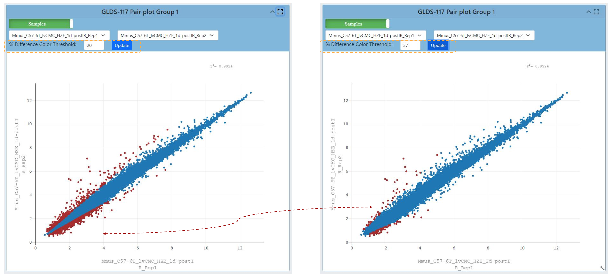<figcaption><p><em>2 scatter plots, the graph on the right has had the % difference color threshold increase to 37. The red dashed line highlights the change in coloring caused by updating the graph after the threshold has been adjusted.</em></p></figcaption></figure>

**Refining Pair plot correlation visualization**

Upon selecting the green "Samples" button located on the plot, one is presented with the opportunity to adjust several correlation coefficient values. These values serve to quantify both the strength and direction of the correlation that exists between data points.

* Coefficients closer to +1 indicate a strong positive correlation, while those near -1 suggest a strong negative correlation. A coefficient near 0 signifies a weak or no correlation. Selecting a different coefficient dynamically alters the spread of the data, with higher coefficients leading to tighter clustering and lower ones resulting in broader scattering.
* Users also can view different data correlations by clicking the green "Samples" button at the top of the plot and comparing it to other study providing a correlation coefficient summary. Clicking this button will change the dropdown to show multiple correlation coefficients for a pair of samples from the OSDR.

<figure>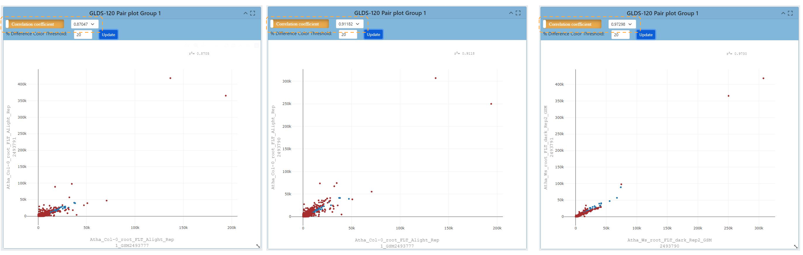<figcaption><p><em>A screenshot presents four pairs of plots. The information presented in the plots comes from GLDS-120. Changing the correlation coefficient influences the number of samples and the spread of the data in the graph.</em></p></figcaption></figure>

#### Volcano Plots <a href="#v6dx63l0d9d" id="v6dx63l0d9d"></a>

[Link to read about Volcano Plots](https://www.htgmolecular.com/blog/2022-08-25/understanding-volcano-plots)

**The name volcano plot comes from its resemblance to a volcanic eruption with the most significant points at the top, like spewed pieces of molten lava.**

* A volcano plot is useful for identifying events that differ significantly between two groups of experimental subjects. The default display for Volcano Plots will have the -Log10(Adj P Value) with an Adj P Value threshold of 0.05 and a Log2 FC threshold of 1.00 as shown below.
  * **Each point on the graph represents a gene:** The log2-fold differences between the groups are plotted on the x-axis and the -log10 p-value differences are plotted on the y-axis. The horizontal dashed line represents the significance threshold specified in the analysis, usually derived using a multiple testing correction.

<figure><figcaption><p><em>Screenshot of a volcano plot presenting RNAseq data from OSD-120. Loci going up in abundance are red and loci going down in abundance are blue. A tab is highlighted allowing the user to change the values defined by the Y axis. The option -Log10(P-Value) is highlighted in blue and the results are presented on 2 adjacent volcano plots.</em></p></figcaption></figure>

#### Customizing volcano plots <a href="#xqfjx7fvgehs" id="xqfjx7fvgehs"></a>

**Adjusting the cutoff threshold for coloring the volcano plot and adjusting the distribution of data can increase ease of data integration.**

* Users can change the type of data displayed on the Y axis, and the options from the dropdown menu include "P Value, Adjusted P Value, and -Log10(P Value)".
  * Below is an example of the "P-value", adjusted P value and log10 (P-values) display for a volcano plot. In addition, the ability to change the P value threshold is available and the image below shows a P value and Log2 FC thresholds are also provided. In this example the threshold is increased to P values of 0.25 and a Log2 Fold Change threshold of 3 is applied.

<figure><figcaption><p><em>Screenshot showing 4 different volcano plots demonstrating the effect of each of the different transformation options that can be plotted on the Y axis. To maintain the 'explosive' spread of data the -log10 transformation is essential and changing from adjusted P-values to just P-values increased the range of the data on the Y axis. The thresholds are highlighted with yellow boxes. The change the data distrubution caused by using P-values vs adjusted P-values is highlighted with a yellow circle and the effect of changing the Log2 Foldchange threshold is highlighted by yellow squares.</em></p></figcaption></figure>

#### Heatmaps <a href="#id-90l4f2mpkzz5" id="id-90l4f2mpkzz5"></a>

[Link to read about Heatmaps](https://www.htgmolecular.com/blog/2023-05-03/understanding-heat-maps-in-gene-expression-profiling)

Heatmaps allow researchers to quickly and easily identify patterns of gene expression that are associated with specific conditions or treatments and use color coding to indicate the magnitude of values.

* By measuring the number of RNA molecules produced by genes in a particular sample, researchers can determine the level of gene expression.
  * The default settings for the heat map are shown in the image below. The heatmap links genes depending on how alike they are based on the conditions set in the experiment.
  * **Log2 Transformation:** The Log2 transformation is available to enhance the display of genes with more pronounced differences. Applying Log2 transformation can reveal subtler variations in gene expression between conditions.


<figure><figcaption><p><em>Screenshot a heatmap using data from OSD-120 using the default settings. An orange dashed box highlights the setting tab at the top of the screen. To left there is a figure legend showing the samples and the colors used to define them in the bar at the top heatmap X-axis. The text on the X axis is the names of the samples. To the right of the heatmap a dendrogram shows the connectivity of the sample’s gene expression. To the right of the dendrogram is a red to blue scale bar showing loci expression variation from 1 to 0.</em></p></figcaption></figure>

**Filtering Heatmaps**

Users can filter the genes displayed on the heatmap based on their significance or fold change.

* Filtering by Significance (Adjusted p values) and log2 foldchange thresholds:
  * This filtering helps highlight genes with statistically significant expression changes. Analyze the heatmap to identify gene expression patterns associated with specific conditions or treatments.
  * Users can switch off the clustering of rows or columns of genes causing the dendrograms to be removed. This also affects how the heatmap links genes based on similarity. In some cases, toggling off these types of clustering can help focus on specific groups of genes and their expression patterns. Pay attention to color intensity and clustering.


<figure>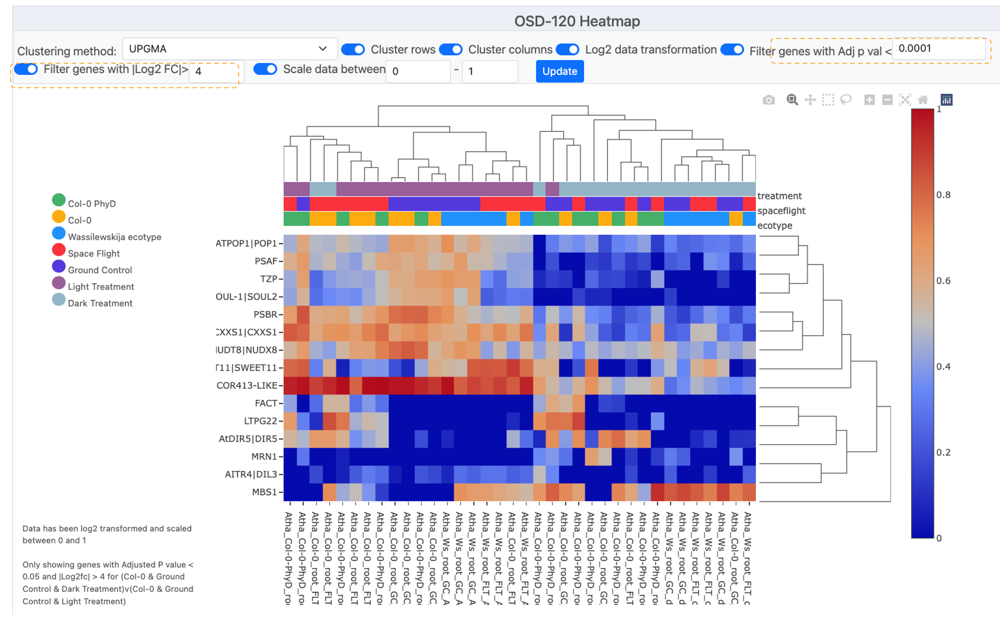4 and also requiring a Adjusted P-vValue of less than <0.0001. These stringent criteria have reduced the number of loci displayed on the graph to 15 displaying the Symbol for each on the Y-axis. To left of the is a figure legend showing the colors used to define the sample metameta in the bar at the top heatmap X-axis. The text on the X axis is the names of the samples. To the right of the heat map a dendrogram shows the connectivity of the sample’s gene expression. To the right of the dendrogram is a red-to-blue scale bar showing loci expression change from 1 to 0."><figcaption><p><em>Screenshot showing a heatmap with fewer genes due to increasing the required log2F to >4 and also requiring a Adjusted P-vValue of less than &#x3C;0.0001. These stringent criteria have reduced the number of loci displayed on the graph to 15 displaying the Symbol for each on the Y-axis. To left of the is a figure legend showing the colors used to define the sample metameta in the bar at the top heatmap X-axis. The text on the X axis is the names of the samples. To the right of the heat map a dendrogram shows the connectivity of the sample’s gene expression. To the right of the dendrogram is a red-to-blue scale bar showing loci expression change from 1 to 0.</em></p></figcaption></figure>

**Heat map clustering options**

Users can select a clustering method to display results.

* Choosing Clustering Method: The default is often set to UPGMA (Unweighted Pair Group Method with Arithmetic Mean). Clustering helps group genes with similar expression profiles, making patterns more apparent so it can be useful to compare multiple options.
  * In this example we compare UPGMA to the Nearest Point Algorithm, Furthest Point Algorithm and the Ward variance minimization

<figure>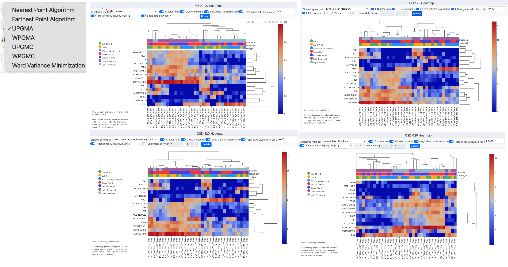<figcaption><p><em>Screenshot montage showing 4 different clustering methods used to process the example data from OSD-120. In the left corner, there is a pop-up window that shows the “Clustering methods” menu which has been opened and the UPGMA method is currently selected.</em></p></figcaption></figure>

#### &#x20;<a href="#gehyxb9h3uh2" id="gehyxb9h3uh2"></a>

#### Ideogram <a href="#k0o83ew6adb9" id="k0o83ew6adb9"></a>

**Ideograms provide a schematic representation of chromosomes, and they are used to show the relative size of the chromosomes and their characteristic banding patterns.**

[Link to read about Ideograms](https://en.wikipedia.org/wiki/Ideogram)

* The ideogram available through OSDR offers three options for customization.
  * Two options are related to how the user would like to filter significant genes, the first choice being genes with an adjusted P value less than the value set in the text box, and the second choice would be filtered by a Log2 FC value greater than the value set in the text box. The third option to customize the plot allows the user to change the layout of annotations for the Ideogram from a drop-down menu.

<figure><figcaption><p><em>Screenshot showing 4 different types of Ideogram created using data from OSD-120. Each of the grey bars represents a chromosome and red lines or arroves depict where genes that are significantly differentially expressed genes can be found.</em></p></figcaption></figure>

### &#x20;<a href="#id-4ngxvslairnl" id="id-4ngxvslairnl"></a>

### DGE Table <a href="#id-2ub25g3cd45c" id="id-2ub25g3cd45c"></a>

**Each study will have an associated Differential Gene Expression (DGE) table available that includes information on each sample from the study.**

To export a Differential Gene Expression (DGE) table from the study visualization page, follow these steps:

1. **Locate the DGE Table:** Scroll down to the bottom of the study visualization page. There, you'll find the Differential Gene Expression table containing valuable data.
2. **Copy the Table to Clipboard:** Identify the "Copy" button within the DGE table. It should be prominently displayed. Click the "Copy" button. This action will copy the entire table, including all data, headers, and values, to your device's clipboard which can then be placed into Word documents and/or spreadsheets.
3. **Or save and export:** As CSV, Excel, PDF, or send to Printer for a physical copy:

* To save the data in various file formats, look for the corresponding buttons.
  * **For a CSV file:** Locate and click the "CSV" button. This will prompt a download of the DGE table data in CSV format to your device.
  * **For an Excel file:** Look for the "Excel" button. Click it to initiate the download of the DGE table data in Excel format (XLSX) to your device.
  * **For a PDF file:** Find and select the "PDF" button. This action will convert the DGE table into a PDF file that you can save to your device.
  * **For Printing:** Spot the "Print" button. Clicking this will open a new window displaying a printer-friendly version of the DGE table. You can then use your browser's print functionality to print the table directly.

**Note:** Choose the method that best suits your needs to access and analyze the DGE data efficiently.

<figure><figcaption><p><em>Table showing 10 significantly differentially expressed mouse loci in the OSD-4. The table shows the Ensemble ID, Symbol, Log2FC, P-value and adjusted P-value. There are button in the top right hand corner that allow the user to down load these data.</em></p></figcaption></figure>

_**Alt text:**_&#x20;

#### &#x20;<a href="#id-8vsniiswkqfg" id="id-8vsniiswkqfg"></a>

#### Multiple study GSEA <a href="#d7vfdcantbds" id="d7vfdcantbds"></a>

**GSEA stands for gene set enrichment analysis, a method to identify gene groups that are overrepresented in a large gene set. It uses statistics to pinpoint significantly enriched or depleted gene classes.**

[Link to read about GSEA](https://www.pnas.org/doi/10.1073/pnas.0506580102)

On the Gene Lab Visualization Portal, you'll find a dedicated GSEA section for each study. Within this GSEA section, there are various parameters you can customize:

1. **Choose genesets:** Select the database geneset enrichment analysis. The default is "KEGG 2019," which is recommended.
2. **Permutations:** Decide the number of permutations you desire and whether they're based on phenotypes or gene sets.
3. **Gene Number Range:** Adjust the minimum and maximum gene sizes. Increasing the minimum size omits genes with fewer than 15 data points, same for the maximum size.
4. **Weighted Score Type:** Defaults to one, representing the t-test. Alternatively, choose signal-to-noise, fold change, or log2 fold change.
5. **Statistical Method:** Select your preferred statistical method. The default is the t-test.

To update the plot with your changes, simply click "Update." A range of plot types is available:

* **Normalized Enrichment Score (NES) Table:** View different gene sets in a table format. Export this table using the options at the top.
* **NES Plot**: The default plot displays normalized enrichment scores based on gene sets.
* **Dot Plot:** Similar to NES Plot, it showcases the top six gene sets based on false discovery rate (FDR). FDR indicates the likelihood that a result is valid, e.g., FDR of 0.25 means a 25% chance of validity.
* **Enrichment Plot**: This reveals the fold change distribution of the top three gene sets with an FDR of under 0.25.
* **Network Plot:** Visualize relationships between gene sets using a network plot.
* **GSEA Info:** For in-depth details about GSEA creation, statistics, and plot documentation.

With these steps, you can effectively navigate and utilize the GSEA section, gaining insights into gene set enrichment analysis for your study. A more detailed explanation can be found in the earlier section on the OSDR single study data visualization application.

### &#x20; <a href="#l8m8wfdlxlsd" id="l8m8wfdlxlsd"></a>

### Multi-study Page Overview <a href="#id-9fsa75cgexjv" id="id-9fsa75cgexjv"></a>

[Link to the detailed tutorial can be found here](https://genelab.nasa.gov/sites/default/files/2024-03/Data%20Visualization%20Portal%20JT\_AU.pdf)

{% embed url="https://genelab.nasa.gov/sites/default/files/2024-03/Data%20Visualization%20Portal%20JT_AU.pdf" %}

**Multi-study analysis is an advanced tool designed for analyzing and visualizing multiple RNA sequencing studies concurrently**.

#### Selecting studies for Multi-study analysis: <a href="#adcagqrqpdky" id="adcagqrqpdky"></a>

* The multi-study page is used to initialize the parameters for data visualization of the multiple studies. Researchers can uncover intricate patterns of gene expression associated with specific conditions or treatments across a variety of experiments. Below are detailed instructions on how to effectively navigate and utilize the Multi-Study Page.
  * For your initial test, let's use rodent studies as an example.
  * Start by selecting "rodent" as the organism of interest. Since combining DNA microarray assays is not supported, ensure filtering by both "rodent" and "RNA sequencing" in the assay technology type.
  * Choose two different rodent studies that encompass various tissue types. For instance, select "OSD-49" and "OSD-100."
  * Mark the checkboxes beside the selected studies in the studies table.
  * Click the "Visualize Study" button to proceed.
  * In this example OSD-49 & OSD100 have been selected, normalized with DESeq2 and their first 2 principle components plotted in a 2D scatter plot. To the right the is a factor selection tab where you can add new factors that will appear as columns beside the OSD-###. Clicking on the “Expand table” button reveals a table showing all the replicates and the metadata the user loads.

<figure><figcaption></figcaption></figure>

_**Alt text:** Screenshot showing the graphical user interface of the Multi-study visualization application showing data for OSD-49 & OSD-100._

#### Multi-study Data Normalization: <a href="#n1ennvxv3ysp" id="n1ennvxv3ysp"></a>

**A dialogue box will appear to prompt you for data normalization options.** The default selection is often "DESeq2" for normalization, but you can also choose "No Normalization."

* **E-mail notification:** If desired, you can enter your email address to receive a notification when the studies have been combined and normalized. Alternatively, proceed without entering an email address.
* **Normalization and PCA Insights:** Understand normalization details by clicking the Information button next to the normalization method. View the PCA chart, which provides insights into data distribution after normalization.
* **Factor Selection and Differential Gene Analysis:** Under "Factor Selection," choose variables to generate a factors table for differential gene analysis. Select parameters, characteristics, or factors from the dropdown list to add to the table.
* **Exploring the Multi-Study Page:** A PCA chart for data visualization will be included on the multi-study page. Utilize the PCA chart options to tailor your visualization based on specific criteria.
* **Modifying Normalization Method:** If you wish to change the normalization method (e.g., from "DESeq2" to "No Normalization"), click "Change Normalization Method."
* **Sample Selection for Gene Expression Analysis:** Select specific samples by clicking the "Select labelled, expand table" button. Choose samples based on factors added during factor selection.
* **Visualizing and Downloading Results:** Click "Visualize Studies" to proceed to visualization plots or download the accounts table. Depending on your selection, enter your email address for a notification upon completion.
* **Exploring Visualization Plots:** Upon completion, the page will direct you to a range of visualization plots and graphs for your data analysis.

#### Environmental Data for Space Biology Experiments <a href="#bzao0vql158v" id="bzao0vql158v"></a>

**Linking changes to the environment and changes in biological data can lead to many discoveries.**

OSDR has incorporated additional data to support spaceflight experiments. These data include environmental data from the space vehicles or payloads (hardware). Currently, OSDR has gathered radiation dosimetry data from spaceflight experiments and provides a complete table for several spacecraft under the ‘Environmental Data’ menu option.

* Select an option from the left menu to display the environmental data available for OSDR studies from that spacecraft dosimetry.
  * **Shenzhou-8 example:** selecting Shenzhou-8 Radiation Dosimetry in the environmental data menu opened a hyperlink that provides a list of all associated samples that are in the OSDR and both quantitative and quality metadata descriptions that provide important context.

<figure><figcaption><p><em>The table displays data related to radiation dosage for the Shenzhou 8 mission. It lists all the samples in the OSDR and their specific ID number.</em></p></figcaption></figure>

In addition, users can find radiation dosimetry details per sample within the sample table for available space flown OSDR study. To access this data, click on the desired OSDR number on the table and navigate to the Samples tab.

**Example:** Radiation metadata for OSDR dataset OSD-63 through the samples tab.


<figure><figcaption><p><em>Some of the radiation metadata has been linked to the sample metadata table link it to the  the Source Name, Sample Name, Exposure Duration, Absorbed Radiation and Maximum Total Absorbed Dose.</em></p></figcaption></figure>

### The Environmental Data Application (EDA App) <a href="#fu5jvh1nxmbu" id="fu5jvh1nxmbu"></a>



The Environmental Data Application (EDA) provides users with convenient access to valuable data collected during the Rodent research missions. The application facilitate the exploration and analysis of this scientific data, offering a comprehensive view of the mission details, telemetry information, and relevant radiation-related metadata.

1. **Mission Information:** The EDA application provides detailed information about each Rodent research mission. This includes mission objectives, launch dates, spacecraft specifications, and key scientific instruments onboard the spacecraft. Users can easily access this information to gain an overview of the mission context and objectives.
2. **Telemetry Data:** Telemetry data, also known as engineering data, is crucial for monitoring the health and status of the spacecraft. The EDA application allows users to access and analyze this data, which includes information such as spacecraft temperatures, power levels, and attitude control parameters. Telemetry data is essential for assessing the performance of the spacecraft and identifying any potential issues.
3. **Radiation-Related Metadata:** Radiation is a significant factor in space exploration, and the Rodent research missions collected valuable data on radiation levels and effects. The EDA application provides radiation data, including information on radiation types, doses, and sources. This data is valuable for studying the effects of radiation on spacecraft components and biological organisms, such as rodents.
4. **User-Friendly Interface:** The EDA application is designed with a user-friendly interface, making it accessible to researchers and the public alike. Users can easily navigate the application, search for specific data, and visualize the information through interactive plots and graphs. The application also provides documentation and tutorials to assist users in making the most of the available data.
5. **Data Export and Sharing:** The EDA application allows users to export the data they need for further analysis or sharing with collaborators. Data can be exported in various formats, including CSV, JSON, and NetCDF, ensuring compatibility with a wide range of scientific software and tools. Additionally, users can share their work with others by publishing their results or creating custom visualizations within the application.

#### Key elements of the EDA application: <a href="#p7htf4mxj9gz" id="p7htf4mxj9gz"></a>

The EDA application promotes scientific exploration by providing access to Rodent research mission data. The application provides interactive access to the environmental data and enables a comprehensive understanding of the environmental factors associated with space exploration.

*   The telemetry data includes the sample's temperature, humidity, and CO2 environmental metadata.

    * The user can select “Display Mission milestones” to add these important concepts to help add context to the data generated from the processed samples.


<figure>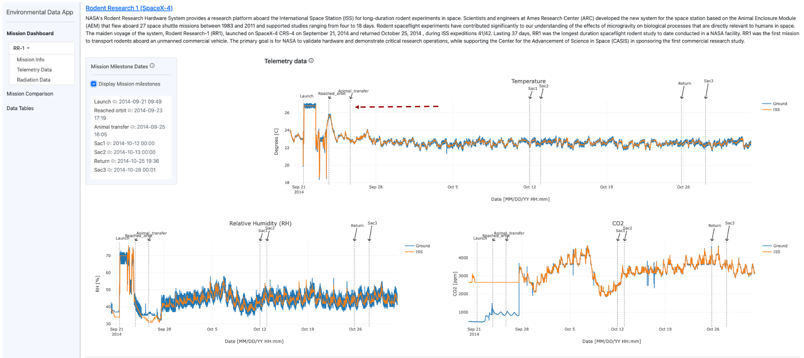<figcaption><p><em>Mulitple <strong>l</strong>ine graphs are displayed on a screen, depicting environmental data collected during rodent research mission 1. Line graphs are employed to illustrate temperature-related trends over time. The second graph is also a line graph, presenting humidity data. The third graph is a line graph that displays CO2 data gathered throughout the duration of the experiment. A red arrow draws attention to the "Display Mission Milestone" button.</em></p></figcaption></figure>


#### Radiation meta-data <a href="#ndmn2aynb6if" id="ndmn2aynb6if"></a>

In this tutorial, we will explore how to access the data presented in the line graphs related to radiation dose. These graphs provide valuable information on accumulated radiation dose, total radiation dose, South Atlantic anomaly, and galactic cosmic rays. By following the steps below, you can easily access and interpret the data from these graphs.

1. **Scroll down to view the Graphs:** The line graphs are titled "Accumulated Radiation Dose," "Total Radiation Dose," "South Atlantic Anomaly," and "Galactic Cosmic Rays."
2. **Understand the Data:** Each graph displays a line representing the data points. The x-axis typically represents time, while the y-axis represents the radiation dose or related measurements. Read the titles and labels on the axes to understand what each graph is measuring.
3. **Interpret the Accumulated Radiation Dose Graph:** Examine the "Accumulated Radiation Dose" graph to observe the trend of accumulated radiation dose over time. Pay attention to any significant changes or patterns in the line.
4. **Analyze the Total Radiation Dose Graph:** Study the "Total Radiation Dose" graph to understand the total radiation dose received over time. Compare the total radiation dose with the accumulated radiation dose to identify any differences.

<figure><figcaption><p><em>Screenshot showing 4 lines graphs depicting the radiation environmental metadata collected.</em> <em>Three-line graphs are displayed on a screen, depicting environmental data collected during rodent research mission 1. Line graphs are employed to illustrate “Galactic Cosmic Ray” trends over time. The second graph is also a line graph, presenting data related to the “South Atlantic Anomaly”. The third graph is a line graph that displays the “Accumulated Radiation Dose” data gathered throughout the duration of the experiment. The fourth graph is the “Total Radiation Dose” measure during their Mission. All graphs displayed mission miles stones.</em></p></figcaption></figure>

#### Select 1 or more Rodent Research (RR) missions. <a href="#slg932o9gcgx" id="slg932o9gcgx"></a>

To compare different RR mission environment data please select the RR mission # of interest from the provided options. Upon selection, the corresponding data will be displayed on the line graph.

* In the provided example, you can observe the temperature to which the samples were exposed during their respective missions.
  * Below the bar plot is a concise summary of this data, which can be downloaded for further analysis. The red arrows indicate the options for adding or removing data from a selection of RR missions.

<figure>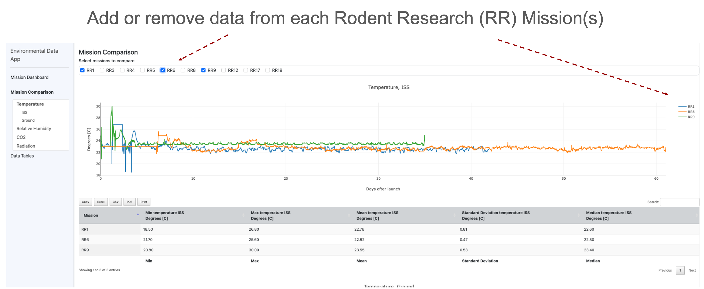<figcaption><p><em>A screenshot showing a line graph comprising of 3 lines depicting environmental data collected during RR1, RR9 and RR9. Line graphs are employed to illustrate temperature data gathered throughout the duration of the experiment. There is a table below that allows the user download the raw data in a variety of different formats including .CSV, .PDF, .excel, Copy or Print.</em></p></figcaption></figure>

#### Scroll down and download tables of radiation metadata <a href="#nkh0fclqgyf" id="nkh0fclqgyf"></a>

After selecting the RR missions of interest the user can then scroll up and down in the main window to analyse the corresponding data displayed on the line graph(s). The line graphs provide a visual representation of the data, making it easier to identify trends, outliers, and relationships between different variables.

* **Line plots and table(s) of data for download:** The application presents the selected data on the graph and also provides it for download in the table below.
  * In the provided example, you can observe the temperature to which the samples were exposed during their respective missions.

<figure>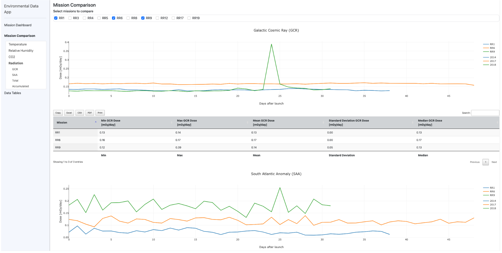<figcaption><p><em>A screenshot showing a 2 line graph comprising of radiation data reacored from either Galatic cosmic rays or the from the South Atlantic Anaoly (SAA) data collected during RR1, RR9 and RR9. Line graphs are employed to illustrate temperature data gathered throughout the duration of the experiment. There is a table below that allows the user download the raw data in a variety of different formats including .CSV, .PDF, .excel, Copy or Print.</em></p></figcaption></figure>


#### Comparison of the environmental measurements on the ISS and Ground. <a href="#v5ikgn3ddnhg" id="v5ikgn3ddnhg"></a>

The user can interact with the graph to access specific environmental data and zoom in or out of specific time periods. The comparison of CO2 levels between the ISS and the ground control offers insights into the challenges of maintaining a habitable environment in space. The left side of the interface allows the user to customize the graph by changing the environmental measurements being plotted from temperature to CO2 to relative humidity to radiation.

* The user is presented with a table that contains the collected data, providing the ability to easily download it for further analysis. By adjusting the parameters, the user can gain insights into the differences and similarities between the CO2 levels in the ISS and the ground control.
  * In this example, we have a comparison of the carbon dioxide (CO2) levels recorded in two distinct environments: the International Space Station (ISS) during research rotation 9 (RR9) and a ground control facility.

<figure>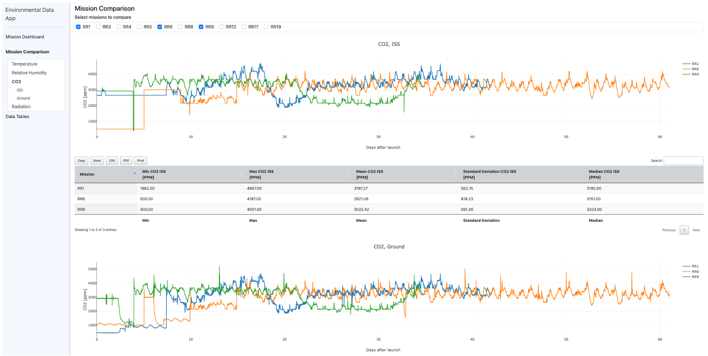<figcaption><p><em>A screenshot showing a line graph comprising of atmospheric CO2 data collected during RR1, RR9 and RR9. One graph displays the data from the ISS and the other displays the data from the “Ground” controls. There is a table below that allows the user download the raw data in a variety of different formats including .CSV, .PDF, .excel, Copy or Print.</em></p></figcaption></figure>

#### Tables of environmental meta-data with download option. <a href="#id-8w47c2b7crhc" id="id-8w47c2b7crhc"></a>

**The environmental data app allows users to access the underlying data tables for export.**

* The user can copy the data for pasting into reports or spreadsheets or download all the raw data in  .CSV, .PDF, excel, or send it _directly to “Print”._
  * _In this example, the screenshot has been adjusted so all 3 tables. The table is the summary data, the second is the telemetry data and the third is the radiation data._

<figure>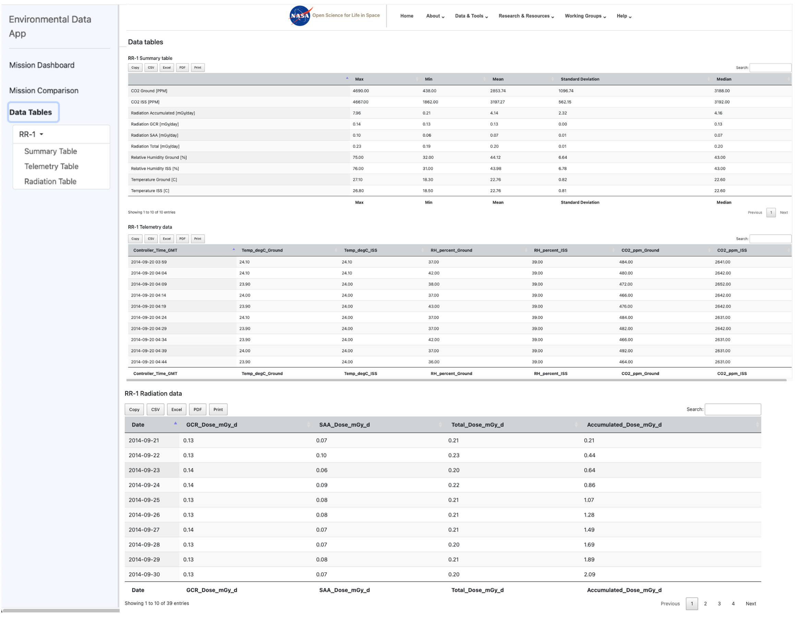<figcaption><p><em>Screen showing 3 data tables that can be accessed for downloading and further analysis. The first table shows the “Summary table of data”, the second contains the “Telemetry data” and the third contains the radiation data</em>.</p></figcaption></figure>

### [Summary of guidelines for Data Submission to OSDR](https://genelab.nasa.gov/guidelines-data-submission-osdr)

Welcome to the Open Science Data Repository (ODSR)! Below you will find guidelines for submitting space biology data.

#### Step 1: Review a Dataset <a href="#eb1p0k3oaubf" id="eb1p0k3oaubf"></a>

First, review one of the existing datasets in OSDR to become familiar with the format: [OSD-48](https://osdr.nasa.gov/bio/repo/data/studies/OSD-48)

#### Step 2: Create an Account <a href="#bszm20ml8vkq" id="bszm20ml8vkq"></a>

Follow [these instructions](https://genelab.nasa.gov/sites/default/files/2024-01/INSTRUCTIONS%20ON%20CREATING%20A%20NASA%20GUEST%20ACCOUNT%20TO%20ACCESS%20BDME.docx\_3.pdf) to create an account to submit data in the OSDR Submission Portal, the Biological Data Management Environment (BDME).

#### Step 3: Review Submission Tutorial <a href="#nphp99m5gjov" id="nphp99m5gjov"></a>

Before submitting your data, review this [tutorial on BDME data submission.](https://genelab.nasa.gov/sites/default/files/2024-01/BDME%20Tutorial\_v3\_noLoginInfo.pdf)

#### Step 4: Create a Study <a href="#faj02j4r6odm" id="faj02j4r6odm"></a>

Following the [tutorial on BDME data submission](https://genelab.nasa.gov/sites/default/files/2024-01/BDME%20Tutorial\_v3\_noLoginInfo.pdf), create a study or studies. (NOTE: If you have a NASA-funded study, and you have not yet filled out a Research Data Submission Agreement (RDSA), please contact Danielle Lopez at [danielle.k.lopez@nasa.gov](mailto:danielle.k.lopez@nasa.gov). Your RDSA will be used to create your study. If you already have an RDSA, your experiment record will have a study associated. You can create more studies as needed).

#### Step 5: Enter Metadata and Upload Data Files <a href="#id-68s941w2i9qs" id="id-68s941w2i9qs"></a>

OSDR organizes metadata into sample-level information and assay-level information. Data files are uploaded into the workspace and can be associated with each study.

* **Option 1:** Enter your metadata and upload files directly to [BDME User Interface](https://osdr.nasa.gov/bio/submission/console). Once completed, follow the instructions in the tutorial to submit your study to OSDR Curation for review.
* **Option 2:** Use the templates below to enter your metadata and submit the completed sample-level and assay-level metadata files to OSDR Curation at [arc-dl-osdr-data@mail.nasa.gov](mailto:arc-dl-osdr-data@mail.nasa.gov). Upload all data files to your [workspace](https://osdr.nasa.gov/bio/workspace-sso-login.html).

Below you will find a sample-level metadata template and assay-level metadata templates for the most common assay types. Use these to properly format your data prior to submission. If you don't see your experimental assay in the folder, please contact us so we can add it.

* [General Study and Sample-Level Metadata Templates](https://drive.google.com/drive/folders/1fbv9EI58PGRDByqZTNMsS-92850VbxKE)



* [Assay Specific Metadata Templates](https://drive.google.com/drive/folders/1wETFFf4MVoyGToAdmDh1nP7laNTKZvtt)



When possible, please use common acronyms as defined on the [OSDR Abbreviations Page](https://genelab.nasa.gov/sites/default/files/2024-01/OSKB-OpenScienceAbbreviations-020124-0900-2\_1.pdf). If your data has acronyms, scientific terms, or column names that need to be defined, please include a data dictionary. An example data dictionary can be found in dataset [OSD-618](https://osdr.nasa.gov/bio/repo/data/studies/OSD-618) (Files > Novel Object Recognition > Data Dictionary Files).



### **Questions?** If you have any questions during the data submission process, please contact the OSDR Curation team at [arc-dl-osdr-data@mail.nasa.gov](mailto:arc-dl-osdr-data@mail.nasa.gov). <a href="#dvb62bcd790t" id="dvb62bcd790t"></a>

### [Data Submission Portal](https://osdr.nasa.gov/bio/submission-sso-login.html)

The Biological Data Management Environment (BDME) is a web-based system that accepts submission of omics data from space-relevant experiments including spaceflight, radiation, simulated gravity, gravitropism, isolation and confinement, hostile closed environments and/or distance from Earth. The OSDR accepts studies whose design, assays and data types match those listed in the homepage, if yours is listed then please contact our curation team to help us add it.

#### Instruction on how to create a NASA Guest account to access the BDME <a href="#mis9z834yiru" id="mis9z834yiru"></a>

Go to https://guest.nasa.gov/. Or From the OSDR homepage, select the data and tools drop down and then select the “Submit Data”, then either register to create a new account or “log in”.

Sign up to create a new account with your email address.

**Logging into BDME:**

1. Go to Biological Data Management Environment ([BDME](https://osdr.nasa.gov/bio/submission-sso-login.html)), (or [Workspace](https://osdr.nasa.gov/bio/workspace-sso-login.html)).





Click on Log in (instead of Register account).

<figure>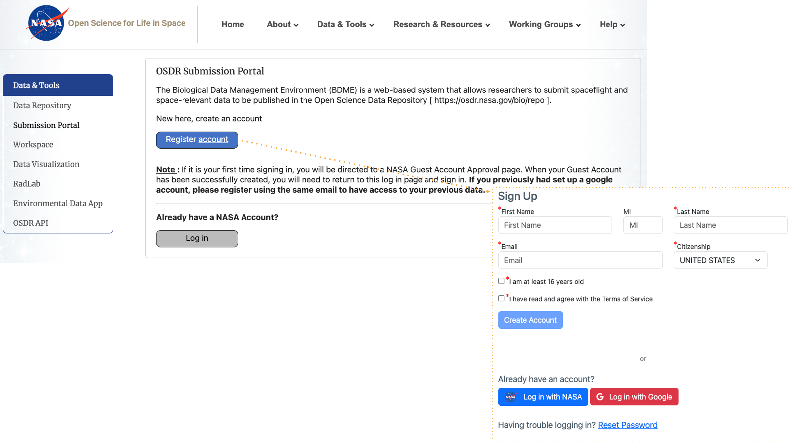<figcaption><p><em>Screenshot showing the login or register account options that provide access to the OSDR submission portal. A yellow arrow highlights the sign-up window that will open to help you create a new account. This will then launch the Guest Account Services window that will prompt the user to provide a password before creating an account.</em></p></figcaption></figure>

1. Create a new account.
   1. You will receive an authorization email with the subject of the email is “\[NASA Guest] Complete your Guest account registration”. Follow the link in the email to set up an account password. \* _If you have registered in GEODE before, please make sure to use the same gmail address so you can access your existing studies/files._
   2. Set up an account password. Your password must be 12 to 32 characters long, it must contain all three of the following four constraints, at least one upper case character, at least one lower case character, at least one number, and at least one special character (e.g. $, !, #, \*, @, %)
   3. The next screen will confirm that a link is sent to the email to complete registration.
2. Log in using your email address and password. _\* If you forgot your password please select the “Reset Password “ option._
3. Or if you have one use your NASA account to automatically log in.
4. In the access LaunchPad page, select Agency User ID. Then use your registered email address as the Agency User ID and the password that you just created.
5. The[ OSDR data submission console](https://osdr.nasa.gov/bio/submission/console) will open and provide access to tools to help you submit your data.



1. When you see "My Studies" page, you have logged into BDME successfully.
2. More detailed [instructions can be found here](https://genelab.nasa.gov/sites/default/files/2024-01/INSTRUCTIONS%20ON%20CREATING%20A%20NASA%20GUEST%20ACCOUNT%20TO%20ACCESS%20BDME.docx\_3.pdf)

{% embed url="https://genelab.nasa.gov/sites/default/files/2024-01/INSTRUCTIONS%20ON%20CREATING%20A%20NASA%20GUEST%20ACCOUNT%20TO%20ACCESS%20BDME.docx_3.pdf" %}


### Features of the data submission console: <a href="#upth8phtyd15" id="upth8phtyd15"></a>

The OSDR homepage, data repository, workspace, tutorials, and support resources are all accessible through the OSDR interface. The workspace allows users to manage files, while the tutorials guide on using OSDR. The FAQs, troubleshooting tips, and contact information assist with resolving any issues or inquiries.

1. The top bar menu shows links to the “OSDR home page”, “data\&tools”, “Research\&Resurces”, “Working Groups” and “Help” menus.
2. GEODE my dashboard button can be used to refresh the results page.
3. "Create new study" – link that allows users to create a new study while incorporating experimental factors. You can find a tutorial on how to submit data through [GEODE](https://genelab.nasa.gov/help/tutorials/GEODE).
4. My studies – allows users to view current studies submitted via [GEODE](https://genelab.nasa.gov/help/tutorials/GEODE), users can exit using the “logout” link or by closing the browser tab.
5. Summary - enter some text that summarizes the study being added to or found in the OSDR database.

**All:** shows data that is in various stages of submission.\
**Submitted:** The link allows users to see only data that has been submitted.\
**In Curation:** The link shows only data that is in curation.\
**In Review:** This link allows users to only see data that is in review.

<figure><figcaption><p><em>Screenshot of the OSDR home page. It has been labelled 1 to 5. The first #1 highlights the OSDR navigation panel, #2 highlights the dashboard refresh button, #3 highlights both the create new study and help panel links. #4 highlights the studies being processed and the #5 highlights where the summary information can be found for an example study.</em></p></figcaption></figure>


### Biological Data Management Environment (BDME) Tutorial <a href="#r4e59dp88icz" id="r4e59dp88icz"></a>

**To create a study use the following instructions (**[BDME data submission tutorial](https://genelab.nasa.gov/sites/default/files/2024-01/BDME%20Tutorial\_v3\_noLoginInfo.pdf)**)**

{% embed url="https://genelab.nasa.gov/sites/default/files/2024-01/BDME%20Tutorial_v3_noLoginInfo.pdf" %}

#### “Create New” <a href="#ltsxld960tlt" id="ltsxld960tlt"></a>

**1**. Click on the “Create New” button&#x20;

**2.** Select “Create a Study”

* In this example the data is not from a NASA-funded grant, which is highlighted in blue, so the user can click “Next” to create the new OSDR-# accession.

<figure><figcaption><p><em>Screenshot showing the welcome page to the guided submission portal.</em></p></figcaption></figure>

#### “Select factor”

**3.** **Choose a factor:** The drop-down list that best describes the subject matter of your study and then click “Let’s get started.” If a pertinent factor is not listed, click on “Other” to email the curation team for review.

* In this example, the user has selected “Gravitropism”.

<figure><figcaption><p><em>Screenshot showing the Factor option stage during the guided submission portal.</em></p></figcaption></figure>

**4.** There is nothing to do at this stage of the guided submission.

* At this stage click “Let’s get started”

<figure><figcaption><p><em>Screenshot showing the welcome page lets get started.</em></p></figcaption></figure>

#### “Raw data can be uploaded later.” <a href="#gjwm03s1ykg3" id="gjwm03s1ykg3"></a>

**5.** **Raw data files are required:** as they are best for downstream analysis and modeling. Uploading raw data files can be done at any time, so you can select “I will upload files later” and click “Next” for now. This system lets you upload files easily and provides the flexibility to do it later if you want. But remember, the files need to follow certain metadata rules and formats to make sure they're compatible and can be processed quickly.

* In this example, we’re selecting “upload files later” so we can get familiar with the system before uploading our results and raw data.


_**Alt text:** Screenshot showing the I will upload files later stage at the initiation of a new study._

#### “Create a new OSD-# and DOI” <a href="#l8ejqtaudeyc" id="l8ejqtaudeyc"></a>

**6.** **Create a new study, OSD identifier and DOI:** Creating a new study will provide you with an OSDR accession number and a unique DOI are assigned to your study that can used when submitting papers for peer review. When you see this screen, a new study has been created successfully and you can start curating your research for greater integration into the OSDR metadata matrix.

* In this example screenshot shot you can see how a new study is given a unique OSD ID number and data set DOI which can be used to reference the dataset.

<figure>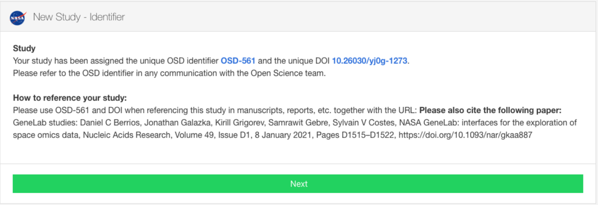<figcaption><p><em>Screenshot shows that the new study has been given a unique OSD ID and data set DOI which can be used during future paper publication process.</em></p></figcaption></figure>

**7.** **You are now ready to enter metadata and upload data files:** OSDR helps organise metadata into sample-level information and assay-level information. Data files are uploaded into the workspace and can be associated with each study based on metadata.

There are 3 ways to proceed from here.

* **Option 1: Manuscript-guided auto-populate metadata.**
* **Option 2: Manually** enter your metadata and upload files directly to [BDME User Interface](https://osdr.nasa.gov/bio/submission/console). Once completed, follow the instructions in the tutorial to submit your study to OSDR Curation for review.
* **Option 3:** **Use the templates** below to enter your metadata and submit the completed sample-level and assay-level metadata files to OSDR Curation at [arc-dl-osdr-data@mail.nasa.gov](mailto:arc-dl-osdr-data@mail.nasa.gov). Upload all data files to your [workspace](https://osdr.nasa.gov/bio/workspace-sso-login.html).

Below you will find a sample-level metadata template and assay-level metadata templates for the most common assay types. Use these to properly format your data prior to submission.

* [General Study and Sample-Level Metadata Templates](https://drive.google.com/drive/folders/1fbv9EI58PGRDByqZTNMsS-92850VbxKE)
* [Assay Specific Metadata Templates](https://drive.google.com/drive/folders/1wETFFf4MVoyGToAdmDh1nP7laNTKZvtt)

If you don't see your experimental assay in the folder, please contact us so we can add it.

#### Entering the study description using publication (Option 1) <a href="#jsbuv8iudmls" id="jsbuv8iudmls"></a>

**7.1. The page explains how to proceed with guided submission or skip to the study overview section when submitting a study.**

Guided submission offers step-by-step guidance for new users or complex studies but requires a pre-published paper to guide the process. Users can also choose to skip guided submission and directly provide an overview of their study, including purpose, methods, and procedures. Regardless of the chosen path, both options lead to the final step (step 8) where users can review and make necessary changes before submission to the OSDR. Additionally, users can stop at any point and resume editing later, ensuring flexibility throughout the submission process.

* In this example we can see the user has got the study description stage, they now have the choice to add their Study design description manually or provide a DOI or PubMed ID to automate the metadata field completion.

<figure><figcaption><p><em>Screenshot showing the study description creation page, at this stage the user can decide to import study description from a DOI or PubMed ID or can choose to enter the information and metadata manually.</em></p></figcaption></figure>

#### Guided Submission (Option 1) <a href="#zfgxamnggn4b" id="zfgxamnggn4b"></a>

**7.2. There is a lot of information required to populate all the fields, but if you’ve already published a peer review paper then the guided submission process can help.**

Enter the following information, this can be done at a time that is convenient and by clicking on the “Next” button you can navigate through the process so you can familiarize yourself with each stage.

* **Study Design Description:** use an ontology if available.
* **Study Title:** Use the primary paper title or a related phrase.
* **Study Summary:** a brief description of the study. You can also enter the abstract of the publication, there is a 60-character minimum for this field.
* **Study Contact:** the principal investigator and the submitter are required to be listed in a dataset.
* **Manuscript:** enter DOI or PMID to add a manuscript (s).

<figure>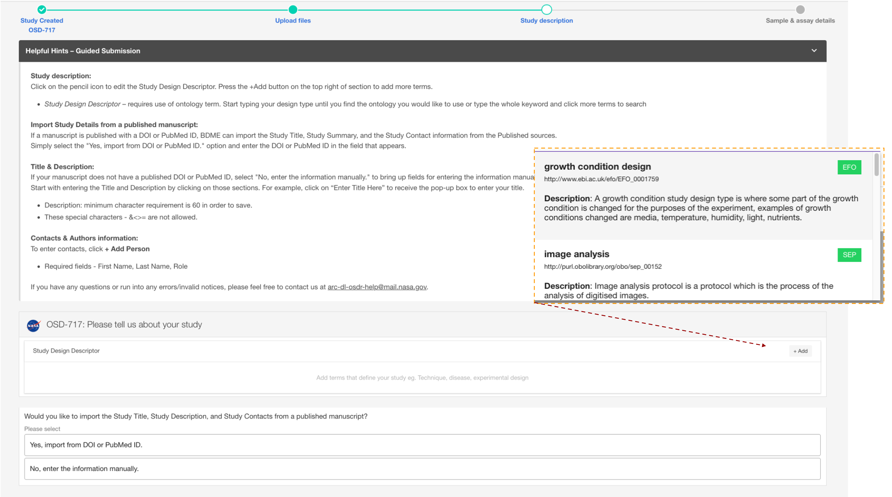<figcaption><p><em>Screenshot shows the study description creation page with a red line highlighting how the user can choose to enter the Study Design Description information and metadata manually. The diagram has been highlighted to show how the ontology database assists with field completion. A red dashed line points at the “+Add” button that allows users to add study descriptions.</em></p></figcaption></figure>


#### Guided Submission adding assays (Option 2) <a href="#lyn1gotgb7a8" id="lyn1gotgb7a8"></a>

**7.3** **Click and add study design information related to your study.**

You’ll be able to select the Measurement, Technology type and Platform applicable to your data.

Click “Next" to go to the next step and populate assay info later.

* In this example the assay type measurement type was transcriptional profiling, the technology type is still to be selected in the drop-down menu.

<figure>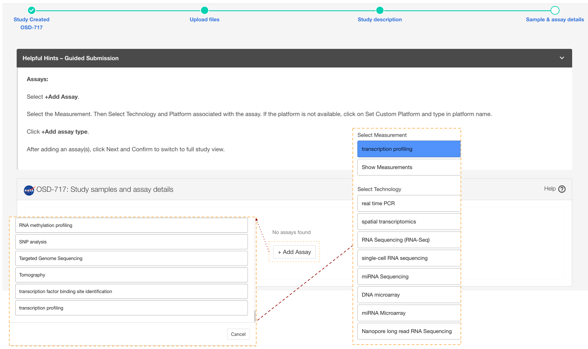<figcaption><p><em>Screenshot showing that the guided submission process allows you to add metadata related to your assay type. The red dotted line shows the first set of ontology-defined options the user is presented with, the yellow dashed boxes highlight how a highly curated “nested” ontology database can be used to assist your definition of assay type.</em></p></figcaption></figure>

#### Unguided Submission (Option 3) <a href="#id-7tbvts4rcnin" id="id-7tbvts4rcnin"></a>

**8. ´Enter your study title, and description and click to list people who participated in the study if you have not done so in the previous steps.**

The principal investigator and the submitter are required to be listed in a dataset along with other members of the primary research team. Other metadata concepts such as project type, flight program, or NASA center can all be added. “Funding source(s)”, “Experimental platforms”, “Sponsoring agency” and “Acknowledgements” are all free text fields allowing the data submitters to provide links to previous project ID’s and data management plans.

* In this example, 3 highlighted pop-out boxes show some of the options in the Project Types, Flight Program and NASA center are linked via red arrows to the pop-up windows that provide the user with a list of options to select from.

<figure>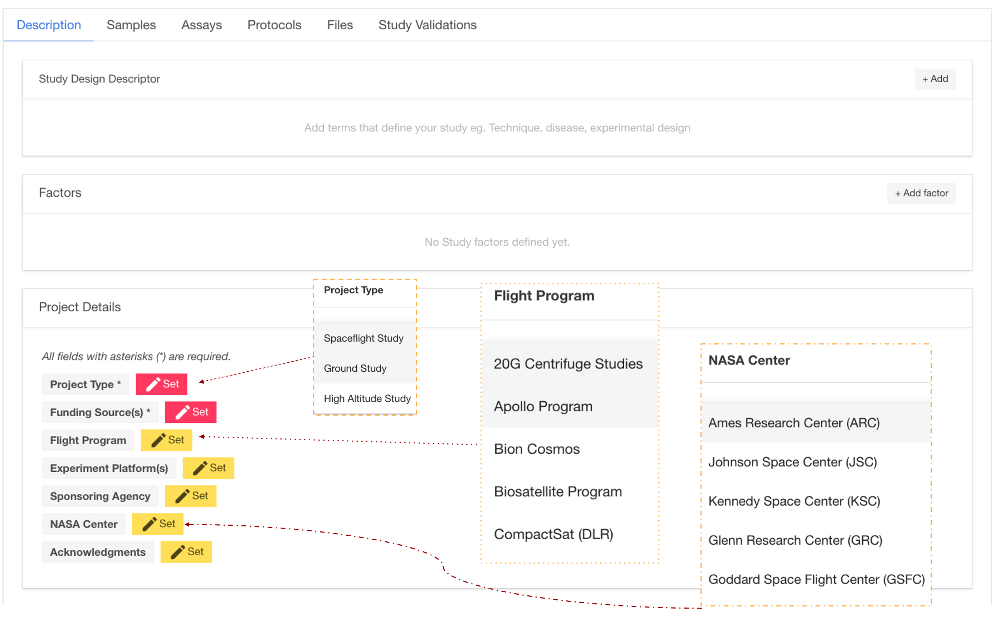<figcaption><p><em>Screenshot showing the user interface that allows users to input metadata related to their study. 3 highlighted pop-out boxes show some of the options in the Project Types, Flight Program and NASA center. Red lines and arrows highlight the assisted completion options that are available for uses, the other key project details can be completed with text-based answers.</em></p></figcaption></figure>

#### Study description <a href="#eg5v4cb4728w" id="eg5v4cb4728w"></a>

**8.1. The study description needs the user to input text but provides guidelines for creating a detailed study design descriptor.**

The description is intended to provide comprehensive information about the study to facilitate understanding and reproducibility. It includes sections on study design, factors studied, project details (funding, institutions, and principal investigators), mission description (for spaceflight studies), data source, and data submission information.

* In this example, the user has selected to add publication as it contains the information required to populate the study description and is in the process of entering data into the publication metadata fields.

<figure>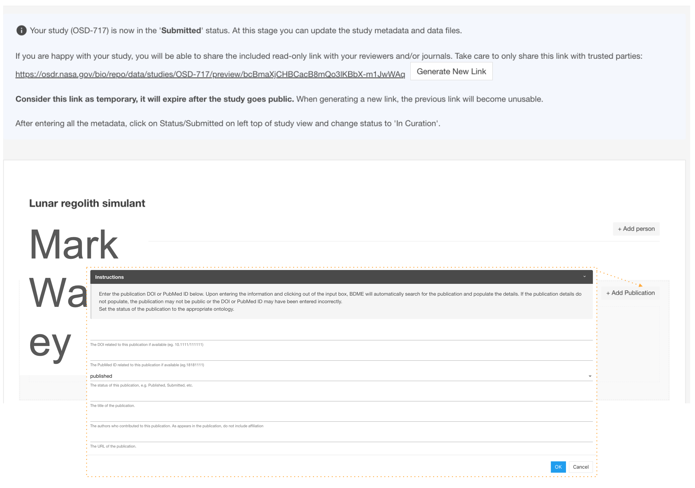<figcaption></figcaption></figure>

_**Alt text:** Screenshot showing the user interface that allows users to “Add person” as co-investigators and enter descriptions of the experiment. The “+Add publications” button has been highlighted and the pop-up menu shows the instructions that guide the submission process._

#### Protocols <a href="#nemxckfukhpa" id="nemxckfukhpa"></a>

**8.2.** **You will need to describe the protocols you used to generate samples for analysis with your assay(s) of choice.**

If you have added an assay in the previous steps, you will find a list of default protocol sections for the assay chosen to be populated. If you haven’t added an assay, you can first go to the "Assays tab" and add an assay then return to the “Protocols tab” to populate all the protocols. Adding a protocol parameter to a sample this way allows the user to use the preexisting ontology database making it easier to connect with other studies in the Open Science Archive.

* In this instance, the "add parameters" button has been emphasized, and a pop-up window reveals the existence of a nested ontology database intended to guide in the addition of recognized factors. Moreover, it facilitates the user's input of a parameter value that is not present in the ontology as free text.

<figure>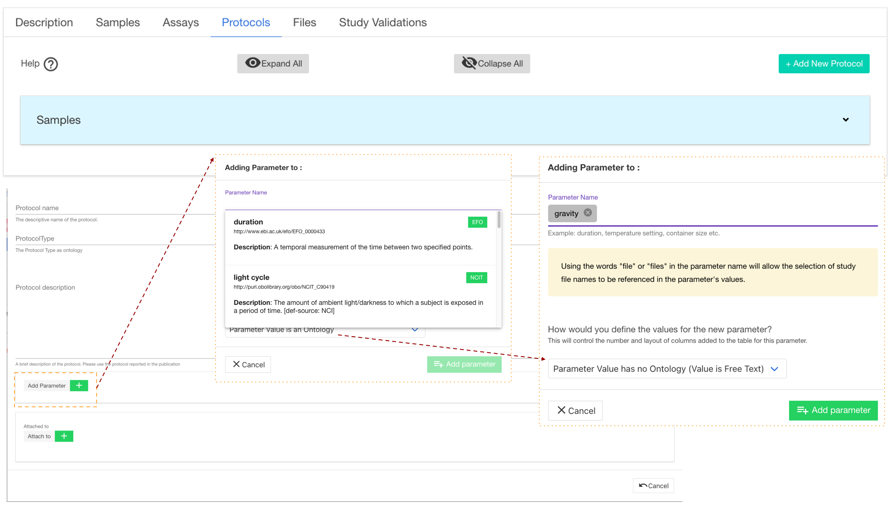<figcaption><p><em>Screenshot showing the user interface that allows users to add information about the protocols that were used. The add parameters button has been highlighted, the image shows that there is a ontology database to help guide the addition of known factors. It also allows the user to enter a parameter value that no ontology as free text.</em></p></figcaption></figure>

#### Samples <a href="#uh5k2fqxl096" id="uh5k2fqxl096"></a>

**8.3.** **You will need to provide descriptions of your samples and the metadata that was collected during your study.**

To provide detailed information about samples up to the point of collection, create one row per sample and select an applicable ontology term, if available. To initiate this process, select the sample's characteristic column and add pertinent metadata such as organism, tissue type, age at harvest, preservation method or other relevant options.

* The screenshot below illustrates how users can add characteristics to their sample metadata sheet.
* Currently, there are no samples loaded.
* In this example the samples have been highlighted, it shows it currently doesn’t have any sample field associated.
* In the second panel, we can see that the “Characteristic” tab has been selected to highlight some of the category options such as organism, organism part, and variant or allows you to provide free text.

<figure>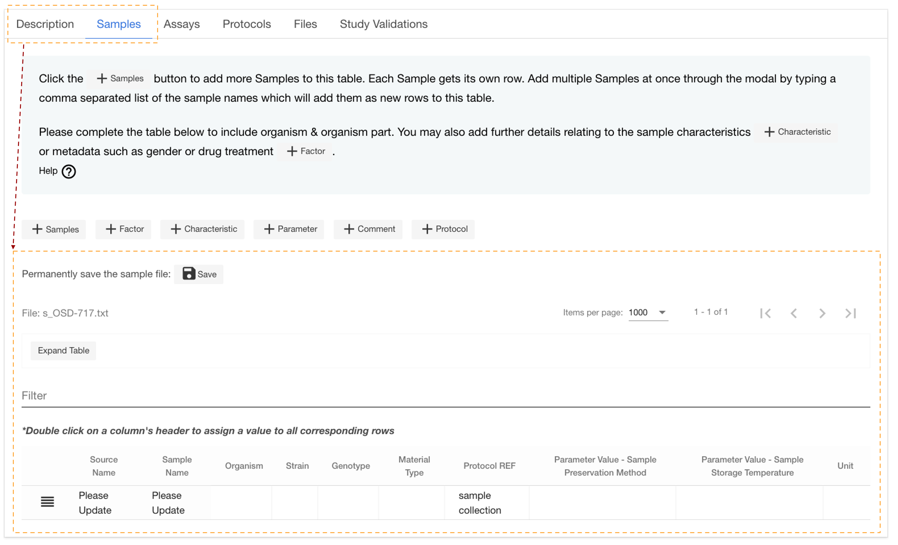<figcaption></figcaption></figure>

<figure>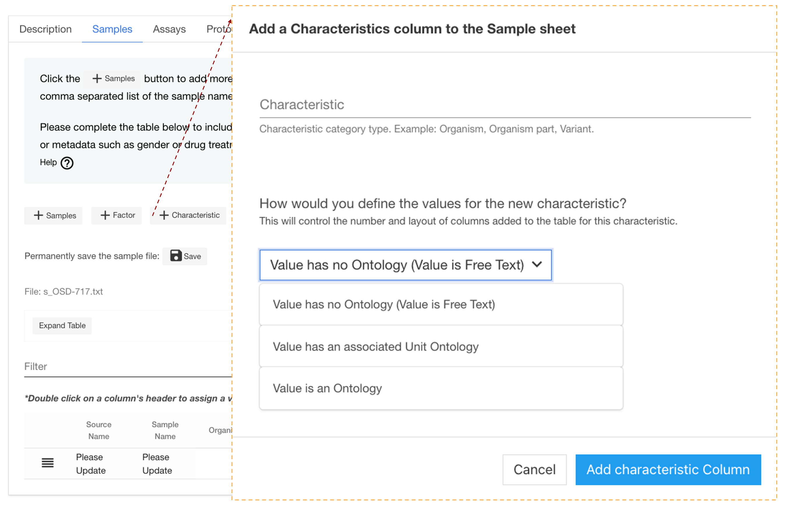<figcaption><p><em>Screenshot showing the user interface that allows users to add information about the samples that were used. The add characteristics button has been highlighted, the image shows that there is an ontology database to help guide the addition of known factors. It also allows the user to enter a parameter value that no ontology as free text.</em></p></figcaption></figure>

#### Assays

**8.4 You will need to provide descriptions of the assays you used to assess your samples.**

To populate assay level information, beginning with extraction, with one row per sample and select an ontology term if relevant. At the conclusion of the table, identify the sample-to-file relationship. In this illustration, clicking on the "add assay" button opens a pop-out window, allowing the user to choose a measurement type, which then provides a secondary option for selecting the technology type and even the precise platform.

* For example, area measurements derived from image analysis using photography enabled by the camera platform, which is as specific as possible, in this instance, “Cannon EOS rebel”.

<figure>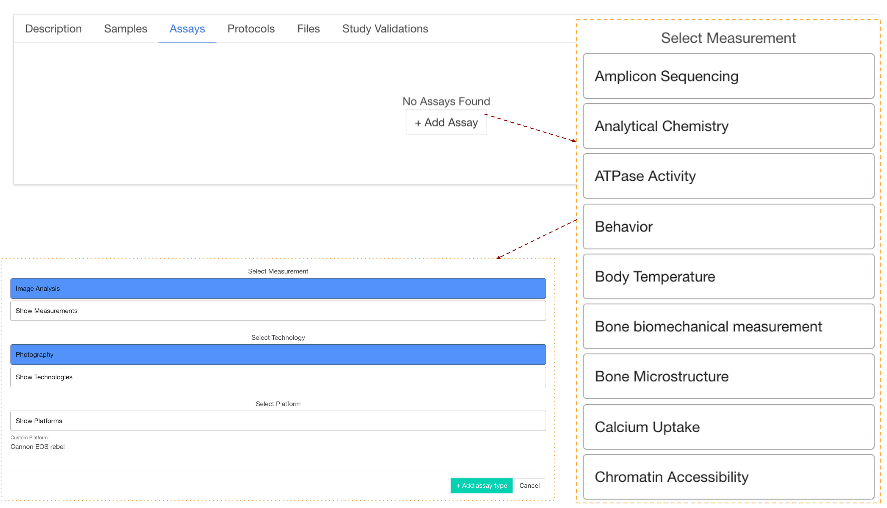<figcaption><p><em>Screenshot showing the user interface that allows users to add information about the Assay that was used to analyze the samples. The “add Assay” button has been highlighted, the image shows that there is an ontology database to help guide the addition of known technologies and platforms. Red arrows show how a nested series of ontology databases assist the user in defining their experimental setup.</em></p></figcaption></figure>

#### Files in the BDME <a href="#veb8eegkhy1h" id="veb8eegkhy1h"></a>

**8.5 You can save your data files in your BDME account which is also connected to your Workspace account.**

You can upload files by dragging and dropping them onto your “home folder” and then associate them with your studies in the OSDR at a later date after they have been uploaded (This time varies depending on your interest connection speed). Please provide compressed individual raw data files (e.g. .fastq.gz or .CEL.gz etc.) and do not archive multiple files as zipped archives. See this [“Frequently Asked Questions](https://genelab.nasa.gov/faq#5,)” page, for accepted file types. After uploading files, click and open unfold the folder.

* In this example, we can see that the user's home folder contains their username “Mark Watney” and data folders nested inside that. This workspace contains the original raw data files and their processed results and some important intermediate file formats produced during the analysis. The yellow arrow highlights how users can drag and drop their data into their workspace from their desktop computer.

<figure>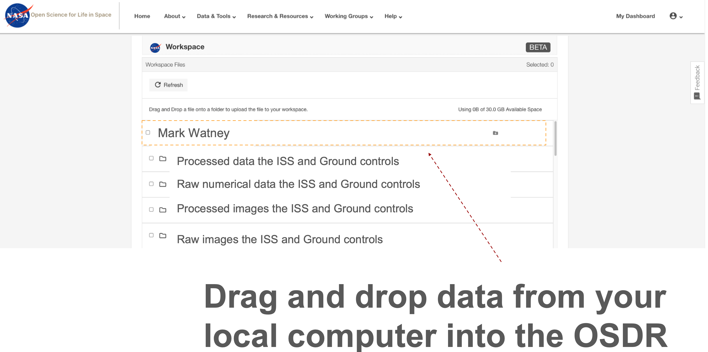<figcaption><p><em>Screenshot showing an OSDR user workspace environment. In this folder, the user “Mark Watney” has a home folder that contains the raw and processed data from a spaceflight-related mission. The red arrow highlights how the user can simply drag and drop their data into their workspace from their desktop computer.</em></p></figcaption></figure>

**Associate data files with an OSDR study:**

**8.6. Once you’ve created an OSDR study and provided a basic summary of the project you’ll want to associate the raw data files in the workspace to a “resource category”.**

Assuming you’ve already drag and drop the data files to your Workspace folder, this can be achieved by selecting the file(s) and assigning it an ontology-guided resource category, this then provides the subsequent options of resource subcategories. After defining the data resources metadata the user can then associate it with the their study.

* In this example we can see “Mark Watney” has selected “Raw image files” and then the appropriate Resource Category/Subcategory which would be “Raw image file”, so the user can select the type of data they want to associate with their study. Click to confirm that all the files are associated.

<figure>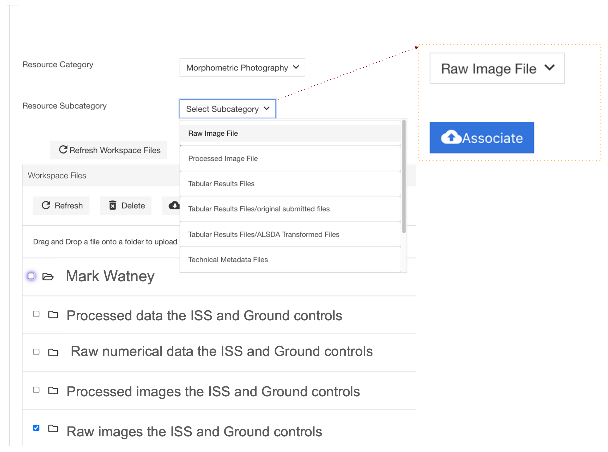<figcaption><p><em>Screenshot showing how users can associate their raw data with metadata resources category. Most categories have subcategory that also needs to be defined. After selecting the data subgroup the user can then associate their raw data with this ontology term. A red arrow highlights that after selecting the subcategory associated with their data they can then click on the blue associate button to link their data to their OSDR study repository.</em></p></figcaption></figure>

#### My Dashboard & Preview <a href="#h19r10ww5n74" id="h19r10ww5n74"></a>

**9. You can preview the study by clicking next to My Dashboard on top right corner anytime.**

The preview button allows users to create a demo OSDR page, the preview page reflects the latest version of your OSD-# page so remember to save the metadata before viewing it. A read-only preview link will also be provided for you to share with your reviewers and/or journals. Use the arrow pointing down to access their account and potentially choose to log out.

<figure><figcaption><p>The top right corner of the screen has buttons for viewing the study dashboard, creating a demo OSDR page, and accessing account settings or logging out. The preview button makes a demo webpage that allows to view what your OSDR study page will look like after you make it public.</p></figcaption></figure>

#### Study Status Review <a href="#f7yzyrqsc1g2" id="f7yzyrqsc1g2"></a>

**10. Complete metadata validation can take some time to achieve**

The Open Science Data Repository (OSDR) provides a data curation team dedicated to assisting researchers in ensuring the quality and completeness of their metadata entries. This team is available to review and provide guidance on metadata, ensuring that it meets the required standards and best practices.

To initiate the data curation process, researchers can select the "Study Validation" tab within the OSDR platform and click on the "Submit" button. This action triggers a validation test that summarizes the status of the repository, providing valuable insights into any potential issues or areas requiring attention or addition of more information.

Once the validation test is complete, the status of the study in the left panel will change to "In Curation" or another relevant status, such as "Submitted." During the curation process, the OSDR curation team will thoroughly review the study metadata, ensuring its accuracy, completeness, and compliance with the repository's standards.

It's important to note that once a study enters the curation status, researchers will temporarily lose the ability to make changes to the metadata. This is to ensure the integrity and consistency of the curation process. The OSDR curation team will contact researchers if any missing information is identified or if changes are needed to meet the repository's curation standards. After the curation team has completed their review, researchers will receive the updated metadata for final review. This provides an opportunity for researchers to verify the changes made by the curation team and ensure that the metadata accurately represents their study.

_**Alt text:** Screenshot highlighting that on the left of the page is a “status” box, clicking on the validation button causes the OSDR to scan the repo and provide reports on how complete the meta-data fields are. By leveraging the expertise of the OSDR data curation team, space biology researchers can benefit from a streamlined and efficient curation process. The team's guidance and support ensure that metadata is of the highest quality, facilitating data discovery, reuse, and reproducibility in the scientific community._

### Contact us <a href="#id-6sf2d6eiaxo7" id="id-6sf2d6eiaxo7"></a>

If you have any questions or issues, please contact us at [arc-dl-osdr-help@mail.nasa.gov](mailto:arc-dl-osdr-help@mail.nasa.gov).

The default quota of the Workspace account is 30GB, please reach out to us if you need more space.


<figure>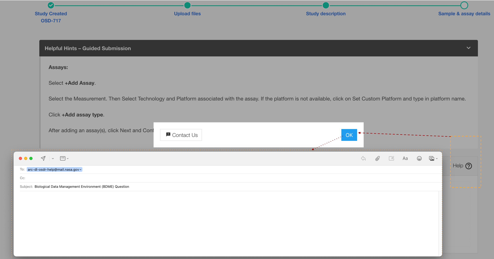<figcaption><p><em>Screenshot showing how to create a e-mail to contact the OSDR. An orange box highlights the help button, then red arrow show how a popup box will automatically start an email conversation with the annotation team.</em></p></figcaption></figure>

### RadLab <a href="#typih5j0h9wr" id="typih5j0h9wr"></a>

**Please follow this link to access the** [**RadLab OSDR Visualization application**](https://visualization.osdr.nasa.gov/radlab/gui/data-overview/)**.**



The OSDR RadLab application is a valuable tool for researchers and scientists who need access to radiation measurements from space. The application provides a central repository for radiation data from a wide variety of sensors that have flown on various spacecraft. This makes it easy for users to find and access the data they need, regardless of the specific sensor or spacecraft that collected it.

The OSDR RadLab application is also a powerful tool for data analysis. It provides a variety of features that allow users to visualize, analyze, and compare radiation data. This can be helpful for identifying trends and patterns in the data, as well as for understanding the effects of radiation on different materials and systems.

One of the most important features of the OSDR RadLab application is its ability to connect primary radiation data with metadata such as vehicle and time. This information is essential for understanding the context in which the radiation data was collected. It can also be used to filter and sort the data, making it easier to find the specific information that users are looking for.

The OSDR RadLab application is a valuable resource for researchers and scientists who need access to radiation measurements from space. It is a powerful tool for data analysis and visualization, and it can help users to understand the effects of radiation on different materials and systems.

#### **Data overview page** <a href="#txgh0vy0ejzk" id="txgh0vy0ejzk"></a>

**When you first land on the RadLab you start in the “data overview” page.**

This page summarizes the different sensors, the time they were collecting data and the space vehical they were on. The graph is interactive so the users can select subsets within the data to drill down and the graph will rearrange to optimize the data visualization. On the bar on the left the user can then navigate down to a range of different visualization options.

<figure>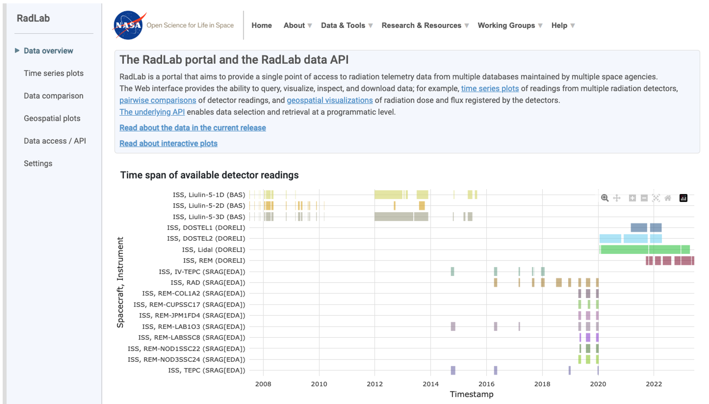<figcaption><p><em>Screenshot of a data overview webpage titled “RadLab portal and the RadLab data API” on the NASA website. The page shows a time graph of available detector readings. The y-axis shows the number of detectors and the x-axis shows the timespan.</em></p></figcaption></figure>

#### RadLab Time series line plots <a href="#j9p2w6eomst7" id="j9p2w6eomst7"></a>

**When you first land on the Time series plot page the graphs initially appear empty**

This page allows users to view the radiation data but requires users needs to define the periods and sensors of interest.

* In this example, a Red arrow highlights how users can quickly load a preselected period to help get familiarized with the interface.
* Select either “Total dose rate” or “Total flux” values.
* The user can alternate between a “Linear” and “Log” scale.

<figure>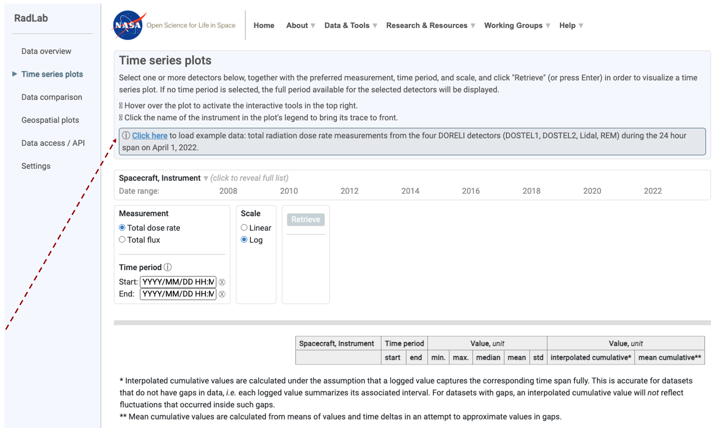<figcaption><p><em>Screenshot of a data overview webpage titled “Time series plots” on the NASA RadLab website. On the initial landing page doesn't contain any data, the red arrow highlights the “click here” button that loads an example data set. There is an empty template that shows time on the x-axis and provides the user with the chance to load different spacecraft, instruments or specific time period.</em></p></figcaption></figure>

#### Selecting periods for closer inspection <a href="#fo72k5ccrlpg" id="fo72k5ccrlpg"></a>

In this example 4 sensors have been selected for a 2-day period, an orange box highlights how a user can click on the graph and make a selection lasso to define a smaller region such as a 5-hour period as highlighted by the red arrow. The user can then explore the graph using the mouse to reveal metadata about the spacecraft, instrument, data source, time stamp, and total dose rate.

<figure>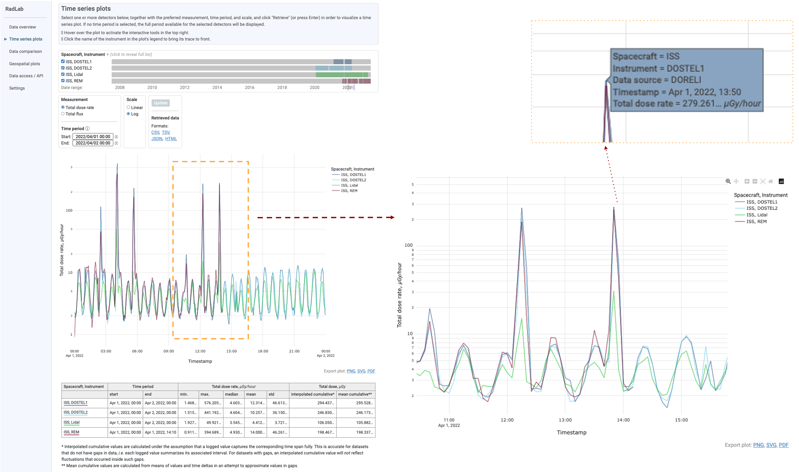<figcaption><p><em>Screenshot of a “Time series plots” on the NASA RadLab website. On the initial landing page, an orange box highlights periods that were selected by clicking on the screen. To the right is the zoomed-in view that shows these data with greater resolution. The orange dotted box shows that when the user moves the mouse over the graph additional data is shown. Time on the x-axis currently shows 3 different types of sensors on the ISS.</em></p></figcaption></figure>


#### Data comparison <a href="#r1egtxz201kr" id="r1egtxz201kr"></a>

In this example, the user has selected a specific point in time and have decided to use regression to compare the results from 2 different types of sensors. The images show the meta options that were used to compare the REM and Lidal sensors. The orange dashed lines show how the user has selected. Region of the graph, this then updates allowing the user to see the data at a high resolution. The 3rd inserts zoom in to show that these graphs are interactive allowing the user to highlight specific data points using their mouse to acquire further information as to how that data point was acquired.


<figure>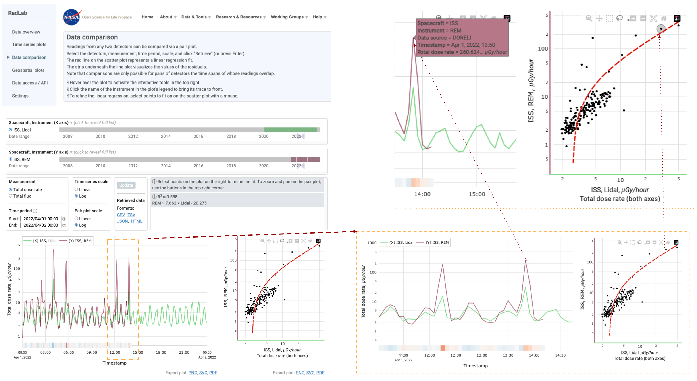<figcaption></figcaption></figure>

_**Alt text:** Screenshot of a “Data comparison” on the NASA RadLab website. On the initial landing page, an orange box highlights the periods selected by clicking on the screen. To the right is the zoomed-in view that shows these data with greater resolution and allows the user to linear regression comparing different combinations of sensors. The orange dotted box shows that when the user moves the mouse over the graph additional data is shown. Time on the x-axis and currently shows 3 different types of sensors on the ISS._

#### &#x20;<a href="#rtxkc7ji9cn8" id="rtxkc7ji9cn8"></a>

#### Geospatial plots <a href="#w4tmxbok3f7q" id="w4tmxbok3f7q"></a>

**When the Geospatial plots page loads it starts empty.**

In the example below we’ve highlighted that there is a demo option that loads data from the lidal detector for the year of 2022.

<figure>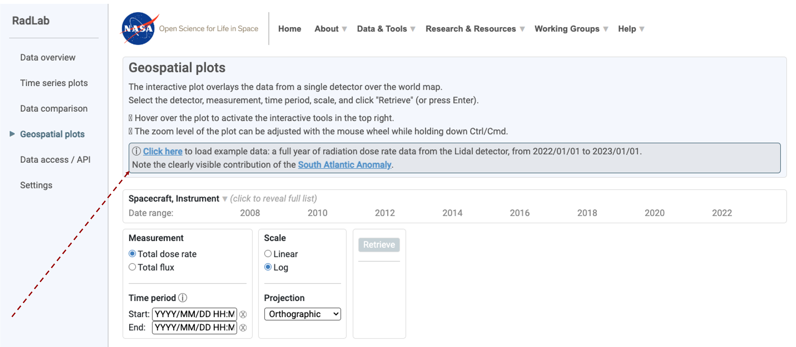<figcaption></figcaption></figure>

_**Alt text:** Screenshot of a data overview webpage titled “Geospatial plots” on the NASA RadLab website. On the initial landing page, a red arrow highlights the “click here” button that loads an example dataset. There is an empty template that shows time on the x-axis and provides the user with the chance to load different spacecraft, instruments, or specific time period._

#### Geospatial orthographic projection <a href="#id-7rjstjqv0fx9" id="id-7rjstjqv0fx9"></a>

The geospace plot page contains information about the spacecraft, the time period, the instrument, the measurement type, the scale of data transformation, the current projection type being used and also allows the users to down the data as a .csv, .txt, .json, and/or .HTML.

* In this example the demo data from 2022 has been loaded, the log scale selected, allowing us to the Total dose rate as measured by the Lidal sensor.

<figure>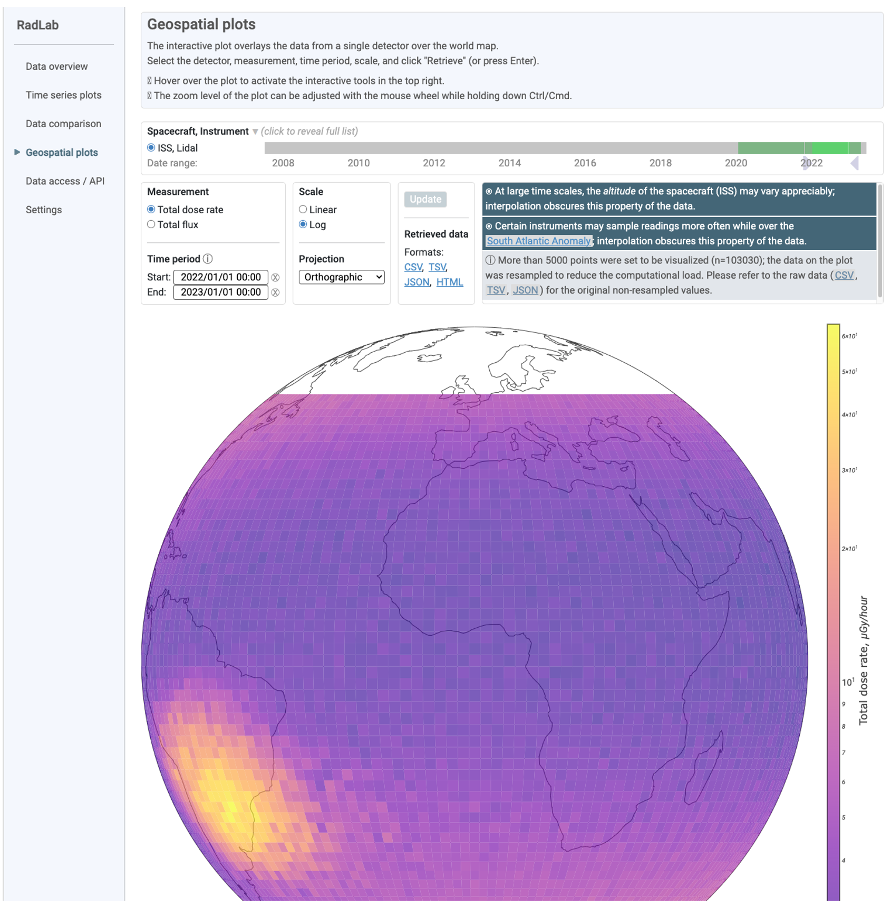<figcaption></figcaption></figure>

_**Alt text:** Screenshot of a Geospatial data overview webpage on the NASA RadLab website where the example dataset has been added, it shows data from an ISS Lidal sensor from a period of 2020-2022 as an orthographic projection. The data is then plotted on the map showing a radiation hot spot above the South Atlantic Ocean._

#### Other Geospatial options <a href="#id-2dua0qehws7m" id="id-2dua0qehws7m"></a>

The RadLab allows users to change the type of geographical pot they use to present the data. In this example, we can see a comparison of 2 different methods, the equal Earth and natural earth. We recommend you explore them all and choose the one that is best for you.

<figure>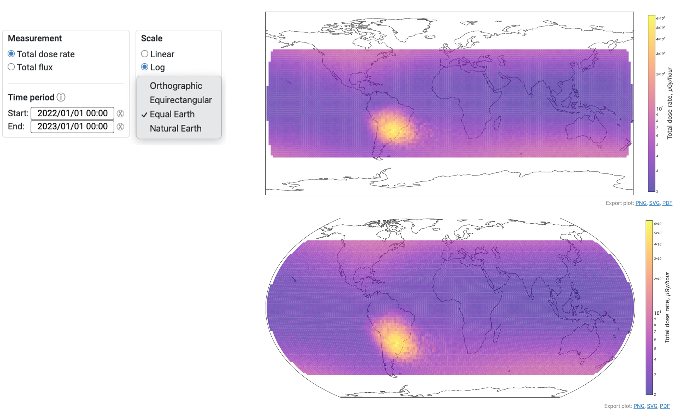<figcaption></figcaption></figure>

_**Alt text:**_ _Screenshot of a data overview of 2 different ways to project the data with an insert showing the options that currently include Orthographic, Equirectangular, Equal Earth, and Natural Earth. The example dataset has been added, it shows data from an ISS Lidal sensor from the period of 2020-2022. The data is then plotted on the map showing a radiation hot spot above the South Atlantic Ocean._

#### RadLab sensor color definitions <a href="#p0ccotkc25gv" id="p0ccotkc25gv"></a>

This page provides a list of all instruments in RadLab, along with the data source, the spacecraft, and the color that RadLab uses to define them through the analysis. This page also reminds users to clear their “cookies” is they have previously saved any settings.

<figure><figcaption><p><em>Screenshot of a NASA RadLab website “Settings” page, it lists all the instruments that are currently in the RadLab database. The data is then plotted on the map showing a radiation hot spot above the South Atlantic Ocean.</em></p></figcaption></figure>


### &#x20;<a href="#lqe4n3fweleg" id="lqe4n3fweleg"></a>

### Open Science Data Repository Public API <a href="#fsy8ob44zzs" id="fsy8ob44zzs"></a>

NASA OSDR provides a RESTful Application Programming Interface (API) to its full-text search, data file retrieval, and metadata retrieval capabilities. The API provides a choice of standard web output formats, either JavaScript Object Notation (JSON) or Hyper Text Markup Language (HTML), of query results. The Data File API returns metadata on data files associated with dataset(s), including the location of these files for download via https. The Metadata API returns entire sets of metadata for input study dataset accession numbers. The Search API can be used to search dataset metadata by keywords and/or metadata. It can also be used to provide search of three other omics databases: the National Institutes of Health (NIH) / National Center for Biotechnology Information's (NCBI) Gene Expression Omnibus (GEO); the European Bioinformatics Institute's (EBI) Proteomics Identification (PRIDE); the Argonne National Laboratory's (ANL) Metagenomics Rapid Annotations using Subsystems Technology (MG-RAST).

In addition to study datasets, NASA OSDR also hosts metadata for 7 other data types: experiments, payloads, subjects, biospecimens, missions, vehicles, and hardware. The API for these data types is listed separately and uniform throughout, to make for easy metadata exploration.

**Resources:** For more information on making API requests with python, try this [python API tutorial](https://www.dataquest.io/blog/python-api-tutorial/).

Alternatively for more advanced information on the OSDR Public API visit [https://api.nasa.gov/](https://api.nasa.gov/).



### &#x20;<a href="#id-22paw416qpf8" id="id-22paw416qpf8"></a>

### [OSDR API](https://genelab.nasa.gov/genelabAPIs)

[Find out more about the OSDR Automatic programmatic interaction (API) here.](https://genelab.nasa.gov/genelabAPIs)



### **Making API Requests with Python**

Python to make basic API requests. This will be crucial for anyone working with bioinformatics data, as many resources offer data access through APIs.

### **The requests library**

The go-to library for making API requests in Python is called requests. It provides a simple and elegant way to interact with web services. The first step is to install the library using pip, the Python package manager. Open your terminal and type the following command:

\`` `` bash `

`pip install requests`

` ``` `

`Once you've installed requests, you can import it into your Python code. Here's an example of a basic API request:`

` ``` python `

`import requests`

`# Replace API_ENDPOINT_HERE with the actual API endpoint URL`

`response = requests.get("API_ENDPOINT_HERE").json()`

`# Process the data in the response object`

` ``` `

In this code, we first import the requests library. Then, we use the requests.get() function to send a GET request to the specified API endpoint URL. The .json() method is used to parse the JSON response from the API into a Python dictionary that we can easily work with in our code.

### **Example: Accessing NASA data**

Let's look at a concrete example. Suppose we want to retrieve some data from NASA's Open Science Data Repository (OSDR). Here's how we can use the requests library to fetch a specific file:


` ```Python `

`import requests`

`# API endpoint URL for a specific file in OSDR`

`url = "https://osdr.nasa.gov/osdr/data/osd/files/87"`

`response = requests.get(url).json()`

`# Now you have the data from the file in the response object`

` ``` `

By replacing API\_ENDPOINT\_HERE with the actual URL of the API endpoint you want to access, you can use this code template to retrieve data from a variety of web services.

### &#x20;<a href="#rzk9oxersg9a" id="rzk9oxersg9a"></a>

### &#x20;<a href="#id-91pors730wn0" id="id-91pors730wn0"></a>

### Summary of Study Metadata API <a href="#oa543j8meou9" id="oa543j8meou9"></a>

**Syntax:** _“a set of rules for or an analysis of the syntax of a language.”_

`https://osdr.nasa.gov/osdr/data/osd/meta/{OSD_STUDY_ID}`

| Parameters       | Data Type | Notes                         | Values       | Required |
| ---------------- | --------- | ----------------------------- | ------------ | -------- |
| {OSD\_STUDY\_ID} | Integer   | Single study accession number | Example: 137 | Yes      |

Single Study Metadata Request:

**Example:** [https://osdr.nasa.gov/osdr/data/osd/meta/137](https://osdr.nasa.gov/osdr/data/osd/meta/137)

**Returns:** JSON-formatted response

**Response:** This example provides all metadata for OSD sample # 137 revealing the datatypes that are linked to this study accession #.

### **Explanation of the OSDR Study Metadata API** <a href="#xlmaonc22d9n" id="xlmaonc22d9n"></a>

The OSDR Study Metadata API provides access to detailed information about specific studies stored in NASA's Open Science Data Repository (OSDR), making it a valuable tool for bioinformatics researchers.

#### Understanding Syntax: The Rules of the Game

Before diving in, let's clarify the term "syntax." In computer science, syntax refers to the specific rules that define how elements of a language are arranged to create a well-formed instruction. Here, the syntax defines how we structure the API request to target a particular study.

#### The API Endpoint: Your Gateway to Study Data

The OSDR Study Metadata API uses the following endpoint URL structure:

### https://osdr.nasa.gov/osdr/data/osd/meta/{OSD\_STUDY\_ID} <a href="#y1ghpc1dn4ak" id="y1ghpc1dn4ak"></a>

This endpoint acts like a doorway to a specific study's metadata.&#x20;

The key element here is the {OSD\_STUDY\_ID} placeholder.

#### Parameters: The Keys that Unlock Information

**The API uses a single parameter:** {OSD\_STUDY\_ID} (Integer, Required): This represents the unique accession number assigned to a specific study within OSDR. Think of it as the study's identification code.

#### Putting it all Together: A Real-World Example

Let's say you're interested in exploring the metadata for a particular OSDR study with the accession number 37. Here's how you would construct the API request URL:

### https://osdr.nasa.gov/osdr/data/osd/meta/37 <a href="#dcke2d2hpnil" id="dcke2d2hpnil"></a>

By using this URL through the API, you'll receive a response containing all the metadata associated with study 137. This metadata serves as a treasure trove of information, revealing details about the study design, samples involved, data types collected, and much more. [This Google CoLab Notebook ](https://github.com/dr-richard-barker/Space\_Biology\_and\_AstroBotany.io/blob/main/OSDR\_API\_demo\_GLDS-37.ipynb)demonstrates the what this API looks like and is available for users to edit and evolve.



#### The Power of the Response: Unveiling Study Secrets

The response from the API will be delivered in JSON format, a common and easily readable format for data exchange. This JSON response will essentially be a digital document containing all the metadata associated with the requested study. Imagine it as a detailed report outlining the study's purpose, methods, and collected data.

By parsing through this response using Python or other programming languages, you can extract valuable insights into the study and its associated data. This information can be crucial for understanding the context and design of the research, ultimately enabling more informed analysis and interpretation of the data itself.

#### Remember:

Replace {OSD\_STUDY\_ID} with the actual accession number of the study you're interested in.

This API retrieves metadata, not the actual data files themselves. Use the Data File API (covered elsewhere) to download the data associated with a study.

Always refer to the official OSDR documentation for the latest information on the API and its functionalities.

### &#x20;<a href="#yahoeltsguat" id="yahoeltsguat"></a>

### Summary of Study Data File API <a href="#tz0q8lmeplzy" id="tz0q8lmeplzy"></a>

Syntax 1:

https://osdr.nasa.gov/osdr/data/osd/files/{**OSD\_STUDY\_IDs**}/?page={CURRENT\_PAGE\_NUMBER}\&size={RESULTS\_PER\_PAGE}?all\_files={ALL\_FILES}

| Parameters              | Data Type          | Notes                                                                                                                                                                              | Values                  | Required |
| ----------------------- | ------------------ | ---------------------------------------------------------------------------------------------------------------------------------------------------------------------------------- | ----------------------- | -------- |
| {OSD\_STUDY\_IDs}       | Integer or Decimal | Comma separated list with mixture of single OSD accession numbers and ranges. Use single decimal numbers to indicate a specific study version (Ex: 4.1 would be OSD-4, version 1). | ex. 87-95,137,153.2     | Yes      |
| {CURRENT\_PAGE\_NUMBER} | Integer            | Current page number in pagination                                                                                                                                                  | Starts from 0           | No       |
| {RESULTS\_PER\_PAGE}    | Integer            | Number of results returned per page in pagination                                                                                                                                  | Max 25 results per page | No       |
| {ALL\_FILES}            | Boolean            | Include hidden files. true to include invisible files; false to exclude. Default value is false.                                                                                   | true or false           | No       |

#### Example requests: <a href="#rxafhhfdshrl" id="rxafhhfdshrl"></a>

* Single study request using study accession number

**Example:** [https://osdr.nasa.gov/osdr/data/osd/files/87](https://osdr.nasa.gov/osdr/data/osd/files/87)

* Multiple studies request using combination of range and comma-separated list

**Example:** [https://osdr.nasa.gov/osdr/data/osd/files/137,87-95,13,20-50](https://osdr.nasa.gov/osdr/data/osd/files/137,87-95,13,20-50)

**Returns:** The JSON-formatted response includes the study\_files element, and the remote\_url attribute will obtained from that element. Which can be used to obtain the specific download URL for the file by prefacing with the OSDR data server address, [https://osdr.nasa.gov](https://osdr.nasa.gov/) .

In the example query/response below, the first study file for OSD-87 (version 1) study in the response below can be downloaded from [https://osdr.nasa.gov/geode-py/ws/studies/OSD-87/download?source=datamanager\&file=GLDS-87\_metadata\_Zanello\_STS135-ISA.zip](https://osdr.nasa.gov/geode-py/ws/studies/OSD-87/download?source=datamanager\&file=GLDS-87\_metadata\_Zanello\_STS135-ISA.zip)

#### &#x20;<a href="#id-4d451e8kdbnt" id="id-4d451e8kdbnt"></a>

### **Explanation of the OSDR Study Data File API** <a href="#ivh1s0qlv61f" id="ivh1s0qlv61f"></a>

Alright class, buckle up! Today we're diving into the OSDR Study Data File API, the key to unlocking the actual data associated with studies in NASA's Open Science Data Repository. This API empowers you to download the data files used in a specific study or a collection of studies.

#### **Understanding the API's Language: Syntax Breakdown**

The API uses a specific syntax to define your request. Here's how it works:

**Base URL:** https://osdr.nasa.gov/osdr/data/osd/files/

This is the foundation of your API request URL.

#### **Parameters: The Keys to Specificity**

The API offers several parameters to fine-tune your request:

* **{OSD\_STUDY\_IDs} (Integer or Decimal, Required):** This is the star of the show! It's a comma-separated list containing the accession numbers of the studies you want to retrieve data files from. You can even include ranges of accession numbers for efficiency.
* {CURRENT\_PAGE\_NUMBER} (Integer, **Optional**): If the number of data files associated with a study is extensive, the API will return them in pages. This parameter allows you to specify the specific page of results you want to retrieve. Pagination starts from page 0, so the first page would be 0.
* {RESULTS\_PER\_PAGE} (Integer, **Optional**): This parameter lets you control how many data files are returned per page. The maximum allowed value is 25, so keep that in mind when dealing with large datasets.
* {ALL\_FILES} (Boolean, **Optional**): This parameter allows you to include hidden files in your search results. By default, only visible files are returned. Set it to true to include hidden files and false to exclude them.

#### &#x20;<a href="#hvrs2d7wiafy" id="hvrs2d7wiafy"></a>

#### **Constructing Your Request URL: Examples in Action** <a href="#id-19gl8lt4uvzb" id="id-19gl8lt4uvzb"></a>

Let's explore some real-world examples:

1. **Single Study Request:**

Want to download data files for study with accession number 87? Use this URL:

#### https://osdr.nasa.gov/osdr/data/osd/files/87 <a href="#w1xkxlkruyfu" id="w1xkxlkruyfu"></a>

1. **Multiple Studies Request:**

Need data from multiple studies? This URL grabs data from studies 137, 87-95 (accession numbers 87 to 95), study 13, and studies 20 to 50:

#### https://osdr.nasa.gov/osdr/data/osd/files/137,87-95,13,20-50 <a href="#wr2nxymxrizr" id="wr2nxymxrizr"></a>

**Decoding the Response: Your Downloading Roadmap**

The response from the API will be delivered in JSON format. Within the response, look for the study\_files element. This element will contain information about the data files associated with the requested studies, including a crucial attribute called remote\_url.

The remote\_url provides the download link for the specific data file. To get the complete download URL, simply prepend the OSDR data server address (https://osdr.nasa.gov) to the remote\_url provided in the response.

For example, if the remote\_url for the first data file in study OSD-87 (version 1) is geode-py/ws/studies/OSD-87/download?source=datamanager\&file=GLDS-87\_metadata\_Zanello\_STS135-ISA.zip, the complete download URL would be:

https://osdr.nasa.gov/geode-py/ws/studies/OSD-87/download?source=datamanager\&file=GLDS-87\_metadata\_Zanello\_STS135-ISA.zip

**Remember:**

* This API retrieves data file information, not the actual data files themselves. Use the provided download URL to access the data.
* Pagination is your friend for large datasets. Play around with the {CURRENT\_PAGE\_NUMBER} and {RESULTS\_PER\_PAGE} parameters to navigate through extensive data collections.
* Always refer to the official OSDR documentation for the latest information on the API and its functionalities.

#### &#x20;<a href="#id-9myeo8lauurq" id="id-9myeo8lauurq"></a>

#### Study Dataset Search API <a href="#fkzsxq1uj01p" id="fkzsxq1uj01p"></a>

Syntax 1 (returns JSON response)

https://osdr.nasa.gov/osdr/data/search?\<PARAMETER-LIST>

| parameters | definition                  | values                                                                                                                                                                                            |
| ---------- | --------------------------- | ------------------------------------------------------------------------------------------------------------------------------------------------------------------------------------------------- |
| term       | search keyword              | string                                                                                                                                                                                            |
| from       | starting page               | integer (single value)                                                                                                                                                                            |
| size       | search result display count | integer (single value)                                                                                                                                                                            |
| type       | datasource                  | cgene , nih\_geo, ebi\_pride, mg\_rast (accepts multiple value separated by comma separated)                                                                                                      |
| sort       | sort field                  | string (Field Name)                                                                                                                                                                               |
| order      | sort order                  | ASC - ascending order; DESC - descending order                                                                                                                                                    |
| ffield     | filter field                | string (should always be pared with fvalue); append .raw to the end of the field to use the exact match index; see table below for possible filter field values and example filter value pairings |
| fvalue     | filter value                | string (should always be pared with ffield)                                                                                                                                                       |

#### Crafting Your Search Query: Understanding the Syntax <a href="#d30ufompv5ir" id="d30ufompv5ir"></a>

The API uses a specific syntax to understand your search criteria. Here's how it breaks down:

**Base URL:** [https://osdr.nasa.gov/osdr/data/**search**](https://osdr.nasa.gov/osdr/data/search)**?**

This is the foundation of your API request URL.

**Parameters: The Fine-Tuning Tools**

The API offers a variety of parameters to tailor your search:

* **term (String):** This is your search keyword. Enter the term(s) you want to use to find relevant datasets.
* **from (Integer, Optional):** If the search results are extensive, the API will return them in pages. This parameter allows you to specify the page number you want to start your search results from. The first page is numbered 0.
* **size (Integer, Optional):** This parameter controls how many datasets are displayed per page in the search results. The maximum allowed value is typically 25, so keep that in mind for large searches.
* **type (String, Optional):** This allows you to filter your search by specific data sources within OSDR. Some examples include cgene (Gene Expression Omnibus), nih\_geo (Gene Expression Omnibus by NIH), ebi\_pride (PRoteomics IDentification Experiment), and mg\_rast (Metagenomics Research Analysis Sharing Tool). You can even search across multiple sources by separating them with commas.
* **sort (String, Optional):** Want to organize your search results in a particular way? This parameter allows you to sort the results by a specific field name.
* **order (String, Optional):** This parameter refines the sorting further. Use ASC for ascending order (e.g., A to Z) or DESC for descending order (Z to A).
* **ffield (String, Required if using fvalue):** This defines the field you want to filter your search by. The OSDR documentation provides a detailed list of available filter fields. For exact matches, append .raw to the field name (e.g., title.raw).
* **fvalue (String, Required if using ffield):** This specifies the value you want to filter by. It should always be paired with the corresponding ffield.

#### Building Your Search URL: Examples in Action <a href="#eo0brdniye4v" id="eo0brdniye4v"></a>

Let's explore some real-world examples to solidify your understanding:

1. **Basic Search:**

Looking for datasets containing the term "microbiome"? Use this URL:

[https://osdr.nasa.gov/osdr/data/search?term=microbiome](https://osdr.nasa.gov/osdr/data/search?term=microbiome)

1. **Paginated Search with Filtering:**

Want to see datasets related to "RNA-seq" starting from page 2, displaying 10 results per page, and filtered by data source "nih\_geo"? This URL achieves that:

[https://osdr.nasa.gov/osdr/data/search?term=RNA-seq\&from=1\&size=10\&type=nih\_geo](https://osdr.nasa.gov/osdr/data/search?term=RNA-seq\&from=1\&size=10\&type=nih\_geo)

1. **Exact Match Filtering:**

Need datasets with the exact title "A Study of Microbial Communities in Space"? This URL leverages the .raw extension for exact matching:

[https://osdr.nasa.gov/osdr/data/search?term=\&ffield=title.raw\&fvalue=A%20Study%20of%20Microbial%20Communities%20in%20Space](https://osdr.nasa.gov/osdr/data/search?term=\&ffield=title.raw\&fvalue=A%20Study%20of%20Microbial%20Communities%20in%20Space)

**Remember:**

* This API searches for datasets, not the actual data files themselves. Use the provided information within the search results to locate the data.
* Pagination and filtering are your allies for efficient searching, especially with large datasets.
* Always refer to the official OSDR documentation for the latest list of available filter fields and for more advanced search functionalities.

#### POST and GET requests accept the URL encoded name/value pairs for submission <a href="#id-9lfixb1g42vf" id="id-9lfixb1g42vf"></a>

| **Filter Field (Case Sensitive)** | **Example Filter Value**                                                                        |
| --------------------------------- | ----------------------------------------------------------------------------------------------- |
| Accession                         | OSD-4                                                                                           |
| Acknowledgments                   | NASA JPL                                                                                        |
| Authoritative Source URL          | OSD-4                                                                                           |
| Data Source Accession             | GSE18388                                                                                        |
| Data Source Type                  | cgene                                                                                           |
| Experiment Platform               | Animal Enclosure Module                                                                         |
| Flight Program                    | Shuttle                                                                                         |
| links                             | GPL13112                                                                                        |
| Managing NASA Center              | Ames Research Center                                                                            |
| Material Type                     | thymus                                                                                          |
| organism                          | Mus musculus                                                                                    |
| Project Identifier                | NNA04CC97G                                                                                      |
| Project Link                      | https://taskbook.nasaprs.com/tbp/index.cfm?action=public\_query\_taskbook\_content\&TASKID=7191 |
| Project Title                     | Vector-Averaged Gravity                                                                         |
| Project Type                      | Spaceflight                                                                                     |
| Space Program                     | NASA                                                                                            |
| Study Assay Measurement Type      | transcription profiling                                                                         |
| Study Assay Technology Platform   | Affymetrix                                                                                      |
| Study Assay Technology Type       | DNA microarray                                                                                  |
| Study Description                 | Murine Thymus Tissue                                                                            |
| Study Factor Name                 | Spaceflight                                                                                     |
| Study Factor Type                 | Space Flight                                                                                    |
| Study Funding Agency              | NNA04CC97G                                                                                      |
| Study Identifier                  | OSD-4                                                                                           |
| Study Protocol Description        | thymus tissue                                                                                   |
| Study Protocol Name               | sample collection                                                                               |
| Study Protocol Type               | sample collection                                                                               |
| Study Public Release Date         | 1268179200                                                                                      |
| Study Publication Author List     | Gruener R                                                                                       |
| Study Publication Title           | spaceflown murine thymus tissue                                                                 |
| Study Title                       | Space-flown Murine Thymus Tissue                                                                |

**Example(s):** [https://osdr.nasa.gov/osdr/data/search?term=space\&from=0\&type=cgene,nih\_geo\_gse\&ffield=links\&fvalue=GPL16417\&ffield=Data%20Source%20Accession.raw\&fvalue=GSE82255](https://osdr.nasa.gov/osdr/data/search?term=space\&from=0\&type=cgene,nih\_geo\_gse\&ffield=links\&fvalue=GPL16417\&ffield=Data%20Source%20Accession.raw\&fvalue=GSE82255)

[https://osdr.nasa.gov/osdr/data/search?ffield=organism\&fvalue=Homo%20sapiens\&ffield=Study%20Assay%20Technology%20Type\&fvalue=RNA%20Sequencing](https://osdr.nasa.gov/osdr/data/search?ffield=organism\&fvalue=Homo%20sapiens\&ffield=Study%20Assay%20Technology%20Type\&fvalue=RNA%20Sequencing)

#### Understanding POST and GET Filter Field Options <a href="#cpl54pj0ww3a" id="cpl54pj0ww3a"></a>

The API provides a comprehensive list of filter fields that you can leverage to pinpoint datasets that meet your specific criteria. Remember, filter fields are case-sensitive, so ensure you use the exact spelling as specified in the API documentation.

Here are some noteworthy filter fields along with example filter values to illustrate their functionality:

* **Accession (OSD-4):** This field allows you to search for datasets based on their unique accession number within OSDR.
* **Acknowledgments (NASA JPL):** Want to find datasets that acknowledge a specific entity (e.g., funding agency, collaborator)? Use this field.
* **Authoritative Source URL (OSD-4):** This filter helps you identify datasets with a specific authoritative source URL.
* **Data Source Accession (GSE18388):** If you know the accession number of the dataset in the original data source (e.g., Gene Expression Omnibus), you can use this filter to locate it within OSDR.
* **Data Source Type (cgene):** Refine your search by specifying the data source type (e.g., cgene for Gene Expression Omnibus, nih\_geo for Gene Expression Omnibus by NIH).
* **Experiment Platform (Animal Enclosure Module):** This filter helps you narrow down datasets based on the specific experimental platform used (e.g., specific instrument, growth chamber).
* **Flight Program (Shuttle):** This field is useful for studies related to a particular spaceflight program (e.g., Shuttle, Apollo).
* **Links (GPL13112):** Search for datasets that are linked to other relevant resources identified by their IDs (e.g., gene expression platform in GEO).
* **Additional Fields:** The API offers a variety of other filter fields encompassing details like the managing NASA center, material type, organism, project information, study characteristics (assay type, technology platform, description), and more.

**Crafting Powerful Search Queries:**

By strategically combining search terms with filter fields, you can formulate highly specific search queries that efficiently navigate the vast amount of data within OSDR. For instance, you could search for datasets related to "spaceflight" that involve "Mus musculus" (house mouse) organisms, were collected during the "Shuttle" program, and focus on "thymus" tissue.

**Remember:**

* Refer to the official OSDR documentation for a complete list of available filter fields and their descriptions.
* Filter fields are powerful tools, but use them judiciously to avoid overly restricting your search results.
* Combine search terms and filter fields creatively to pinpoint datasets that perfectly align with your research needs.

**Syntax 2 (returns HTML response):**

Example Format: [https://osdr.nasa.gov/bio/repo/search?q=](https://osdr.nasa.gov/bio/repo/search?q=)<**SEARCH-TERMS**>\&data\_source=<**DATA-SOURCE**>

**Example(s):**

[https://osdr.nasa.gov/bio/repo/search?q=**cancer**\&data\_source=**cgene**](https://osdr.nasa.gov/bio/repo/search?q=cancer\&data\_source=cgene)

[https://osdr.nasa.gov/osdr/bio/repo/search?q=**mouse%20AND%20liver**\&data\_source=**cgene**](https://osdr.nasa.gov/bio/repo/search?q=mouse%20AND%20liver\&data\_source=cgene)

| Parameters   | Values                                     | Usage                                                                                                                                                                                                                                                                                                                                                                                                                                                                                                                                |
| ------------ | ------------------------------------------ | ------------------------------------------------------------------------------------------------------------------------------------------------------------------------------------------------------------------------------------------------------------------------------------------------------------------------------------------------------------------------------------------------------------------------------------------------------------------------------------------------------------------------------------ |
| SEARCH-TERMS | text                                       | <p>Any text to search for, can be augmented by the keywords:</p><ul><li>AND - ALL search terms must be present (default boolean search)</li><li>OR - ANY of your search terms can be present</li><li>NOT - exclude words from your search</li></ul><p>If no conjunctive or disjunctive operator specified, the default is "AND"</p>                                                                                                                                                                                                  |
| DATA-SOURCE  | cgene, nih\_geo\_gse, ebi\_pride, mg\_rast | <ul><li><strong>cgene</strong> - Search authoritative data records in NASA Open Science Data Repository</li><li><strong>nih_geo_gse</strong> - Search authoritative data records in NIH Gene Expression Omnibus database</li><li><strong>ebi_pride</strong> - Search authoritative data records in the European Bioinformatics Institute Proteomics Identification database</li><li><strong>mg_rast</strong> - Search authoritative data records in the Metagenomic Rapid Annotations using Subsystems Technology database</li></ul> |

### &#x20;<a href="#id-67jejmnznql6" id="id-67jejmnznql6"></a>

#### Alternative Search Interface: Syntax Breakdown

This alternative search syntax offers a user-friendly interface for exploring datasets within OSDR:

### **Base URL:** [https://osdr.nasa.gov/bio/repo/search](https://osdr.nasa.gov/bio/repo/search)?

### **Parameters:**

* Values (Text): This is where you enter your search terms. You can use standard search operators (AND, OR, NOT) to refine your search. By default, the system uses "AND" which means all search terms must be present in the results.
* data\_source (String): This parameter specifies the data source you want to search within OSDR. Your options include:
  * cgene: Search authoritative data records in NASA Open Science Data Repository.
  * nih\_geo\_gse: Search authoritative data records in NIH Gene Expression Omnibus database.
  * ebi\_pride: Search authoritative data records in the European Bioinformatics Institute Proteomics Identification database.
  * mg\_rast: Search authoritative data records in the Metagenomic Rapid Annotations using Subsystems Technology database.

**Examples in Action:** Let's see some examples to understand how this syntax works:

1. **Basic Search**: Looking for datasets related to "cancer" within the Gene Expression Omnibus database?

**Use this URL:** [https://osdr.nasa.gov/bio/repo/search?q=cancer\&data\_source=nih\_geo\_gse](https://osdr.nasa.gov/bio/repo/search?q=cancer\&data\_source=nih\_geo\_gse)

1. **Advanced Search with Operators:** Want to find datasets that contain "mouse" AND "liver" within the Gene Expression Omnibus database?

**This URL achieves that:**

[https://osdr.nasa.gov/bio/repo/search?q=mouse%20AND%20liver\&data\_source=nih\_geo\_gse](https://osdr.nasa.gov/bio/repo/search?q=mouse%20AND%20liver\&data\_source=nih\_geo\_gse)

### **Key Points to Remember:** <a href="#l1um6r5i21tp" id="l1um6r5i21tp"></a>

* This syntax returns results in an HTML format, providing a user-friendly interface for browsing datasets.
* You can leverage search operators (AND, OR, NOT) to refine your search criteria.
* This approach may be useful for more general exploration of datasets, while the previously covered JSON-based syntax with filter fields offers more precise control for experienced users.

### Experiments, Missions, Payloads, Hardware, Vehicles, Subjects, Biospecimens <a href="#si5ui8eh4y04" id="si5ui8eh4y04"></a>

Experiments, Missions, Payloads, Hardware, Vehicles, Subjects, and Biospecimens follow the same API format. The "All" call returns a list of all objects within that data type, while the "Single" call returns an expanded version of a specific object. The endpoint for any single object can be selected from the "All" call. Some objects may include links to other objects within the API, such as a vehicle within a mission.

**A Universal API Structure: "All" vs. "Single"**

The OSDR API offers a standardized approach for interacting with various data types. Here's the core concept:

**All Call:** This endpoint retrieves a list of all objects within a specific data type.

For example, using the **"All"** call for experiments would return a list of all experiments stored in OSDR.

**Single Call:** This endpoint allows you to delve deeper and access detailed information about a particular object within a data type.

To use the **"Single"** call, you'll need the unique identifier of the specific object you're interested in. These identifiers can often be found within the response from the "All" call.

**API Endpoints: Your Gateways to Information**

Here's a breakdown of the API endpoints for each data type, allowing you to retrieve information using the "All" or "Single" call structure:

Important Considerations:

* Remember to replace {identifier} in the "Single" call URLs with the actual identifier of the specific object you're interested in. You can often find these identifiers within the response from the corresponding "All" call.
* The response from the API will be delivered in JSON format, making it easy to parse and integrate into your bioinformatics workflows.

**Some objects may contain links to other objects within the API.**

* Experiments:
  * All: [https://osdr.nasa.gov/geode-py/ws/api/experiments](https://osdr.nasa.gov/geode-py/ws/api/experiments) (lists all experiments)
  * Single: [https://osdr.nasa.gov/geode-py/ws/api/experiment/](https://osdr.nasa.gov/geode-py/ws/api/experiment/) + {identifier} (detailed information about a specific experiment)
* Missions:
  * All: [https://osdr.nasa.gov/geode-py/ws/api/missions](https://osdr.nasa.gov/geode-py/ws/api/missions) (lists all missions)
  * Single: [https://osdr.nasa.gov/geode-py/ws/api/mission/](https://osdr.nasa.gov/geode-py/ws/api/mission/) + {identifier} (detailed information about a specific mission)
* Payloads:
  * All: [https://osdr.nasa.gov/geode-py/ws/api/payloads](https://osdr.nasa.gov/geode-py/ws/api/payloads) (lists all payloads)
  * Single: [https://osdr.nasa.gov/geode-py/ws/api/payload/](https://osdr.nasa.gov/geode-py/ws/api/payload/) + {identifier} (detailed information about a specific payload)
* Hardware:
  * All: [https://osdr.nasa.gov/geode-py/ws/api/hardware](https://osdr.nasa.gov/geode-py/ws/api/hardware) (lists all hardware)
  * Single: [https://osdr.nasa.gov/geode-py/ws/api/hardware/](https://osdr.nasa.gov/geode-py/ws/api/hardware/) + {identifier} (detailed information about a specific hardware component)
* Vehicles:
  * All: [https://osdr.nasa.gov/geode-py/ws/api/vehicles](https://osdr.nasa.gov/geode-py/ws/api/vehicles) (lists all vehicles)
  * Single: [https://osdr.nasa.gov/geode-py/ws/api/vehicle/](https://osdr.nasa.gov/geode-py/ws/api/vehicle/) + {identifier} (detailed information about a specific vehicle)
* Subjects:
  * All: [https://osdr.nasa.gov/geode-py/ws/api/subjects](https://osdr.nasa.gov/geode-py/ws/api/subjects) (lists all subjects)
  * Single: [https://osdr.nasa.gov/geode-py/ws/api/subject/](https://osdr.nasa.gov/geode-py/ws/api/subject/) + {identifier} (detailed information about a specific subject)
* Biospecimens:
  * All: [https://osdr.nasa.gov/geode-py/ws/api/biospecimens](https://osdr.nasa.gov/geode-py/ws/api/biospecimens) (lists all biospecimens)
  * Single: [https://osdr.nasa.gov/geode-py/ws/api/biospecimen/](https://osdr.nasa.gov/geode-py/ws/api/biospecimen/) + {identifier} (detailed information about a specific biospecimen)

**Examples in Action:**

**Single Mission Example:** Want to know everything about the SpaceX-12 mission? Use this URL: [https://osdr.nasa.gov/geode-py/ws/api/mission/SpaceX-12](https://osdr.nasa.gov/geode-py/ws/api/mission/SpaceX-12)

**Single Vehicle Example:** Curious about the details of the Dragon spacecraft? This URL provides the answer: [https://osdr.nasa.gov/geode-py/ws/api/vehicle/Dragon](https://osdr.nasa.gov/geode-py/ws/api/vehicle/Dragon)

### &#x20;<a href="#g4dbf6ytvc9o" id="g4dbf6ytvc9o"></a>

### **Tutorial using R Code for Bioinformatics Analysis with NASA OSDR** <a href="#id-69hdujge0cpk" id="id-69hdujge0cpk"></a>

### This tutorial guides you through leveraging R code to access, analyze, and visualize data from the NASA Open Science Data Repository (OSDR) for differential expression and pathway enrichment analysis. <a href="#id-8nsftjty6wh" id="id-8nsftjty6wh"></a>

#### **Step 1: Accessing Metadata and Data** <a href="#id-2cp6z3lz7neo" id="id-2cp6z3lz7neo"></a>

**1.1 (Optional) Tokenization:** While user authentication isn't required for this specific example, obtaining a token might be necessary for some functionalities. Refer to the OSDR documentation for details on token acquisition.

**1.2 Metadata Retrieval:**

We'll use the httr library to retrieve metadata for a specific study (e.g., OSD-569). This includes information on samples, factors, and timestamps.

**Code snippet**

**` ``` `**

`library(httr)`

`get.csv <- function(url, ...) {`

`response <- GET(url, add_headers(Authorization = paste("Bearer", TOKEN)))`

`return(read.csv(text = content(response), ...))`

`}`

`# Replace "TOKEN" with your actual token (if needed)`

`GLOPENAPI <- "https://visualization.genelab.nasa.gov/GLOpenAPI/"`

`query <- URLencode("id=OSD-569&study.factor value")`

`metadata <- get.csv(paste0(GLOPENAPI, "metadata/?", query), skip = 1)`

`summary(metadata) # View metadata column information`

` ``` `

**1.3 Data Retrieval:**

We'll retrieve unnormalized RNA-Seq counts data (suitable for differential expression analysis) for OSD-569.

**Code snippet**

query <- URLencode("id=OSD-569\&file.datatype=unnormalized counts")

url <- paste0(GLOPENAPI, "data/?", query)

data <- get.csv(url, check.names = FALSE, skip = 2, row.names = 1)

#### **Step 2: Differential Expression Analysis** <a href="#cfu8sz9mb7sx" id="cfu8sz9mb7sx"></a>

**2.1 Data Preparation:**

Ensure gene names are set as row names and sample names as column names. You might need to perform additional preprocessing steps like normalization and filtering depending on the chosen analysis data type.

**2.2 Performing Differential Expression Analysis:**

This example utilizes DESeq2 for differential expression analysis with unnormalized counts. Here, we classify timestamps into preflight, postflight, and recovery based on specific criteria.

**Code snippet**

**` ``` R `**

`rownames(metadata) <- metadata$sample.name`

`metadata$status <- sapply(metadata$timestamp, function(t) {`

`ifelse(t == "R+1", "postflight",`

`ifelse(startsWith(t, "R+"), "recovery",`

`"preflight"))`

`})`

`library(DESeq2)`

`dds <- DESeqDataSetFromMatrix(round(na.omit(data)),`

`# Ensure integer values and no NaNs`

`metadata, ~status + subject,`

`)`

`lrt <- DESeq(dds, test = "LRT", reduced = ~subject)`

`deg <- results(lrt, contrast = c("status", "postflight", "preflight"))`

`# Consider adding functionalities for multiple contrasts here.`

` ``` `

#### **Step 3: Pathway Enrichment Analysis** <a href="#boaekpp8sp8l" id="boaekpp8sp8l"></a>

There are many R packages to visualize pathway enrichment based on the results of the differential expression analysis and the subsequent clustering and intersect analysis.

` ``` R `

`library(msigdbr)`

`C2 = msigdbr(species="human", category="C2")`

`pathways = split(x=C2$ensembl_gene, f=C2$gs_name)`

`library(fgsea)`

`deg$rank = deg$padj * sign(deg$log2FoldChange)`

`ranks = with(na.omit(deg), setNames(rank, rownames(na.omit(deg))))`

`plotEnrichment(pathways$DIAZ_CHRONIC_MYELOGENOUS_LEUKEMIA_UP, ranks)`

` ``` `

**Conclusions**

By following this tutorial, researchers can effectively access, analyze, and derive insights from the rich biological datasets available through the NASA Open Science Data Repository. This tutorial serves as a foundational guide for bioinformatics professionals aiming to explore space-induced biological responses and advance research in understanding the impact of space travel on human health.

**Citation:**

\[1] Sylvain Costes, Lauren Sanders, Kirill Grigorev et al. Inspiration4 Data Access through the NASA Open Science Data Repository, 05 January 2024, PREPRINT (Version 1) available at Research Square \[https://doi.org/10.21203/rs.3.rs-3755391/v1]

### Getting Started with OSDR Data in AWS S3 buckets <a href="#a5sz8b4klkm8" id="a5sz8b4klkm8"></a>

This how-to guide is for new users who would like to access and work with the Open Science Data Repository (OSDR) data available on the Registry of Open Data on AWS. This initiative, as part of the Science Mission Directorate (SMD) Open-Source Science Initiative, aims to enhance data accessibility for open science within the NASA space biology community. Through the OSDR S3 bucket, users can access a diverse range of data including microbe, plant, fruit fly, rodent, human cell culture, ground study, and commercial astronaut studies. This guide will walk you through the steps of installing the AWS Command Line Interface (CLI) and utilizing it to access OSDR data.

### Introduction to OSDR Data on AWG <a href="#id-8ye2imi3hl09" id="id-8ye2imi3hl09"></a>

**A Universe of Data at Your Fingertips: The OSDR S3 Bucket**

The OSDR data resides within a special storage unit on AWS called an S3 bucket. This bucket holds a vast collection of data types, ready to fuel your research endeavors. It encompasses data related to experiments, missions, organisms, and more, all relevant to space biosciences.

**Two Keys to Unlock the Data: Your Access Options**

To access and explore this wealth of information, you have two primary methods:

**AWS S3 Browser Interface:** This user-friendly web interface allows you to visually navigate the OSDR data. It's a fantastic starting point for getting acquainted with the data and exploring its organization. Simply visit the following URL to launch the browser interface:\
Link:[ http://nasa-osdr.s3-website-us-west-2.amazonaws.com/](http://nasa-osdr.s3-website-us-west-2.amazonaws.com/)

**AWS Command Line Interface (CLI):** For those comfortable with command-line tools, the AWS CLI provides a powerful way to programmatically access and interact with the OSDR data. This approach offers greater flexibility and automation for researchers. The remaining lectures will focus on mastering the AWS CLI for programmatic access to the OSDR data.

### Installing the AWS CLI <a href="#h80amja1dt3q" id="h80amja1dt3q"></a>

Before you can start working with OSDR data using the AWS CLI, you need to install it on your system. Follow these steps to install the AWS CLI:

* Open a terminal window
* Visit the following link for installation instructions: [Install or update the AWS CLI](https://docs.aws.amazon.com/cli/latest/userguide/getting-started-install.html)
* Once the AWS CLI is installed, you're ready to start exploring OSDR data programmatically

#### Prerequisites: Equipping Yourself AWS CLI data access. <a href="#eiq0tb4h8v68" id="eiq0tb4h8v68"></a>

**An AWS Account:** If you don't have one already, setting up a free tier AWS account grants you access to a limited amount of AWS services, which should be sufficient for most initial explorations of the OSDR data.

**AWS CLI Installation:** Download and install the AWS CLI on your machine following the official instructions provided by AWS [https://docs.aws.amazon.com/cli/latest/userguide/getting-started-install.html](https://docs.aws.amazon.com/cli/latest/userguide/getting-started-install.html).

**Learning the Language of the AWS CLI:** The AWS CLI is a command-line tool that allows users to interact with Amazon Web Services (AWS) services. Some basic commands to get started with the AWS CLI include "aws configure" to set up your credentials, "aws help" to get help on commands and options, "aws ec2 describe-instances" to list your EC2 instances, "aws s3 ls" to list your S3 buckets, and "aws iam list-users" to list your IAM users.

aws s3 ls**:** This command allows you to list the contents of an S3 bucket. For instance, to list the datasets within the OSDR S3 bucket, you could use:

aws s3 ls s3://nasa-osdr/

aws s3 cp**:** This command enables you to copy data from the S3 bucket to your local machine. For example, to download a specific data file named experiment.csv from the OSDR bucket, you could use:

aws s3 cp s3://nasa-osdr/experiment.csv ./experiment.csv

aws s3 head**:** Use this command to get information about a specific S3 object (file or folder) within the bucket. This can be helpful to determine the size and creation date of a dataset before downloading.

These are just a few foundational commands. The AWS CLI offers a comprehensive set of functionalities for managing and interacting with data stored in S3 buckets. Refer to the official AWS CLI documentation[ https://docs.aws.amazon.com/cli/](https://docs.aws.amazon.com/cli/) for a complete list of commands and detailed explanations.

#### &#x20;<a href="#lpahhb6lzyrc" id="lpahhb6lzyrc"></a>

#### Navigating the OSDR Data Landscape <a href="#qtcs4a9vt67d" id="qtcs4a9vt67d"></a>

The OSDR S3 bucket is meticulously organized. Data is typically stored within folders based on projects, missions, or experiment types. By using the aws s3 ls command recursively (with the -r flag), you can explore the folder hierarchy and identify the datasets relevant to your research.

**For instance, the command:**

\`\`\`bash

aws s3 ls -r s3://nasa-osdr/SpaceX-12/

` ``` `

This reveal subfolders containing data from the SpaceX-12 mission, allowing you to pinpoint specific datasets of interest.

#### Automating Your Workflow: Scripting with the AWS CLI <a href="#id-72f4q5osv6ai" id="id-72f4q5osv6ai"></a>

The true power of the AWS CLI lies in its ability to be integrated into scripts. By stringing together commands and incorporating conditional statements, you can automate repetitive tasks such as downloading multiple datasets or filtering data based on specific criteria. Learning basic scripting principles will unlock this advanced functionality.

#### Exploring OSDR Data <a href="#pexwa1fo84wi" id="pexwa1fo84wi"></a>

Now that you have the AWS CLI installed, you can use it to explore OSDR data in the S3 bucket.

Here are some basic commands to help you get started:

To list the contents of the OSDR S3 bucket (command line):

` ```bash `

`aws s3 ls --no-sign-request s3://nasa-osdr/`

` ``` `

To list the contents of a specific OSDR dataset (e.g., OSD-96):

` ```bash `

`aws s3 ls --no-sign-request s3://nasa-osdr/OSD-96/ --recursive`

` ``` `

#### Copying Data Locally <a href="#tfkokc87qin5" id="tfkokc87qin5"></a>

To copy specific files from the OSDR S3 bucket to your local machine, you can use the aws s3 cp command. For example:

* To copy a specific file to your local directory:

\`\`\`bash

aws s3 cp --no-sign-request s3://nasa-osdr/OSD-96/version-6/rna\_seq/GLDS-96\_rna\_seq\_Dmel\_Can-S\_wo\_GC\_5th-gen-GC-der\_1.5hr\_GSM2350418\_R2\_raw.fastq.gz\_trimming\_report.txt

\`\`\`

* To copy all files within a specific dataset to your local directory:

\`\`\`bash

aws s3 cp --no-sign-request s3://nasa-osdr/OSD-96/ --recursive

\`\`\`

### Additional Resources <a href="#o603fbfwinv0" id="o603fbfwinv0"></a>

If you're looking to delve deeper into OSDR data access and AWS capabilities, consider exploring the following resources:

* [AWS CLI Documentation:](https://aws.amazon.com/cli/) Comprehensive documentation for the AWS CLI, covering various commands and features
* [AWS S3 Documentation:](https://aws.amazon.com/s3/) Learn more about Amazon Simple Storage Service (S3) and its capabilities
* [Registry of Open Data on AWS:](http://nasa-osdr.s3-website-us-west-2.amazonaws.com/) Explore the OSDR data repository using the AWS S3 browser interface
* [NASA Space Biology Open Science Data Repository (OSDR):](https://osdr.nasa.gov/) The official website for the OSDR project, providing information about datasets and research

This tutorial serves as a starting point for beginners to access and explore OSDR data using the AWS CLI. As you become more familiar with the tools and resources, you can expand your knowledge and take advantage of advanced features for data analysis and research.

Please [Contact Us](https://osdr.nasa.gov/bio/help/contact.html) if you have any questions or need further assistance.

Happy exploring the world of open science data on AWS!

### AWS S3 bucket GUI setup <a href="#p9mbqgvy1fww" id="p9mbqgvy1fww"></a>

How to use Cyberduck (on mac and PC) to access S3 buckets

Setting up a GUI for S3 bucket visualization

The issue with cyber duck, during connection you will be prompted for

“Account name”, “Access Key ID” and the “Secret Access Key”

How does one get these terms in order to access the OSDR-S3 bucket through the cyberduck GUI?

This will all allow other similar tools to access the data.

#### RadLab API Syntax <a href="#c7nh1nbl3qjq" id="c7nh1nbl3qjq"></a>

The data can be retrieved programmatically with queries sent as a GET request to [https://visualization.osdr.nasa.gov/radlab/api](https://visualization.osdr.nasa.gov/radlab/api).

**Queries can be constructed using one of two approaches:** either as [key-value pairs](https://visualization.osdr.nasa.gov/radlab/gui/data-access/) (a simple approach, but with limited complexity with regard to nesting logical expressions), or as [boolean expressions](https://visualization.osdr.nasa.gov/radlab/gui/data-access/) (allow combining AND, OR, NOT, and comparison operators with optional parentheticals). The API responds with data in JSON format, making it easy to integrate with bioinformatics analyses. Two approaches to using the API are mutually exclusive.

The API will return an error if there is an attempt to mix the two syntaxes: _e.g.,_ query='spacecraft=ISS'\&instrument=REM\&timestamp will not be accepted; instead, either the key-value pair syntax should be used, _i.e._ spacecraft=ISS\&instrument=REM\&timestamp, or the boolean expression syntax, _i.e._ query='(spacecraft=ISS)AND(instrument=REM)'\&fields+=timestamp.

**Reaching for the Data: API Syntax Demystified**

The RadLab API utilizes GET requests to retrieve data. Here's how you can craft your queries:

**Endpoint URL:** https://visualization.osdr.nasa.gov/radlab/api

This is the foundation of your API request URL.

**Query Construction:** You have two main approaches to construct your queries:

1. Key-Value Pairs (Simple but Limited):\
   This method involves specifying parameters and their corresponding values separated by an equal sign (=), connected with ampersands (&). It's a straightforward approach, but it may struggle with complex queries that involve nested logical expressions (e.g., combining multiple filters with AND, OR, and NOT operators).\
   **Example:** spacecraft=ISS\&instrument=REM\&timestamp
2. This query retrieves data where the spacecraft is the International Space Station (ISS), the instrument is the Radiation Exposure Monitor (REM), and includes the timestamp field in the response.
3. Boolean Expressions (Powerful and Flexible):\
   This approach offers greater control by allowing you to combine logical operators (AND, OR, NOT) and comparison operators (e.g., =, >, <) to construct intricate filters. You can even leverage parentheses for more complex logic.\
   **Example:** query='(spacecraft=ISS)AND(instrument=REM)'\&fields+=timestamp
4. This query retrieves data where both conditions are met: spacecraft must be ISS AND the instrument must be REM. It also includes the timestamp field using the fields parameter (more on that later).


**Key-value pair syntax; data fields**

| Key               | Type                                              | Description                                | Unit        | Value format                                                                                                                                                                                                                                                                                                                                                                                                                                                                  | Examples                                                                                                                                                                                   |
| ----------------- | ------------------------------------------------- | ------------------------------------------ | ----------- | ----------------------------------------------------------------------------------------------------------------------------------------------------------------------------------------------------------------------------------------------------------------------------------------------------------------------------------------------------------------------------------------------------------------------------------------------------------------------------- | ------------------------------------------------------------------------------------------------------------------------------------------------------------------------------------------ |
| source            | string                                            | name of source (data provider)             |             | <ul><li>empty: Request the field without applying filters to its values</li><li>=value: Match value</li><li>=value1|value2: Match value1 or value2</li></ul>                                                                                                                                                                                                                                                                                                                  | <p>source</p><p>source=DORELI</p><p>source=DORELI|BAS</p>                                                                                                                                  |
| spacecraft        | string                                            | name of spacecraft                         |             | <p>spacecraft</p><p>spacecraft=ISS</p>                                                                                                                                                                                                                                                                                                                                                                                                                                        |                                                                                                                                                                                            |
| instrument        | string                                            | name of instrument                         |             | <p>instrument</p><p>instrument=Liulin-5-1D</p><p>instrument=Lidal|REM</p>                                                                                                                                                                                                                                                                                                                                                                                                     |                                                                                                                                                                                            |
| timestamp         | <p>ISO-formatted string</p><p>(or Unix epoch)</p> | timestamp of recorded value(s)             |             | <ul><li>empty: Request the field without applying filters to its values</li><li>&#x3C;value: Match any less than value</li><li>&#x3C;=value: Match any less or equal to value</li><li>=value: Match value</li><li>>=value: Match any greater or equal to value</li><li>>value: Match any greater than value</li></ul><p>Note: can be used more than once in a single query.</p><p>Note: special characters (&#x3C;, >, :) may need to be URL-encoded (see "Notes" below).</p> | <p>timestamp</p><p>timestamp=2021-01-01T15:25</p><p>timestamp&#x3C;=2021-01-01T15:25</p><p>timestamp>=2022-01-01T00:00&#x26;timestamp&#x3C;2023-01-01T00:00</p><p>timestamp>1683786900</p> |
| dose\_rate\_total | number                                            | total radiation dose rate                  | μGy/hour    | <p>dose_rate_total</p><p>dose_rate_total>=2</p>                                                                                                                                                                                                                                                                                                                                                                                                                               |                                                                                                                                                                                            |
| flux\_total       | number                                            | total particle flux                        | cm-2sr-1s-1 | <p>flux_total</p><p>flux_total&#x3C;1</p>                                                                                                                                                                                                                                                                                                                                                                                                                                     |                                                                                                                                                                                            |
| latitude          | number                                            | latitude of spacecraft at given timestamp  | deg         | <p>latitude</p><p>latitude&#x3C;-10</p>                                                                                                                                                                                                                                                                                                                                                                                                                                       |                                                                                                                                                                                            |
| longitude         | number                                            | longitude of spacecraft at given timestamp | deg         | <p>longitude</p><p>longitude>30</p>                                                                                                                                                                                                                                                                                                                                                                                                                                           |                                                                                                                                                                                            |
| altitude          | number                                            | altitude of spacecraft at given timestamp  | km          | <p>altitude</p><p>altitude>=420</p>                                                                                                                                                                                                                                                                                                                                                                                                                                           |                                                                                                                                                                                            |
| B                 | number                                            | B value                                    | nT          | <p>B</p><p>B&#x3C;=50000</p>                                                                                                                                                                                                                                                                                                                                                                                                                                                  |                                                                                                                                                                                            |
| L                 | number                                            | L value                                    |             | <p>L</p><p>L>3</p>                                                                                                                                                                                                                                                                                                                                                                                                                                                            |                                                                                                                                                                                            |


**Boolean expression syntax**

| **Key** | **Aliases**                                | **Type** | **Description**                                                                                                                                       | **Examples**                                                                                                                                                                                                                                                                                           |
| ------- | ------------------------------------------ | -------- | ----------------------------------------------------------------------------------------------------------------------------------------------------- | ------------------------------------------------------------------------------------------------------------------------------------------------------------------------------------------------------------------------------------------------------------------------------------------------------ |
| query   |                                            | string   | a boolean query referencing fields described in the "data fields" table above, and using AND, OR, NOT, =, !=, <=, >= operators and parentheses ((, )) | <p>query=(timestamp>=2023-05-16)AND((instrument=REM)OR(spacecraft=LND))</p><p>Note: spaces inside the query string are allowed (e.g. spacecraft = LND); the query can be optionally encased in single or double quotes. However, spaces and quotes may need to be URL-encoded (see "Notes" below).</p> |
| fields+ | <p>fields</p><p>columns</p><p>columns+</p> | string   | a comma-separated list of additional fields to retrieve (i.e. fields not already implicated in the boolean query)                                     | fields+=dose\_rate\_total,flux\_total                                                                                                                                                                                                                                                                  |

**Auxiliary keys (used with both syntaxes)**

| **Key** | **Type** | **Description** | **Unit** | **Value format**                                                                                                          | **Examples**                        |
| ------- | -------- | --------------- | -------- | ------------------------------------------------------------------------------------------------------------------------- | ----------------------------------- |
| format  | string   | output format   |          | <ul><li>(not speficied): Use the default format (csv)</li><li>=value: Use "value" (one of csv, tsv, json, html)</li></ul> | <p>format=tsv</p><p>format=json</p> |

Notes

* Special characters (spaces, |, <, >, :, ', ") may need to be URL-encoded _(although_ e.g. _Python will only complain if spaces are not encoded and will accept all other characters as-is; therefore, this depends on the use case):_
  * → %20 (space)
  * \| → %7C
  * < → %3C
  * \> → %3E
  * : → %3A
  * ' → %27
  * " → %22
* Therefore, if this reference describes a query like timestamp<=2021-01-01T15:25, it may need to be sent as timestamp%3C=2021-01-01T15%3A25.
* Field _names_ are case insensitive (_i.e._ timestamp is the same as TimeStamp); string _values_ are not (_i.e._ REM is valid, but reM is not).
* Boolean expression operators are case sensitive, _i.e._ AND is understood as an operator, while and will result in a syntax error. Only the operators listed in the tables above are accepted.

**Examples**

* Key-value pair syntax
  * Dose rate and flux readings from DOSTEL1 and DOSTEL2 on the ISS between 11 PM on 01 Apr 2022, inclusive, and 1:05 AM on 02 Apr 2022, non-inclusive, only where the dose rate is above 2 μGy/hour, together with the spatial and magnetic coordinates of the ISS and the data provider name, formatted as HTML:
    * Conceptually:\
      https://visualization.osdr.nasa.gov/radlab/api/\
      ?spacecraft=ISS\
      \&instrument=DOSTEL1|DOSTEL2\
      \&source\
      \&timestamp>=2022-04-01T23:00\
      \&timestamp<2022-04-02T01:05\
      \&dose\_rate\_total>2\
      \&flux\_total\
      \&latitude\
      \&longitude\
      \&altitude\
      \&b\
      \&l\
      \&format=html
    * URL-encoded _(may not be necessary)_:\
      https://visualization.osdr.nasa.gov/radlab/api/\
      ?spacecraft=ISS\
      \&instrument=DOSTEL1%7CDOSTEL2\
      \&source\
      \&timestamp%3E=2022-04-01T23%3A00\
      \&timestamp%3C2022-04-02T01%3A05\
      \&dose\_rate\_total%3E2\
      \&flux\_total\
      \&latitude\
      \&longitude\
      \&altitude\
      \&b\
      \&l\
      \&format=html
    * Full URL: [https://visualization.osdr.nasa.gov/radlab/api/?spacecraft=ISS\&instrument=DOSTEL1%7CDOSTEL2\&source\&timestamp%3E=2022-04-01T23%3A00\&timestamp%3C2022-04-02T01%3A05\&dose\_rate\_total%3E2\&flux\_total\&latitude\&longitude\&altitude\&b\&l\&format=html](https://visualization.osdr.nasa.gov/radlab/api/?instrument=DOSTEL1%7CDOSTEL2\&spacecraft=ISS\&source\&timestamp%3E=2022-04-01T23%3A00\&timestamp%3C2022-04-02T01%3A05\&dose\_rate\_total%3E2\&flux\_total\&latitude\&longitude\&altitude\&b\&l\&format=html)
    * Full URL without encoding (should work in most browsers, Python, ...): [https://visualization.osdr.nasa.gov/radlab/api/?spacecraft=ISS\&instrument=DOSTEL1|DOSTEL2\&source\&timestamp>=2022-04-01T23:00\&timestamp<2022-04-02T01:05\&dose\_rate\_total>2\&flux\_total\&latitude\&longitude\&altitude\&b\&l\&format=html](https://visualization.osdr.nasa.gov/radlab/api/?instrument=DOSTEL1%7CDOSTEL2\&spacecraft=ISS\&source\&timestamp%3E=2022-04-01T23:00\&timestamp%3C2022-04-02T01:05\&dose\_rate\_total%3E2\&flux\_total\&latitude\&longitude\&altitude\&b\&l\&format=html)
* Boolean expression syntax
  * Dose rate readings from all detectors _not_ on the ISS between 15 Jul 2020 inclusive and 23 Jul 2020, non-inclusive; also retrieve the name of the instrument for each reading, and format the output as TSV:
    * Conceptually:\
      query: timestamp >= 2020-07-15 AND timestamp < 2020-07-23 AND NOT spacecraft = ISS\
      additional fields: dose\_rate\_total, instrument\
      format: tsv
    * URL-encoded, and strategically using parentheses to avoid having to also encode spaces in the query _(may not be necessary)_:\
      https://visualization.osdr.nasa.gov/radlab/api/\
      ?query=(timestamp%3E=2020-07-15)AND(timestamp%3C2020-07-23)AND(NOT(spacecraft=ISS))\
      \&fields+=dose\_rate\_total,instrument\
      \&format=tsv
    * Full URL: [https://visualization.osdr.nasa.gov/radlab/api/?query=(timestamp%3E=2020-07-15)AND(timestamp%3C2020-07-23)AND(NOT(spacecraft=ISS))\&fields+=dose\_rate\_total,instrument\&format=tsv](https://visualization.osdr.nasa.gov/radlab/api/?query=\(timestamp%3E=2020-07-15\)AND\(timestamp%3C2020-07-23\)AND\(NOT\(spacecraft=ISS\)\)\&fields+=dose\_rate\_total,instrument\&format=tsv)
    * Full URL without encoding (should work in most browsers, Python, ...): [https://visualization.osdr.nasa.gov/radlab/api/?query=(timestamp>=2020-07-15)AND(timestamp<2020-07-23)AND(NOT(spacecraft=ISS))\&fields+=dose\_rate\_total,instrument\&format=tsv](https://visualization.osdr.nasa.gov/radlab/api/?query=\(timestamp%3E=2020-07-15\)AND\(timestamp%3C2020-07-23\)AND\(NOT\(spacecraft=ISS\)\)\&fields+=dose\_rate\_total,instrument\&format=tsv)

#### Key-Value Pairs: A Simpler Approach

The key-value pair syntax offers a straightforward method for crafting API requests. Here's how it works:

* **Keys:** These represent the data fields you want to filter or retrieve. Refer to the provided table for a list of available data fields (source, spacecraft, instrument, etc.).
* **Values:** These specify the criteria for filtering the data. Values can be:
  * **Empty:** This includes all values for that data field in the response.
  * **Specific Value:** Retrieve data entries where that field matches the exact value you provide (e.g., spacecraft=ISS for data from the International Space Station).
  * **Multiple Values (separated by** |**):** Retrieve data entries where the field matches any of the listed values (e.g., instrument=DOSTEL1|DOSTEL2 for data from either instrument).

**Example:** Imagine you're interested in dose rate and flux readings from both DOSTEL1 and DOSTEL2 on the ISS between April 1st, 2022 (11 PM) and April 2nd, 2022 (1:05 AM), focusing only on entries where the dose rate surpasses 2 μGy/hour. You'd also like to include the spatial coordinates (latitude, longitude, and altitude) of the ISS during that time frame, along with the data source (who provided the information). Here's the key-value pair construction for this scenario:

?spacecraft=ISS

\&instrument=DOSTEL1|DOSTEL2

\&source

\&timestamp>=2022-04-01T23:00 \&timestamp<2022-04-02T01:05 \&dose\_rate\_total>2

\&flux\_total

\&latitude

\&longitude

\&altitude

#### Data Fields: The Core of Your Query

The data field table is your treasure map, guiding you to the specific data points you can retrieve using the API. This table details:

* **Key:** The data field name (e.g., source, spacecraft, instrument).
* **Type:** The data type of the field (e.g., string, number).
* **Description:** A clear explanation of what the data field represents.
* **Unit:** The unit of measurement for numerical data fields (e.g., μGy/hour for dose rate).
* **Value format:** How you should specify values in your queries (e.g., dates in ISO format, multiple values separated by pipes).
* **Examples:** Demonstrations of how to construct queries using that specific data field.

### **Important Considerations:**

* Special characters like <, >, :, and spaces might require URL encoding depending on your programming language. The reference table provides details on how to handle this encoding.
* Field names are case-insensitive (e.g., source is the same as Source), but string values are case-sensitive (e.g., REM is valid, but rem is not).
* Boolean operators (AND, OR, NOT) are case-sensitive.

### &#x20;<a href="#y276k5gp6t0f" id="y276k5gp6t0f"></a>

### Open Science Abbreviations <a href="#qajl9nudnnw8" id="qajl9nudnnw8"></a>

[For more information, this website is a valuable resource when looking up any NASA-specific acronyms](https://www9.jsc.nasa.gov/AcronymCentral/scripts/index.cfm).

#### General Abbreviations <a href="#f85u4statarl" id="f85u4statarl"></a>

**Abbreviation Definition**

OSDR Open Science Data Repository

BDME Biological Data Management Environment

GL GeneLab

GLDS GeneLab Data Systems

ALSDA Ames Life Sciences Data Archive

NBISC NASA Biological Institutional Scientific Collection

RDSA Research Data Submission Agreement

#### Data Systems Abbreviations <a href="#vhq31eu99qy3" id="vhq31eu99qy3"></a>

Abbreviation Definition

MVP Minimum Viable Product

#### Sample OSDR Abbreviations <a href="#tbueq45c5mjh" id="tbueq45c5mjh"></a>

experiment to establish the initial condition of the experimental subjects

pFLT parabolic flight

pGC ground control for parabolic flight (i.e. samples were grown/processed in the same equipment as those in the pFLT groups)

soFLT suborbital ballistic rocket flight

soGC ground control for suborbital ballistic rocket flight (i.e. samples were grown/processed in the same equipment as those in the soFLT

groups)

CTRL control group for a space-relevant (but NOT spaceflight) experiment

HLU hind limb unloading (aka hindlimb suspension)

RL re-loaded - subjects re-exposed to limb/body loading

HLLC hind limb loaded control

TRHLLC tail restrained hind limb loaded control

uG microgravity

HG hypergravity http://bioportal.bioontology.org/ontologies/MESH?p=classes\&conceptid=D018471

1G 1x gravity

2G 2x gravity

act activated

nonact non-activated

Tcells T cells

Dmel Drosophila melanogaster

Can-S Canton-Special (strain of Drosophila melanogaster)

Ecol Escherichia coli

Bbas Beauveria bassiana

infdw infected with

uninfd uninfected

sham-infd sham infected, treated similarly to the infected group but administered a control solution that does not contain an infectious agent (i.e.

treated with PBS, water, etc.)

Atha Arabidopsis thaliana

Brap Brassica rapa

nipp nipposinica (variant of Brassica rapa)

Etsl Etiolated seedlings - after further review I think "etiolation" should be made into standalone factor Kristen here - etiolation is a

condition of a sample we deal with differently now.

UdCC undifferentiated cell culture

BA1 BRIC A PDFU-1

BA2 BRIC A PDFU-2

BA3 BRIC A PDFU-3

BA4 BRIC A PDFU-4

BA5 BRIC A PDFU-5

BB2 BRIC B PDFU-2

BB3 BRIC B PDFU-3

BB4 BRIC B PDFU-4

BB5 BRIC B PDFU-5

BG1 BRIC G PDFU-1

BG2 BRIC G PDFU-2

BG3 BRIC G PDFU-3

WT wild-type

MUT mutant

wo whole organism

ADR Adrenal Glands

AT Adipose Tissue

BAT Brown Adipose Tissue

BRN Brain

Cb Cerebellum

CLN Colon

DSKN Dorsal Skin

EDL Extensor Digitorum Longus

eWAT Epididymal White Adipose Tissue

EYE Eye

FCS Feces

FSKN Femoral Skin

GST Gastrocnemius

HPC Hippocampus

iBAT Intrascapular Brown Adipose Tissue

iWAT Inginal White Adipose Tissue

KDN Kidney

LD Longissimus Dorsi Muscle

Lg-INT Large Intestines

LNG Lung

LVR Liver

HRT Heart

INT Intestines

MG Mammary Gland

OVY Ovary or Ovaries

Quad Quadricep

RTN Retina

SKN Skin

SLS Soleus

SM Skeletal Muscle

SPL Spleen

TA Tibialis Anterior

TES Testis or Testes

TMS Thymus

TNG Tongue

WAT White Adipose Tissue

RR Rodent Research

MHU Mouse Habitat Unit (JAXA mouse habitat unit)

FS Freezing Study

JAXA Japan Aerospace Exploration Agency

CC Cohort Control

C# Cohort Number

LAR Live Animal Return

ISS-T ISS Terminal Animal

NuRFB Nutrient Upgraded Rodent Food Bar

IR Irradiation

BSP Biospecimen Sharing Program

LSDA Life Science Data Archive

ALSDA Ames Life Science Data Archive

ACF Animal Care Facility

LLU Loma Linda University

KSC Kennedy Space Center

RNA Ribonucleic acid

DNA Deoxyribonucleic acid

PRT Protein

ALQ Aliquot

LN2 Liquid nitrogen

RNAlat RNA later

RIN RNA integrity number

DIN DNA integrity number

MIX1 ERCC Spike In mix 1

MIX2 ERCC Spike In mix 2

BLD Blood - we may want to revisit this - Whole Blood (WB), White Blood Cells (WBCs), Red Blood Cells (RBCs)

WB whole blood

WBCs White Blood Cells

RBCs Red Blood Cells

leu Leukocytes

L Left

Lg Large

R Right

D Dorsal

V Ventral

F Femoral

OD Optical Density

URR Universal Reference RNA

UHRR Universal Human Reference RNA

UMRR Universal Mouse Reference RNA

Gspe Genus species

C57-6J C57BL/6 mouse from Jackson Labs

OR Oregon R (Fruit Fly strain)

act2-3 Arabidopisis thaliana vegetative actin mutant

Col-0 Arabidopsis thaliana Columbia-0 ecotype

C57-10J C57BL/10J mouse from Jackson Labs

Ler-0 Landsberg ecotype

sShoots seedling shoots - will probably change. describes development AND anatomy. will review in JIRA process Amanda M. Saravia-butler

C57-6IBCh C57BL/6 mouse from Shemyakin & Ovchinnikov Institute of Bioorganic Chemistry, Russia

C57-6T C57BL/6 mouse from Taconic Biosciences

I dissected immediately after euthanasia

C dissected from frozen carcass

ARG1-KO A. thaliana Col-0 knock-out line deficient in the gene named Altered response to gravity-1

JkTcells Jurkat T cells

C57-6CR C57BL/6 mouse from Charles River

os-ind osteo-induced

not-ind not induced

BMSC Bone Marrow Stromal Cells

MSCs Mesenchymal Stem Cells

EMF treated with electromagnetic fields

suG simulated microgravity

LDC Large Diameter Centrifuge

RPoM Random Positioning Machine

ML Magnetic Levitator

do days old

yo years old

C Celsius

oLDC outside the Large Diameter Centrifuge

oRPoM outside the Random Positioning Machine

oML outside the Magnetic Levitator

YR Gamma Radiation

HZE High (H) Charge (Z) and Energy (E) HZE ionizing radiation

ATM1 mutant defective in the DSB-sensing protein kinase ATM

Gy Gray

sl seedling

sl-pool pool of 2 or more whole seedlings

lvCMC left ventricular cardiomyocytes

MCL medial collateral ligament

Rnor Rattus norvegicus

Sx surgery

noSx no surgery

shamSx sham surgery

bildisMCL bilateral disruption of the medial collateral ligament

lpup late pupae - may want to revisit. combining time/development and organism part

dT delta (change in) Temperature

NOdT no change in Temperature

ltdO2 limited Oxygen

normO2 normal Oxygen levels

Ws-0 Wassilewskija-0 (Arabidopsis thaliana) ecotype, species variant 391

Ws-2 Wassilewskija-2 (Arabidopsis thaliana) ecotype, species variant 393

Ws Wassilewskija (Arabidopsis thaliana) ecotype, species variant 382

Cvi-0 Cape Verde Islands - 0 (Arabidopsis thaliana) ecotype, species variant 98

suppO2 supplemented with Oxygen

kPa kilopascals

Hml-Gal4-UASGFP

Hemolectin-GAL4 crossed with UAS-GFP to make a transgenic line in Dmel

TKSC Tsukuba Space Center (JAXA)

N2 Bristol N2 (C.elegans strain)

Clinorotation Clinorotation

ISS International Space Station

RWV Rotating Wall Vessel

2T3cells osteoblast cell line 2T3

LS292 C.elegans strain representing a dys1(cx18) mutant

HF Hair Follicles

inFLT in spaceflight (describes condition in which sample was collected)

preFLT pre spaceflight (describes condition in which sample was collected)

postFLT post spaceflight (describes condition in which sample was collected)

BAL-SL BALB/c mouse from Simonsen Labs

BAL-JL BALB/c mouse from Jackson Laboratory

BAL-TAL BALB/c mouse from Taconic Animal Laboratory

4T1-Tumor Flank tumor derived from the 4T1 murine mammary carcinoma cell line that was generated from a BALB/cfC3H mouse

1D11 Antibody that binds to TGFB and thus inhibits function

IsoCTRL Isotype control - primary antibodies that lack specificity to the target, but match the class and type of the primary antibody used in the

application

TGFB-Het TGFBeta-Heterozygote

Sham type of control sample

post-Sham describes sample post sham

post-IR describes sample post irradiation

wk week (Time)

LCL Lymphoblastoid Cell Line Amanda M. Saravia-butler i have a dataset we could test this on. Lets revisit this one

GM15036 Lymphoblastoid Cell Line GM15036

GM15510 Lymphoblastoid Cell Line GM15510

RCCS Rotary Cell Culture System

RAW2647cells RAW 264.7 cell line

TK6cells TK6 Lymphoblast Cell Line

cax1-1 describes cax1-1 transgenic line of Arabidopsis thaliana

SDR Sprague Dawley Rats (for general use when source is not available Amanda M. Saravia-butler )

SDR-TF Sprague Dawley Rats from Taconic Farms

56Fe Iron isotope

C3H-He-Slc C3H/He mice from Japan Slc, Inc.

C57-6J-Jms-

Slc

C57BL/6J Jms mice from Japan Slc, Inc.

AJ-Jms-Slc A/J Jms mice from Japan Slc, Inc

h hour (Time)

Cs137 Caesium-137 isotope

Epi200MT 3-dimensional tissue model of human epidermis, MatTek Corporation, Ashland, MA

SMK Smoker - not to be confused with Super Mario Kart

nSMK non-Smoker

um micrometer

tumor tumor

MCF10Acells MCF10A cells - human mammary epithelial cells

TGFB Tumor Growth Factor Beta

X-ray X-ray irradiation

Preg Pregnant

Lac Lactating

Hi-LET High Linear Energy Transfer

Si Silicon isotope

C3H-HeJ C3H Heston mouse from Jackson Labs (aka C3H/HeJ)

d day (time)

K-12MG1655 strain (of E. coli) K-12 MG1655

HBF hyper-buoyancy flotation (used for bed-rest study)

VL vastus lateralis

Rep replicate

Hsap Homo sapiens

Mmus Mus musculus

shamIR mock irradiation (i.e. subject to irradiation equipment but not exposed to irradiation)

HUVEC Cells derived from the endothelium of veins from the umbilical cord

Scer Saccharomyces cerevisiae

BY4742 Strain of Saccharomyces cerevisiae

BY4742\_FLO1 S. cerevisiae strain BY4742 over-expressing the FLO1 member of the Flo adhesin protein family

BY4742\_FLO8 S. cerevisiae strain BY4742 over-expressing the FLO8 member of the Flo adhesin protein family

Cele Caenorhabditis elegans

BMCs bone marrow cells

BM bone marrow

Euth Euthasol

DI Dry Ice

Ket-Xyl Ketamine/Xylazine

ext1 RNA was extracted the same day organs were dissected from frozen carcasses

ext2 Organs were dissected from frozen carcasses, flash frozen in (l)N2 and stored at -80C then RNA was extracted on a later date

Lminus Launch minus (usually followed by a time frame, for example Lminus30d means 30 days before launch)

Lplus Launch plus (usually followed by a time frame, for example Lplus30d means 30 days after launch)

Rminus Return minus (usually followed by a time frame, for example Rminus30d means 30 days before return to earth)

Rplus Return plus (usually followed by a time frame, for example Rplus30d means 30 days after return to earth)

CO2 Carbon Dioxide

RLT RNeasy Lysis Buffer

IRC Irradiation Control - No mock IR was performed, i.e. subjects were not exposed to IR nor an IR set-up

F# mouse number from a spaceflight group

G# mouse number from a ground control group

B# mouse number from a basal group

V# mouse number from a vivarium group

R1 Forward Read

R2 Reverse Read

JC JAXA Chow

JCwFOS JAXA Chow fortified with fructooligosaccharides (FOS)

Alight specimen grown in Ambient light

dark specimen grown in darkness

Col-0-PhyD Columbia ecotype with a mutation in phytochrome D (PhyD)

mon month

y year(s)

SP spleen pool - spleens from 2 or more animals pooled together to make one sample

ss-tissues tissues that underwent size selection during library prep (after extraction)

tissues more than 1 tissue from 1 animal was pooled

MCC MidiCAR centrifuge

MgSO4 magnesium sulfate

min minute

Rotation rotation

Hypocotyl hypocotyl

HypocotylCC Hypocotyl cell culture (a cell culture derived from the hypocotyl part of the plant)

PBLD Peripheral Blood

In-FLT-CTRL In-flight Control

PC pipette centrifuge

Olat Oryzias latipes

TGFP-ODsRed Oryzias latipes (Japanese medaka) F1 fish of two closed colonies; Japanese medaka wild type Cab and Cab strain transgenic fish

(TRAP:GFP, Osterix:DsRed)

NCTC-86 strain (of E. coli) NCTC 86; ATCC 4157

ug-mL concentration in micrograms per milliliter

Smut Streptococcus mutans

ITS internal transcribed spacer

Paer Pseudomonas aeruginosa

RWV-V Rotating Wall Vessel in veritical direction

RWV-H Rotating Wall Vessel in horizontal direction

PA01 PAO1 strain - Pseudomonas aeruginosa

HMVEC-dBL Human dermal microvascular endothelial cells

LPS lipopolysaccharide

S-UHRR Stratagene Universal Human Reference RNA

PTN-OSF1 transgenic mice overexpressing the osteogneic factor PTN/OSF1

cells material type - cell line

DLD-1 DLD-1 cells epithelial, adherent cell line derived from a colorectal adenocarcinoma (Dukes type C)

MOLT-4 MOLT-4 cell line T lymphoblast, suspension cell line derived from an acute lymphoblastic leukemia

IMR90iPSCs induced pluripotent stem cells derived from the IMR90 human cell line

CPCs Cardiac progenitor cells

PhaB Pharyngeal Bones

Cab wild type Cab strain of Oryzias latipes (Japanese medaka fish)

LC Laboratory control - may refer to a control group or groups grown under standard laboratory conditions and processed to test an

aspect(s) of spaceflight experimental parameters

TLCs T lymphocyte cells

cGy centigray

168 Strain of Bacillus subtilis

PBMCs peripheral blood mononuclear cells

pip2Dclino 2D pipette clinostat

pipcent pipette centrifuge

ALLCL acute lymphoblastic leukemia cell line

CRCCL colorectal cancer cell line

GF Glovebox Freezer

CyroC Cyrochiller

WCar Whole Carcass (i.e. the sample was extracted from an intact carcass)

PCar Partial Carcass (i.e. the samples was extracted from a carcass that had one or more part(s) removed)

Esco Euprymna scolopes

aposym aposymbiotic

sym symbiotic

HARV high-aspect-ratio rotating wall vessel bioreactors

LO Light Organ

UAMS-1 Strain of Staphylococcus aureus

Saur Staphylococcus aureus

Mmar Mycobacterium marinum

LHM4 Strain of Mycobacterium marinum

InsP-5-ptase transgenic Arabidopsis thaliana (Columbia-0) plants constitutively express the mammalian type I inositol polyphosphate 5-

phosphatase (InsP 5-ptase)

LLC Lewis lung carcinoma

LLCtumor Tumor derived from Lewis lung carcinoma cells

LLCcells Lewis lung carcinoma cells

Trp53N-MG Trp53 null mammary gland

B6.

129S2KrasLA1

B6.129S2-Krastm2Tyj/Nci Mouse strain - This strain carries a targeted latent 'hit-and-run' K-ras allele that can be activated by an in

vivo spontaneous recombination event ('run'). One half of the in vivo recombination events result in a normal K-ras allele and one half

in an activated allele (K-rasG12D).

Trp53N-MGT Trp53 null mammary gland tumor

Drer Danio rerio

PBLs peripheral blood lymphocytes

AG01522 human fibroblasts AG01522 cells

ble bleomycin

FBC fibroblasts cells

Low-LET Low Linear Energy Transfer

C57-6 C57BL/6 mouse from an unknown origin

cls plant callus

T tesla (magnetic field unit)

MM2d Arabidopsis thaliana MM2d cell line

Bsub Bacillus subtilis

S288C strain of Saccharomyces cerevisiae

HIR Heavy Ion Radiation

TNR Thermal Neutron Radiation

FNR Fast Neutron Radiation

HSFA2-KO a knockout Arabidopsis thaliana line deficient in the gene encoding HSFA2

AB Strain of Danio rerio

WN624 Strain of Bacillus subtilis

WN1106 Strain of Bacillus subtilis

HEBC3KT a human bronchial epithelial cell line

28Si Si 28 isotope

Zone-I region of root apex: 0.5 mm, root cap and meristematic zone

Zone-II region of root apex: 1.5 mm, transition, elongation and growth terminating zone

Node3 node 3 of ISS

AHSFS air handling system filter screen of ISS

SIEV sieved

Batr Bacillus atrophaeus

blank no DNA or RNA added to extraction kit

PAS passive aerosol sample

HBECs human bronchial epithelial cells

2D cells grown in 2D condition

3D cells grown in 3D condition

TT tetanus toxoid (treatment with tetanus toxoid)

noTT tetanus toxoid control (animals were not treated with tetanus toxoid, just the solution used to dilute the tetanus toxoid)

ODNCpG adjuvant treatment of a synthetic oligodeoxynucleotide (ODN) containing unmethylated CpG motifs (CpG)

noODNCpG adjuvant treatment control (animals were not treated with ODNCpG, just the solution used to dilute the ODNCpG)

AG1522 a normal human foreskin fibroblast cell line

HT1080 a human fibrosarcoma cell line

RAD51 RAD51 gene

G1 G1 phase of cell cycle

G2 G2 phase of cell cycle

Asyn Asynchronous cells, cells in various phases of cell cycle

FirstSet first set of animals (or samples) processed/preserved in a given day of operations

SecondSet second set of animals (or samples) processed/preserved in a given day of operations

ThirdSet third set of animals (or samples) processed/preserved in a given day of operations

FourthSet fourth set of animals (or samples) processed/preserved in a given day of operations

CTRLSet control set of animals (or samples) processed/preserved in a given day of operations

Styp Salmonella typhimurium

SL1344 Salmonella enterica subsp. enterica serovar Typhimurium strain SL1344

dhfq isogenic hfq deletion mutant

HT-29 human colorectal adenocarcinoma cell line with epithelial morphology

U937 human macrophage cell line established from a diffuse histiocytic lymphoma

3DCoC 3D co-culture model

LoopG Loop Genomics

w1118 strain of Drosophila melanogaster

16S 16S rRNA gene

DFVS dust filter of ventilation system

VAC vacuum

INCd incubated

arch archaea

uni universal

M# mouse number

S# subject number

scWim sample collected while inside module

scAem sample collected after exiting module

scBem sample collected before entering module

SKF ion channel inhibitor SKF-96365

HRremoved Human Reads removed

Heat samples treated with heat

noHeat samples not treated with head

Anox Anoxia (oxygen deprived)

noAnox not Anoxia (not oxygen deprived)

mid-age middle-age

C57-6NIA C57BL/6 mouse from National Institute of Aging

CUMS chronic unpredictable mild stressors

Eves Eruca vesicaria

CAAT Controlled Artificial Ageing Treatment

cop1 cop1 gene

uvr8 uvr8 gene

PWB partial weight bearing, as with a harness to reduce loading on all limbs - usually followed by a value for the % of loading. Ex: PWB40

\= 40% of normal loading; PWB100 = 100% of loading (or loading control)

FEM femur

TRIB triceps brachii

CVA calvaria


