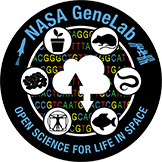
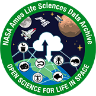

# OSDR Introduction

### Introduction to NASA Open Science Data Repository (OSDR) 

The NASA Open Science Data Repository (OSDR) is an open-access data collection from spaceflight-related missions and other related research activities. The purpose of the OSDR is to provide a centralized location for researchers to access and share data, promote collaboration and discovery, and accelerate scientific research. The OSDR contains various data types, including genomic, transcriptomic, proteomic, metabolic and imaging data. The data is available for download in multiple formats, including CSV, JSON, and XML. The OSDR is a valuable resource for researchers studying topics related to space biology including both human health and environmental science. This training provides an overview of the OSDR and how to access and use the data. The data repository is organized by experiment. Each experiment has a distinct page with a description of the experiment, the data files, and the associated publications.

<figure><figcaption>
Transparent images of organisms and physical processes in microgravity alongside the DNA double helix and a bubble full of micro-bubbles overlayed on an image of an astronaut picking up lunar regolith with a space vehicle in the background. The Artemis logo is overlayed in the bottom right-hand corner. 
</figcaption></figure>

In addition to providing access to data, the OSDR also offers a variety of tools and resources to help researchers use the data. These tools include a data search engine, a data visualization tool, and a data analysis tool. The OSDR also hosts a community forum where researchers can discuss the data and collaborate on projects. The NASA Open Science Data Repository is a powerful and continually evolving ecosystem of open science tools that is helping to advance scientific research and increase the accessibility of Space Biology data. Many users create new code to analyze data from the OSDR and share it with the global community through Git Hub and complete published data products through Zenodo. By providing access to a wealth of open-access data, the OSDR is accelerating the pace of discovery and helping to make the world a better place.

### &#x20;

<figure><figcaption>
The diagram shows three main columns: Increased NASA data connectivity, Data Processing Systems, and Presentation &#x26; Researcher Connectivity. The Data Processing, Analytics, and Management column shows how raw and processed NASA data is stored in a secure AWS bucket. It also shows how data is ingested, processed, and analyzed using analysis workflows. The Presentation &#x26; Researcher Connectivity column shows how researchers can access NASA data. The diagram also shows how new code generated by analysis of OSDR data can be shared through GitHub and published data products can be shared through Zenodo.
</figcaption></figure>

#### OSDR Home page 

<figure><figcaption>
GeneLab logo
</figcaption></figure>

[Learn more GeneLab](https://genelab.nasa.gov/about): GeneLab, an open science multi-omics repository, covering transcriptomics, metagenomics, epigenomics, proteomics, and metabolomics. Studies comprise of data from model organisms including microbes, plants, fruit flies, rodents and humans.

<figure><figcaption>
Biospecimen Sharing Program  Logo
</figcaption></figure>

[Learn more about BSP](https://science.nasa.gov/biological-physical/space-biology-biospecimen-sharing-program): The NASA Space Biology Biospecimen Sharing Program (BSP) collects biospecimens to maximize the scientific return from biological spaceflight and associated ground investigations and to encourage and broaden participation from the scientific community in space biology-related research.

<figure><figcaption>
Ames Life Sciences Data Archive Logo
</figcaption></figure>

[Learn more about ALSDA](https://osdr.nasa.gov/bio/about/alsda.html): Ames Life Sciences Data Archive (ALSDA) collects, curates, and makes available space-relevant higher-order phenotypic datasets. Datasets that enable scientists to perform retrospective analysis across missions, experiments, life science disciplines, research subjects, and species.

<figure><figcaption>
 Biological Institutional Scientific Collection Logo
</figcaption></figure>

[Learn more about NBISC](https://osdr.nasa.gov/bio/about/nbisc.html): NASA Biological Institutional Scientific Collection (NBISC) is a biorepository of non-human samples collected from NASA-funded spaceflight investigations and correlative ground studies. The purpose of NBISC is to receive, store, document, preserve, and make the collection available to the scientific community.

### &#x20;

### **Open Science Data Repository** [**(OSDR) Home Page**](./#y1ghpc1dn4ak)**:**  

**Home:** The Open Science Data Repository (OSDR) home page includes the navigation menu, Latest data releases, Latest news, Spotlight features, Research opportunities and recent open access publications.

(A) Navigation menu – click on any of the options to navigate through the different pages.

(B) Open Science Data Repository (OSDR) data exploration environment.

(C) Open Science Data Repository (OSDR) data submission portal.

<figure><figcaption>
<em>Open Science Data archive allows you to save, share and access FAIR space biology data.</em>
</figcaption></figure>

#### Explore the [OSDR](https://osdr.nasa.gov/bio/index.html) home pages by scrolling down reveals information about the latest data releases, news, and events. 

<figure><figcaption>
<em>The latest OSDR news and also promotes the latest datasets that have been.</em> 
</figcaption></figure>

### [About](https://genelab.nasa.gov/about)

**About:** The "About" drop-down menu from the OSDR home page provides a wealth of information about OSDR groups and resources. Here's a detailed overview of what you can explore:

<figure><figcaption>
<em>"Open Science for Life in Space". To the right of the text is the website's navigation menu the "About," option has been selected revealing subpages “Open Science”, “ALSDA”, “GeneLab”, “BPS”, and “Latest News”</em>
</figcaption></figure>

#### NASA Open Science: Learn about NASA's commitment to open science and its efforts to make scientific data, publications, and software accessible to the public. Discover how NASA's open science policy promotes transparency, collaboration, and the advancement of scientific knowledge. 

#### [Ames Life Science Data Archive (ALSDA)](https://osdr.nasa.gov/bio/about/alsda.html): Explore the ALSDA, a comprehensive repository of life science data generated from NASA spaceflight experiments. Gain insights into the diverse range of biological studies conducted in space, including investigations into human physiology, microbiology, and plant biology.

#### [GeneLab Infrastructure](https://genelab.nasa.gov/about): Discover the GeneLab, a state-of-the-art genomics and bioinformatics facility at NASA Ames Research Center. Learn about the advanced technologies and services offered by the GeneLab, such as DNA sequencing, gene expression analysis, and bioinformatics support.

#### [Space Biology Biospecimen Sharing Program (BPS)](https://nlsp.nasa.gov/explore/lsdahome/datarequest): Explore the BPS, a program that facilitates the sharing of biological samples collected during spaceflight experiments. Gain insights into the importance of biospecimen sharing for advancing space biology research and understanding the effects of space travel on living organisms.

#### [Latest News:](https://genelab.nasa.gov/newsarchive) Stay up-to-date with the latest news and developments in NASA's space biology research. Read about recent scientific discoveries, upcoming missions, and other exciting initiatives in the field of space biology.

### Data & Tools 

**Data & Tools:** The "data & tools" drop-down menu provides a wealth of information about OSDR data and tools. Here's a detailed overview of what you can explore:

<figure><figcaption></figcaption></figure>

#### [Data Repository:](https://osdr.nasa.gov/bio/repo/search?q=\&data\_source=cgene,alsda\&data\_type=study) Links to the data repository, where users can access space biology-centric data. Contains datasets from various space biology studies including data on gene expression, proteomics, and physiological adaptation to spaceflight. Users can search and download datasets of interest.

#### [Submission Portal:](https://osdr.nasa.gov/bio/submission-sso-login.html) Link to the submission portal, where users can upload their space biology data. Allows researchers to contribute their data to the OSDR, making it accessible to the broader scientific community. Users can also submit metadata, including information about experimental protocols and sample characteristics.

#### [Workspace:](https://osdr.nasa.gov/bio/workspace-sso-login.html) Requires the creation of an OSDR guest account. Provides a personalized interface for managing data, creating analyses, and collaborating with other researchers. Includes tools for data visualization, statistical analysis, and data sharing.

#### [Data Visualization:](https://visualization.genelab.nasa.gov/data/) Opens the application that manages multiple research studies. Allows users to visualize and compare data from different studies. Includes a variety of interactive plots and charts, as well as tools for data filtering and sorting.

#### [RadLab:](https://visualization.osdr.nasa.gov/radlab/gui/data-overview/) Is a tool for interrogating radiation data collected during spaceflight missions. Provides a comprehensive view of radiation exposure, including dose, LET, and particle type. Allows users to analyze radiation data in the context of biological effects.

#### [Environmental Data App:](https://visualization.osdr.nasa.gov/eda/) Facilitates visualization of environmental data collated from numerous rodent research studies. Includes data on temperature, humidity, and light levels. Allows users to identify potential environmental factors that may affect research outcomes.

#### [OSDR API:](https://genelab.nasa.gov/genelabAPIs) A webpage presenting the automated programming interface for OSDR. Provides documentation and examples for programmatic access to the OSDR data and tools. This page enables researchers to integrate OSDR data and tools into their applications and workflows.

### Research & Resources 

The "Research & Resources" section provides access to information on open science, artificial intelligence, and life in space. Here's an expanded elaboration of each subsection:

<figure><figcaption></figcaption></figure>

[**Publications:**](https://osdr.nasa.gov/bio/data/publications.html)This page contains links to literature related to the Open Science Repository, a central hub for NASA's open science publications. It includes journal articles, reports, and other scientific documents that have been made publicly available.

**AI/ML:** The "AI/ML" drop-down menu offers a link to the "AI4LS" (Artificial Intelligence for Life in Space Working Group) page. This working group brings together experts from NASA, academia, and industry to explore the potential of AI and machine learning for advancing life in space.

[**AI4LS:**](https://osdr.nasa.gov/bio/data/ai4ls.html) The AI4LS working group focuses on utilizing artificial intelligence (AI) and machine learning (ML) methods to analyze complex, heterogeneous, multi-modal biological datasets. ML approaches have shown promise for deriving meaningful patterns from these datasets and creating mathematical models to fit patterns and minimize errors. The group aims to build ML models to predict the physiological effects of spaceflight hazards using multi-modal biological and environmental data. Focus areas include causal inference, foundation models, and "self-driving" labs. Causal inference aims to elucidate causal relationships in complex biological data by combining invariance theory and ML methodology. Foundation models are trained on large, broad datasets and then refined on smaller datasets, which is relevant to space biology research due to limited sample size and restricted problem space. Self-driving labs are cutting-edge technology designed for space exploration. They employ automation and cloud-based systems to collect data points in a consistent and reproducible manner, leading to enhanced data acquisition and analysis.

#### **Seminars:** The analysis working groups regularly host spacebiology discussions and seminars. 

[**HBISS Seminar Series:**](https://osdr.nasa.gov/bio/data/hbiss.html)

The "HBISS Seminar Series" link leads to the Horizons in Biosciences & Informatics Seminar Series website. This internal NASA seminar series showcases cutting-edge research in the fields of biosciences and informatics, with presentations from leading scientists from around the world.

**Open Science:** The "Open Science" drop-down menu contains a link to the "Data Management Policies for BPS" page. This page summarizes the data management policies for the Biological and Physical Sciences (BPS) division of NASA's Science Mission Directorate (SMD). It outlines the requirements for data management and sharing for BPS-funded research projects.



[**TOPS**](https://osdr.nasa.gov/bio/data/tops.html)**:** The "TOPS" (Transform to Open Science) page provides an overview of the US White House's Transform to Open Science initiative. This initiative aims to make publicly funded research more accessible and reproducible by requiring federal agencies to develop plans for transitioning to open science practices. The page also includes a link to enrol in the OS101 curriculum, which provides training on open science principles and best practices.

[**Data**](https://osdr.nasa.gov/bio/data/data-management-bps.html)[ **management policies:**](https://osdr.nasa.gov/bio/data/data-management-bps.html) NASA seeks to transform science data management to increase research throughput and transparency. The Science Mission Directorate (SMD) has issued new policies, including the Scientific Information Policy for the Science Mission Directorate (SMD Policy Document SPD-41a). The Biological and Physical Sciences (BPS) division of SMD has further specified these policies in the BPS Scientific Data Management Policy (BPS-021). Guidance and aids on implementing these data management policies are available at various locations, including the Space Biology Open Science-Data Management Plan (OS-DMP) Template and Guidance, the ROSES Open Science and Data Management Plan, and the NASA Science Mission Directorate: Open-Source Science Guidance.

[ROSES Open Science and Data Management Plan](https://science.nasa.gov/researchers/sara/faqs/osdmp)

[NASA Science Mission Directorate: Open-Source Science Guidance](https://github.com/nasa/smd-open-science-guidelines#nasa-science-mission-directorate-open-source-science-guidance)

#### [Analysis Working Groups (AWG)](https://osdr.nasa.gov/bio/awg/about.html)

The AWG dropdown menu in GeneLab serves as a comprehensive resource for users to explore and engage with the organization's Applied Working Groups (AWGs). Through this menu, users can access various pages that provide information related to the AWGs.

<figure><figcaption>
Come join one of our analysis working groups.
</figcaption></figure>

[**About AWG(s)**](https://osdr.nasa.gov/bio/awg/about.html)**:** This page offers an overview of GeneLab's AWGs, explaining their purpose, goals, and activities. It highlights how AWGs bring together experts, researchers, and community members to collaborate on specific scientific projects and initiatives.

[**Charter:**](https://osdr.nasa.gov/bio/awg/charter.html) Here, users can access the formal charter documents for each AWG. The charters outline the AWG's mission, objectives, scope of work, and governance structure. They provide a framework for the AWG's activities and ensure alignment with GeneLab's overall strategic goals.

[**How to Join:**](https://osdr.nasa.gov/bio/awg/join.html) This section guides how individuals can become members of an AWG. It outlines the eligibility criteria, application process, and selection procedures. Interested individuals can learn about the requirements and steps involved in joining an AWG.

[**Current AWG Members:**](https://osdr.nasa.gov/bio/awg/awg-members.html) This page lists the current members of each AWG. It includes the names, affiliations, and brief bios of the individuals involved. Users can explore the expertise and backgrounds of the AWG members, providing insights into the diversity and strength of GeneLab's collaborative network.

[**SOLSTICE Project Goals:**](https://osdr.nasa.gov/bio/awg/solstice.html) Under the citizen science dropdown menu, users can find a description of the SOLSTICE project goals. SOLSTICE (Space Open Life Science Team for International Collaborative Exploration) is a citizen science project that engages the public in scientific research. This page outlines the project's objectives, research questions, and anticipated outcomes.

[**SOLSTICE Members and Affiliations:**](https://osdr.nasa.gov/bio/awg/solstice-members.html) This page lists the SOLSTICE members and their affiliations. Similar to the AWG members page, it provides information on the individuals involved in the SOLSTICE project, showcasing the diverse backgrounds and expertise of the participants.

#### &#x20;

#### Help 

**Open Science Data Repository (OSDR) offers a comprehensive collection of resources to assist users with various inquiries, policies, learning materials, and communication channels.** Here's an expanded elaboration of the services provided:

<figure><figcaption>
<em>Feel free to contact us.</em>
</figcaption></figure>

[**Frequently Asked Questions (FAQs)**](https://osdr.nasa.gov/bio/help/faq.html)[**:**](https://osdr.nasa.gov/bio/help/faq.html) A dedicated FAQ section addresses common queries related to OSDR's services, data submission process, accessibility, and account management. The FAQs are organized into categories for easy navigation and quick reference. Regular updates ensure that the information provided stays current and relevant.

[**Terms & Conditions**](https://osdr.nasa.gov/bio/help/terms.html)[**:**](https://osdr.nasa.gov/bio/help/terms.html) OSDR's Terms & Conditions outline the legal agreement between the platform and its users. Clear explanations of rights, responsibilities, and expectations for both parties are provided. Adherence to these terms is crucial for maintaining a respectful and ethical environment within the archive.

[**Tutorials**](https://genelab.nasa.gov/help/tutorials)[**:**](https://genelab.nasa.gov/help/tutorials) Step-by-step tutorials guide users through essential tasks such as data submission, metadata creation, and search functions. Visual aids, screenshots, and detailed instructions make the learning process intuitive and accessible. Tutorials are regularly updated to reflect any changes or improvements in OSDR platform.

[**Contact Information**](https://genelab.nasa.gov/help/contact)[**:**](https://genelab.nasa.gov/help/contact) Multiple communication channels are available for users to reach OSDR staff including (GeneLab Slack and Discorse.OSDR.space are used by AWG's for communication). Email, phone numbers, and social media platforms provide convenient options for inquiries, feedback, and technical support. Prompt response times ensure that users receive the assistance they need promptly.

### &#x20;

### &#x20;

### &#x20;
